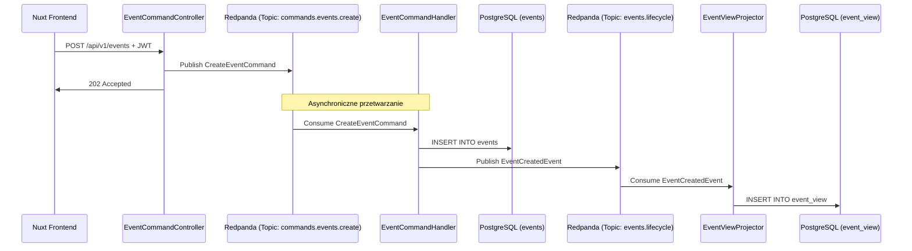

# EventMaster - Aktualizacja Dokumentacji Architektury

## WAŻNE POPRAWKI (2025-10-19)

### 1. Bazy Danych - Aktualna Implementacja

**❌ Błędne założenie w pierwotnej dokumentacji:**
- Używamy dwóch różnych baz danych (PostgreSQL + CockroachDB)

**✅ Faktyczna implementacja:**
- Używamy **jednej bazy PostgreSQL** dla obu modeli
- Write Model: tabela `events` w PostgreSQL
- Read Model: tabela `event_view` w **tej samej** PostgreSQL

**Dlaczego tak?**
- Uproszczenie na etapie developmentu
- Łatwiejsze testowanie (Testcontainers z jednym PostgreSQLContainer)
- W produkcji możemy rozdzielić na osobne bazy

**Konfiguracja DataSource:**
```properties
# Write Model
spring.datasource.write.jdbc-url=jdbc:postgresql://localhost:5432/eventmaster_db
spring.datasource.write.username=eventmaster
spring.datasource.write.password=password

# Read Model (ta sama baza, inna tabela)
spring.datasource.read.jdbc-url=jdbc:postgresql://localhost:26257/defaultdb?sslmode=disable
spring.datasource.read.username=root
spring.datasource.read.password=
```

**W testach:**
Oba DataSources wskazują na ten sam `PostgreSQLContainer`:
```java
registry.add("spring.datasource.write.jdbc-url", postgres::getJdbcUrl);
registry.add("spring.datasource.read.jdbc-url", postgres::getJdbcUrl);
```

---

### 2. Kafka/Redpanda - Poprawione

**❌ W pierwotnej dokumentacji:**
- Ogólne odniesienia do "Apache Kafka"
- Sugestia dodania Redpanda do docker-compose

**✅ Faktyczna implementacja:**
- Używamy **Redpanda** (Kafka-compatible)
- Redpanda jest **teraz w docker-compose.yml**
- Port: 19092 (external), 9092 (internal)
- Health check: `rpk cluster health`

**Topiki:**
1. `commands.events.create` - Komendy tworzenia eventów
2. `events.lifecycle` - Domain Events (EventCreatedEvent)

---

### 3. Testowanie - Kluczowe szczegóły

**BaseIntegrationTest używa Testcontainers:**
```java
@Container
static final PostgreSQLContainer<?> postgres = new PostgreSQLContainer<>("postgres:16");

@Container
static final KeycloakContainer keycloak = new KeycloakContainer("quay.io/keycloak/keycloak:latest")
        .withRealmImportFile("test-realm-config.json");

@Container
static final RedpandaContainer redpanda = new RedpandaContainer("docker.redpanda.com/redpandadata/redpanda:latest");
```

**Kluczowe adnotacje:**
- `@AutoConfigureTestDatabase(replace = NONE)` - NIE używaj H2
- `@SpringBootTest(properties = "spring.kafka.test.embedded.enabled=false")` - NIE używaj embedded Kafka

**Testy asynchroniczne:**
```java
@Test
void shouldProcessCommandAndSaveToWriteModel() {
    // Given: Publikujemy komendę
    kafkaTemplate.send("commands.events.create", command);
    
    // When/Then: Czekamy asynchronicznie (Awaitility)
    await().atMost(5, SECONDS)
        .untilAsserted(() -> {
            Optional<Event> saved = eventRepository.findById(eventId);
            assertThat(saved).isPresent();
        });
}
```

---

### 4. Keycloak - Infrastructure as Code

**Niestandardowy obraz Docker:**
```yaml
keycloak:
  image: quay.io/keycloak/keycloak:latest
  environment:
    KEYCLOAK_ADMIN: admin
    KEYCLOAK_ADMIN_PASSWORD: admin
    KEYCLOAK_IMPORT: /opt/keycloak/data/import/eventmaster-realm.json
  volumes:
    - ./realm-config:/opt/keycloak/data/import
```

**Realm jest importowany automatycznie przy starcie!**
- Plik: `docker/realm-config/eventmaster-realm.json`
- Client: `eventmaster-frontend`
- Redirect URI: `http://localhost/api/auth/callback/keycloak`

---

### 5. Przepływ Danych - Precyzyjny opis



**Kluczowe punkty:**
1. Controller NIE dotyka bazy - tylko Kafka
2. Handler zapisuje do Write Model (tabela `events`)
3. Projector zapisuje do Read Model (tabela `event_view`)
4. Obie tabele w **tej samej bazie PostgreSQL**

---

### 6. Frontend - Szczegóły

**Package manager:** pnpm (nie npm!)
```bash
cd frontend
pnpm install
pnpm dev
```

**UI Library:** PrimeVue (komponenty)
```vue
<InputText v-model="title" />
<Editor v-model="description" />
<Calendar v-model="eventDate" />
<Button type="submit" label="Utwórz" />
```

**Walidacja:** Zod + vee-validate
```typescript
const CreateEventSchema = z.object({
  title: z.string().nonempty('Tytuł nie może być pusty'),
  eventDate: z.date().min(new Date(), 'Data musi być w przyszłości'),
});
```

**Autentykacja:** @sidebase/nuxt-auth
```typescript
// Logowanie
await signIn('keycloak');

// Wylogowanie
await signOut();

// Middleware
definePageMeta({
  middleware: 'auth'  // Wymaga logowania
});
```

---

### 7. Co działa, a co nie (Stan po Zadaniu 12)

**✅ Co działa:**
1. Logowanie przez Keycloak (OAuth2/OIDC)
2. Formularz tworzenia eventu (`/events/create`)
3. Publikacja komendy do Kafki
4. Handler zapisuje do Write Model
5. Projektor zapisuje do Read Model
6. Testy integracyjne (Testcontainers)

**❌ Co NIE działa (TODO):**
1. `EventQueryController` nie jest podłączony do `EventViewRepository`
2. Frontend nie pobiera listy eventów z backendu
3. Strona `/events` nie wyświetla danych

**Następny krok:**
Podłączyć `EventQueryController` do `EventViewRepository` i wyświetlić listę na frontendzie.

---

### 8. Struktura projektu - Aktualna

```
nuxt-learn/
├── docker/
│   ├── docker-compose.yml          # Postgres, Keycloak, Redpanda, Caddy
│   └── realm-config/
│       └── eventmaster-realm.json   # IaC - auto-import do Keycloak
│
├── frontend/                        # Nuxt 4 + Vue 3 + TypeScript
│   ├── pages/
│   │   ├── index.vue               # Strona główna
│   │   └── events/
│   │       ├── index.vue           # Lista (TODO: podłączyć do API)
│   │       └── create.vue          # Formularz (DZIAŁA)
│   ├── nuxt.config.ts
│   └── package.json                # pnpm
│
├── src/                             # Spring Boot Backend
│   ├── main/
│   │   ├── java/com/eventmaster/backend/
│   │   │   ├── config/
│   │   │   │   ├── KafkaConfig.java
│   │   │   │   └── SecurityConfig.java
│   │   │   ├── configs/persistence/
│   │   │   │   ├── WriteDataSourceConfig.java
│   │   │   │   └── ReadDataSourceConfig.java
│   │   │   ├── events/
│   │   │   │   ├── api/
│   │   │   │   │   └── EventCommandController.java
│   │   │   │   ├── command/
│   │   │   │   │   └── CreateEventCommand.java
│   │   │   │   ├── domain/
│   │   │   │   │   ├── Event.java (Write Model)
│   │   │   │   │   └── EventCreatedEvent.java
│   │   │   │   ├── repository/
│   │   │   │   │   └── EventRepository.java
│   │   │   │   ├── EventCommandHandler.java
│   │   │   │   └── query/
│   │   │   │       ├── api/
│   │   │   │       │   └── EventQueryController.java
│   │   │   │       ├── model/
│   │   │   │       │   └── EventView.java (Read Model)
│   │   │   │       ├── repository/
│   │   │   │       │   └── EventViewRepository.java
│   │   │   │       └── projector/
│   │   │   │           └── EventViewProjector.java
│   │   │   └── EventmasterBackendApplication.java
│   │   └── resources/
│   │       ├── application.properties
│   │       └── db/migration/
│   │           └── V1__create_events_table.sql
│   │
│   └── test/
│       └── java/com/eventmaster/backend/
│           ├── BaseIntegrationTest.java  # Testcontainers
│           ├── EventmasterBackendApplicationTests.java
│           └── SecurityConfigTest.java
│
├── pom.xml
├── Caddyfile
├── ARCHITEKTURA_SZCZEGOLOWA.md      # Główna dokumentacja (~9600 słów)
├── ARCHITECTURE_REVIEW.md           # Oryginalny review
├── KLUCZOWE_POPRAWKI.md            # Podsumowanie zmian
└── ARCHITEKTURA_AKTUALIZACJA.md    # Ten dokument
```

---

**Data:** 2025-10-19  
**Status:** Dokumentacja zaktualizowana zgodnie z faktyczną implementacją
