# EventMaster - Szczegółowa Architektura Systemu CQRS

**Dokument architektoniczny dla 15-latka (z terminologią techniczną)**

**Wersja:** 1.0  
**Data:** 2025-10-19  
**Autorzy:** Zespół EventMaster

---

## Spis treści

1. [Wprowadzenie - Co to jest EventMaster?](#1-wprowadzenie)
2. [Podstawy CQRS - Podział na Komendy i Zapytania](#2-podstawy-cqrs)
3. [Architektura wysokopoziomowa](#3-architektura-wysokopoziomowa)
4. [Kontenery i komponenty systemu](#4-kontenery-i-komponenty-systemu)
5. [Backend Java - szczegółowa analiza](#5-backend-java)
6. [Frontend Nuxt.js - szczegółowa analiza](#6-frontend-nuxtjs)
7. [Przepływ danych - scenariusze krok po kroku](#7-przepływ-danych)
8. [Bazy danych i separacja modeli](#8-bazy-danych-i-separacja-modeli)
9. [Kafka - autobus komunikacyjny](#9-kafka-autobus-komunikacyjny)
10. [Bezpieczeństwo i autoryzacja](#10-bezpieczeństwo-i-autoryzacja)
11. [Infrastruktura i deployment](#11-infrastruktura-i-deployment)
12. [Słowniczek pojęć](#12-słowniczek-pojęć)

---

## 1. Wprowadzenie

### 1.1 Co to jest EventMaster?

EventMaster to aplikacja do tworzenia i przeglądania wydarzeń (eventów), podobnie jak Facebook Events czy Meetup.com. Użytkownicy mogą:
- **Tworzyć** nowe wydarzenia (koncerty, konferencje, spotkania)
- **Przeglądać** listę wszystkich nadchodzących wydarzeń

### 1.2 Czym EventMaster jest wyjątkowy?

W przeciwieństwie do standardowych aplikacji, EventMaster wykorzystuje **architekturę CQRS** (Command Query Responsibility Segregation), co oznacza:
- **Osobny tor** dla tworzenia danych (komendy)
- **Osobny tor** dla odczytywania danych (zapytania)
- **Dwie różne bazy danych** optymalizowane pod różne cele

To jak gdybyś miał dwa różne notesy: jeden do pisania notatek, drugi do ich czytania, każdy z inną strukturą, żeby było najwydajniej.

### 1.3 Technologie

```
Backend:  Java 21 + Spring Boot 3.3.1
Frontend: Nuxt 4 + Vue 3 + TypeScript
Message Broker: Apache Kafka
Write Database: PostgreSQL
Read Database: CockroachDB
Auth: Keycloak (OAuth2/OIDC)
Proxy: Caddy
```

---

## 2. Podstawy CQRS

### 2.1 Co to jest CQRS?

**CQRS** = Command Query Responsibility Segregation (Separacja odpowiedzialności komend i zapytań)

Wyobraź sobie bibliotekę:
- **Komenda (Write)**: To jak wypożyczenie książki - musisz wypełnić formularz, bibliotekarz musi sprawdzić dostępność, zapisać w systemie, itp. To **skomplikowana operacja**.
- **Zapytanie (Query/Read)**: To jak sprawdzenie katalogu książek - po prostu szybkie przejrzenie listy. To **prosta operacja**.

W tradycyjnej aplikacji obie te operacje korzystają z tej samej bazy danych i tego samego modelu. W CQRS **rozdzielamy je całkowicie**.

### 2.2 Dlaczego to robimy?

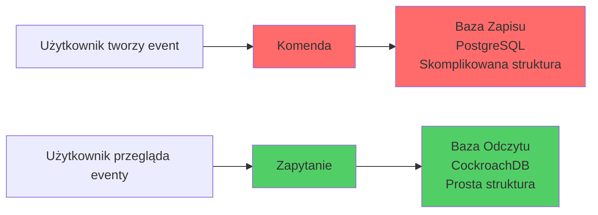

**Zalety:**
1. **Wydajność**: Baza do odczytu może mieć prostszą strukturę (bez JOIN-ów), więc zapytania są szybkie
2. **Skalowalność**: Możemy mieć wiele kopii bazy odczytu (read replicas)
3. **Niezależność**: Zmiana w strukturze zapisu nie wpływa na odczyt
4. **Optymalizacja**: Każda baza jest zoptymalizowana pod swoje zadanie

**Wady:**
1. **Eventual Consistency**: Dane nie są dostępne natychmiast po zapisie (trzeba poczekać kilka milisekund)
2. **Złożoność**: Więcej kodu, więcej baz danych, więcej rzeczy do zarządzania

---

## 3. Architektura wysokopoziomowa

### 3.1 Diagram kontekstu systemu

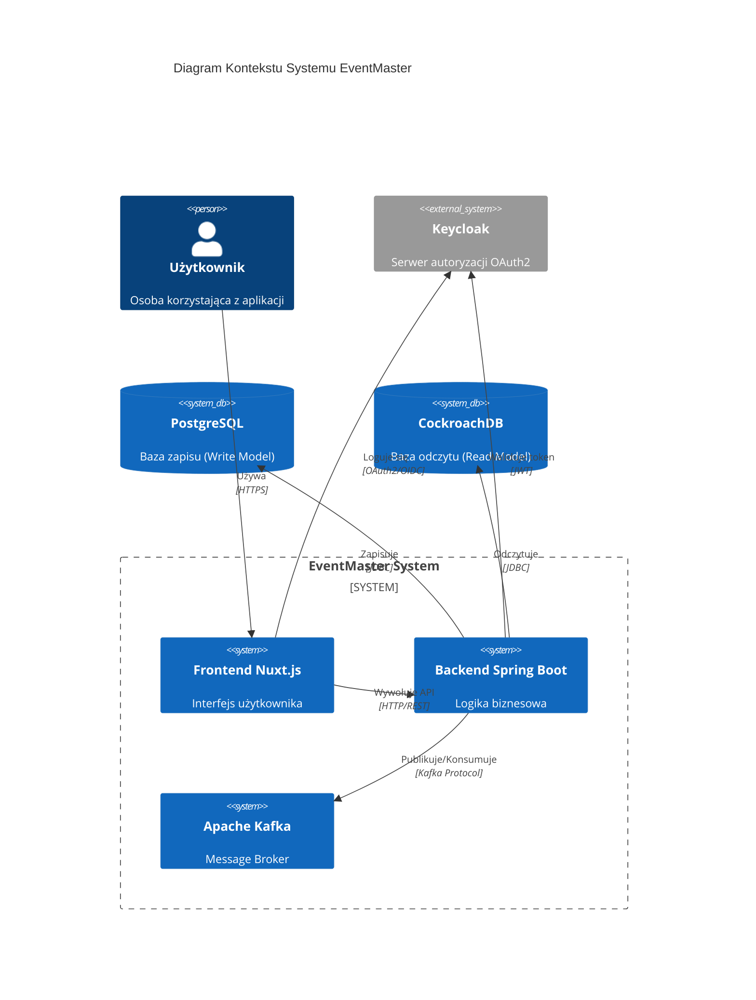

### 3.2 Główne komponenty

| Komponent | Rola | Technologia | Port |
|-----------|------|-------------|------|
| **Frontend** | Interfejs użytkownika, formularze, wyświetlanie listy | Nuxt 4, Vue 3, TypeScript | 3000 |
| **Backend** | Logika biznesowa, walidacja, przetwarzanie komend | Spring Boot 3, Java 21 | 8080 |
| **Kafka** | Kolejka wiadomości, event bus | Apache Kafka | 9092 |
| **PostgreSQL** | Baza danych zapisu (Write Model) | PostgreSQL 16 | 5432 |
| **CockroachDB** | Baza danych odczytu (Read Model) | CockroachDB v23.2 | 26257 |
| **Keycloak** | Serwer autoryzacji, logowanie użytkowników | Keycloak | 8180 |
| **Caddy** | Reverse proxy, routing HTTP | Caddy | 80/443 |

---

## 4. Kontenery i komponenty systemu

### 4.1 Architektura kontenerowa

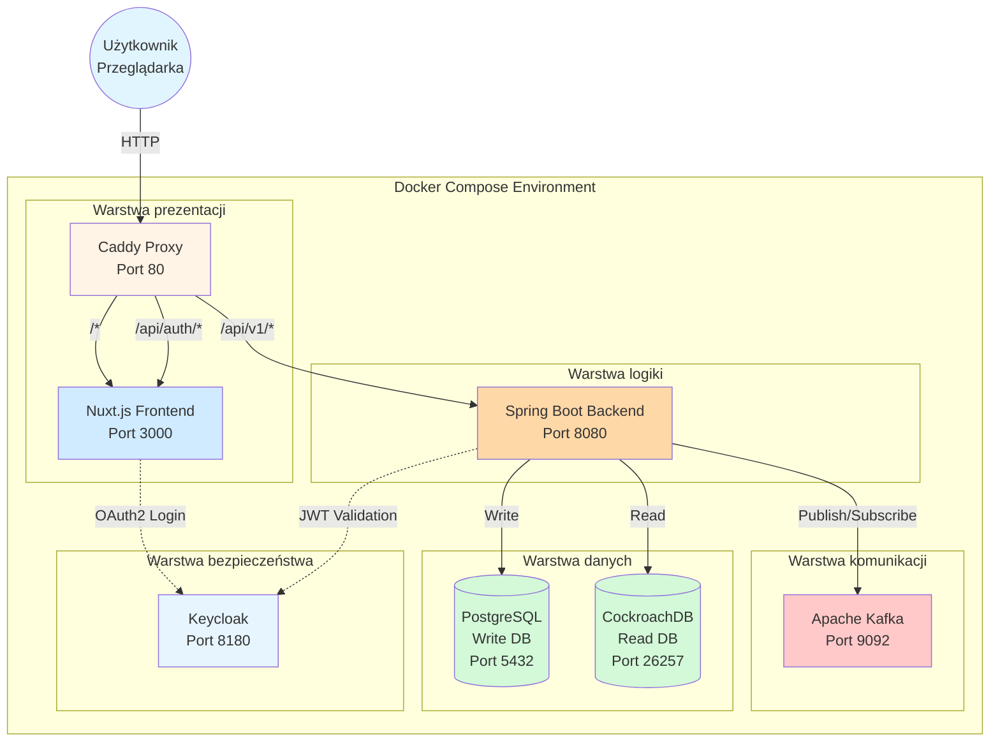

### 4.2 Opis każdego kontenera

#### 4.2.1 Caddy Proxy

**Co to jest?**  
Caddy to reverse proxy - działa jak recepcjonista w hotelu. Gdy przychodzi żądanie HTTP, Caddy sprawdza adres URL i przekierowuje je do odpowiedniego serwisu.

**Co przechowuje?**
- Konfiguracja routingu (Caddyfile)
- Certyfikaty SSL (automatycznie generowane)

**Jak komunikuje się z innymi?**
```
Użytkownik → Caddy → Decyzja routingu:
  ├─ /api/v1/*     → Spring Boot (port 8080)
  ├─ /api/auth/*   → Nuxt Server (port 3000)
  └─ /*            → Nuxt Frontend (port 3000)
```

**Przykład:**
- Żądanie: `GET http://localhost/api/v1/events` → Caddy przekierowuje do `http://localhost:8080/api/v1/events`
- Żądanie: `GET http://localhost/` → Caddy przekierowuje do `http://localhost:3000/`

---

#### 4.2.2 Nuxt.js Frontend

**Co to jest?**  
Frontend to interfejs użytkownika - wszystko co widzisz w przeglądarce. Nuxt.js to framework do budowania aplikacji Vue.js z SSR (Server-Side Rendering).

**Główne komponenty:**
1. **Strony (Pages)**:
   - `/pages/index.vue` - Strona główna
   - `/pages/events/index.vue` - Lista wydarzeń
   - `/pages/events/create.vue` - Formularz tworzenia eventu

2. **Middleware**:
   - `auth` - Sprawdza czy użytkownik jest zalogowany

3. **Server API**:
   - `/server/api/auth/[...].ts` - Obsługa callbacku OAuth2

**Co przechowuje?**
- Tokeny OAuth2 (w session cookies)
- Stan aplikacji (reactive state w Vue)
- Komponenty UI

**Jak komunikuje się?**
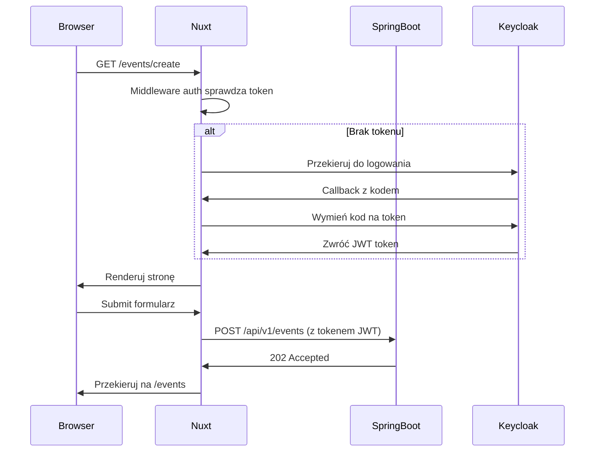

---

#### 4.2.3 Spring Boot Backend

**Co to jest?**  
Backend to serce aplikacji - tutaj dzieje się cała logika biznesowa, walidacja, przetwarzanie komend i zdarzeń.

**Struktura pakietów:**

```
com.eventmaster.backend/
├── config/
│   ├── KafkaConfig.java           # Konfiguracja Kafki (error handling, DLQ)
│   └── SecurityConfig.java        # Konfiguracja OAuth2 Resource Server
│
├── configs/persistence/
│   ├── WriteDataSourceConfig.java # Konfiguracja połączenia do PostgreSQL
│   └── ReadDataSourceConfig.java  # Konfiguracja połączenia do CockroachDB
│
├── events/
│   ├── api/
│   │   ├── EventCommandController.java  # REST endpoint dla komend POST
│   │   └── CreateEventRequest.java      # DTO requestu
│   │
│   ├── command/
│   │   └── CreateEventCommand.java      # Komenda (immutable record)
│   │
│   ├── domain/
│   │   ├── Event.java                   # Agregat (Write Model Entity)
│   │   └── EventCreatedEvent.java       # Zdarzenie domenowe
│   │
│   ├── repository/
│   │   └── EventRepository.java         # JPA Repository (Write Model)
│   │
│   ├── EventCommandHandler.java         # Kafka Listener, zapisuje do Write DB
│   │
│   └── query/
│       ├── api/
│       │   └── EventQueryController.java    # REST endpoint dla GET
│       ├── dto/
│       │   └── EventViewDTO.java            # DTO response
│       ├── model/
│       │   └── EventView.java               # Read Model Entity
│       ├── repository/
│       │   └── EventViewRepository.java     # JPA Repository (Read Model)
│       └── projector/
│           └── EventViewProjector.java      # Kafka Listener, zapisuje do Read DB
│
└── web/
    ├── PingController.java         # Health check
    └── UserInfoController.java     # Info o zalogowanym użytkowniku
```

**Co przechowuje?**
- Nic! Backend jest stateless (bezstanowy). Wszystkie dane w bazach danych.

**Jak komunikuje się?**
- **HTTP REST API** - Przyjmuje żądania od frontendu
- **Kafka Producer** - Wysyła komendy i zdarzenia
- **Kafka Consumer** - Słucha komend i zdarzeń
- **JDBC** - Łączy się z bazami danych

---


#### 4.2.4 Apache Kafka

**Co to jest?**  
Kafka to "autobus wiadomości" - system kolejkowy, przez który płyną wszystkie komendy i zdarzenia w aplikacji. To jak poczta w firmie - każdy może wysłać list (message) na określony adres (topic), a zainteresowani mogą go odebrać.

**Główne koncepcje:**

1. **Topic** (Temat):
   - To jak skrzynka pocztowa z nazwą
   - W EventMaster mamy 2 topici:
     - `commands.events.create` - Komendy tworzenia eventów
     - `domain.events.lifecycle` - Zdarzenia domenowe

2. **Producer** (Producent):
   - Komponent który wysyła wiadomości do topicu
   - W EventMaster: `EventCommandController` i `EventCommandHandler`

3. **Consumer** (Konsument):
   - Komponent który odbiera wiadomości z topicu
   - W EventMaster: `EventCommandHandler` i `EventViewProjector`

4. **Consumer Group**:
   - Grupa konsumentów pracujących razem
   - Każda wiadomość jest przetwarzana przez **jednego** konsumenta z grupy
   - Grupy w EventMaster:
     - `event-command-handler` - Przetwarza komendy
     - `eventmaster-projectors-crdb` - Projektuje do Read Model

**Co przechowuje?**
- Wszystkie wiadomości przez określony czas (domyślnie 7 dni)
- Offset (pozycja) każdego consumera - "który message ostatnio przeczytał"

**Dlaczego używamy Kafki?**
1. **Asynchroniczność**: Nie musimy czekać na przetworzenie - zwracamy 202 Accepted od razu
2. **Niezawodność**: Jeśli backend padnie, wiadomości czekają w Kafce
3. **Retry**: Automatyczne ponowne próby przy błędach
4. **Audytowalność**: Wszystkie komendy są zapisane

**Przepływ przez Kafkę:**
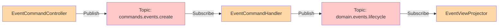

---

#### 4.2.5 PostgreSQL - Write Database

**Co to jest?**  
PostgreSQL to relacyjna baza danych używana jako **Write Model** (Model Zapisu). Przechowuje źródło prawdy (source of truth) - prawdziwy, autorytarny stan eventów.

**Struktura tabeli `events`:**
```sql
CREATE TABLE events (
    id UUID PRIMARY KEY,             -- Unikalny identyfikator eventu
    title VARCHAR(255) NOT NULL,     -- Tytuł wydarzenia
    description TEXT,                -- Opis wydarzenia
    event_date TIMESTAMP NOT NULL,   -- Data wydarzenia
    organizer_id VARCHAR(255) NOT NULL  -- ID organizatora (z Keycloak)
);
```

**Co przechowuje?**
- **Agregaty domeny** - Encje `Event` z pełną informacją
- **Indeksy** - Optymalizowane pod zapis (PRIMARY KEY)
- **Constraints** - Reguły integralności (NOT NULL, UNIQUE)

**Kto zapisuje dane?**
- Tylko `EventCommandHandler` (przez `EventRepository`)
- **NIE** jest używana do odczytu przez frontend

**Dlaczego PostgreSQL?**
- Silne gwarancje ACID (Atomicity, Consistency, Isolation, Durability)
- Dobre wsparcie dla transakcji
- Flyway do migracji schematów

**Konfiguracja:**
```java
// WriteDataSourceConfig.java
@EnableJpaRepositories(
    basePackages = "com.eventmaster.backend.events.repository",  // Tylko Write Model Repositories
    entityManagerFactoryRef = "writeEntityManagerFactory",
    transactionManagerRef = "writeTransactionManager"
)
```

---

#### 4.2.6 CockroachDB - Read Database

**Co to jest?**  
CockroachDB to rozproszona baza danych SQL używana jako **Read Model** (Model Odczytu). Jest zoptymalizowana pod szybkie odczyty.

**Struktura tabeli `event_views`:**
```sql
CREATE TABLE event_views (
    event_id UUID PRIMARY KEY,       -- Taki sam ID jak w Write Model
    title VARCHAR(255),              -- Tytuł (denormalizowany)
    description TEXT,                -- Opis (denormalizowany)  
    event_date TIMESTAMP,            -- Data (denormalizowana)
    organizer_id VARCHAR(255)        -- ID organizatora (denormalizowany)
);

-- Możliwe dodatkowe indeksy dla szybkiego wyszukiwania:
CREATE INDEX idx_event_date ON event_views(event_date);
CREATE INDEX idx_organizer ON event_views(organizer_id);
```

**Co przechowuje?**
- **Widoki** (Views/Projekcje) - Uproszczone dane do wyświetlania
- **Denormalizowane dane** - Wszystko w jednej tabeli, bez JOIN-ów

**Kto zapisuje dane?**
- Tylko `EventViewProjector` (przez `EventViewRepository`)

**Kto czyta dane?**
- `EventQueryController` (przez `EventViewRepository`)
- Frontend przez endpoint `GET /api/v1/events`

**Dlaczego CockroachDB?**
- Skalowalność horyzontalna (możemy dodać więcej węzłów)
- Wysoka dostępność (high availability)
- Szybkie odczyty z replik

**Eventual Consistency:**
```
[Zapis do PostgreSQL] ---(kilka ms)---> [Kafka] ---(kilka ms)---> [Zapis do CockroachDB]
      t=0ms                               t=5ms                         t=10ms
```
Użytkownik może nie zobaczyć swojego eventu przez ~10-50ms po utworzeniu.

**Konfiguracja:**
```java
// ReadDataSourceConfig.java
@EnableJpaRepositories(
    basePackages = "com.eventmaster.backend.events.query.repository",  // Tylko Read Model Repositories
    entityManagerFactoryRef = "readEntityManagerFactory",
    transactionManagerRef = "readTransactionManager"
)
```

---

#### 4.2.7 Keycloak - Authorization Server

**Co to jest?**  
Keycloak to serwer autoryzacji implementujący protokoły OAuth2 i OpenID Connect (OIDC). Obsługuje logowanie użytkowników i wydawanie tokenów JWT.

**Co przechowuje?**
- **Użytkownicy** - Login, hasło (hashowane), email
- **Klienty** - Aplikacje mające dostęp (EventMaster Frontend)
- **Realmy** - Izolowane przestrzenie konfiguracji
- **Sesje** - Aktywne sesje użytkowników
- **Tokeny** - Wydane access tokeny i refresh tokeny

**Jak działa przepływ OAuth2?**

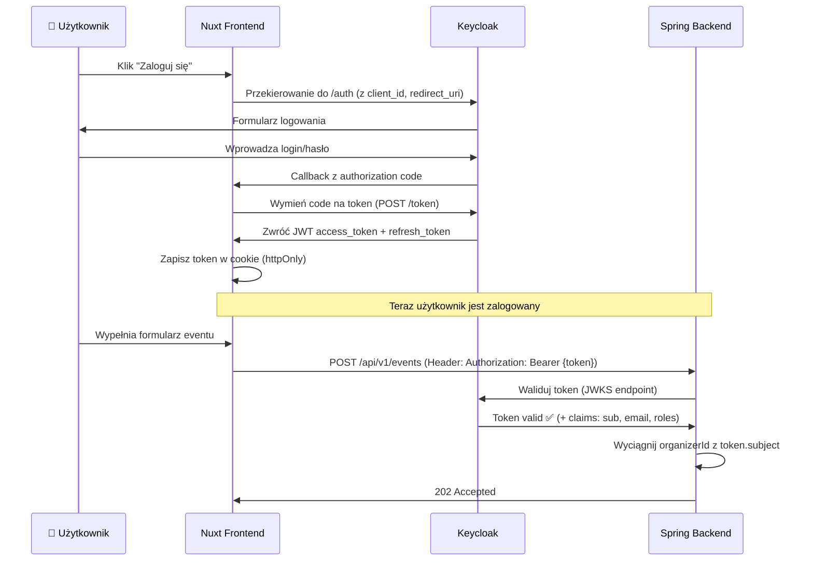

**JWT Token - co zawiera?**
```json
{
  "sub": "f6e9a1b2-3c4d-5e6f-7a8b-9c0d1e2f3a4b",  // Subject = user ID
  "email": "jan.kowalski@example.com",
  "preferred_username": "jankowalski",
  "name": "Jan Kowalski",
  "iat": 1697812345,  // Issued at timestamp
  "exp": 1697815945,  // Expiration timestamp (1h)
  "iss": "http://localhost:8180/realms/eventmaster"  // Issuer
}
```

**Jak Spring Boot waliduje token?**
```java
// SecurityConfig.java
@Bean
SecurityFilterChain filterChain(HttpSecurity http) {
    http.oauth2ResourceServer(oauth2 -> 
        oauth2.jwt(jwt -> 
            jwt.jwkSetUri("http://localhost:8180/realms/eventmaster/protocol/openid-connect/certs")
        )
    );
}
```
Spring automatycznie:
1. Pobiera klucze publiczne z Keycloak (JWKS)
2. Waliduje sygnaturę tokenu
3. Sprawdza czy nie wygasł (exp claim)
4. Udostępnia claims przez `@AuthenticationPrincipal Jwt jwt`

---

## 5. Backend Java - szczegółowa analiza

### 5.1 Warstwa API (Controllers)

#### 5.1.1 EventCommandController

**Lokalizacja:** `com.eventmaster.backend.events.api.EventCommandController`

**Rola:** Endpoint HTTP do przyjmowania komend tworzenia eventów.

**Kod z wyjaśnieniami:**
```java
@RestController  // ← To oznacza, że klasa obsługuje HTTP REST API
@RequestMapping("/api/v1/events")  // ← Wszystkie metody mają prefix /api/v1/events
@RequiredArgsConstructor  // ← Lombok: generuje konstruktor z polami final
public class EventCommandController {

    // ← Wstrzykiwany przez Spring (Dependency Injection)
    private final KafkaTemplate<String, CreateEventCommand> kafkaTemplate;
    
    public static final String TOPIC_COMMANDS_EVENTS_CREATE = "commands.events.create";

    @PostMapping  // ← Obsługuje POST /api/v1/events
    public ResponseEntity<Void> createEvent(
            @Valid @RequestBody CreateEventRequest request,  // ← Walidacja Bean Validation
            @AuthenticationPrincipal Jwt jwt  // ← Spring automatycznie wstrzykuje JWT token
    ) {
        // 1. Wyciągamy ID użytkownika z tokenu JWT
        String organizerId = jwt.getSubject();  // "sub" claim z tokenu

        // 2. Tworzymy komendę (immutable record)
        var command = new CreateEventCommand(
            UUID.randomUUID(),       // ← Generujemy nowe UUID dla eventu
            organizerId,             // ← Z tokenu JWT
            request.title(),
            request.description(),
            request.eventDate()
        );

        // 3. Wysyłamy komendę do Kafki
        //    - Topic: "commands.events.create"
        //    - Key: UUID eventu (dla partycjonowania)
        //    - Value: Cała komenda
        kafkaTemplate.send(TOPIC_COMMANDS_EVENTS_CREATE, command.eventId().toString(), command);

        // 4. Zwracamy 202 Accepted (przyjęte do przetworzenia)
        //    NIE CZEKAMY na przetworzenie!
        return ResponseEntity.accepted().build();
    }
}
```

**Przepływ żądania:**
```
1. Frontend → POST /api/v1/events
            Content-Type: application/json
            Authorization: Bearer eyJhbGciOi...
            Body: { "title": "Koncert", "description": "...", "eventDate": "2025-12-31T20:00:00Z" }

2. Spring Security → Waliduje JWT token
3. @Valid → Waliduje request body (title nie pusty, data w przyszłości)
4. Controller → Tworzy CreateEventCommand
5. KafkaTemplate → Wysyła do topicu "commands.events.create"
6. Controller → Zwraca 202 Accepted (KOŃCZY przetwarzanie w kontrolerze)
```

**Dlaczego 202 Accepted, a nie 201 Created?**
- `201 Created` oznaczałby, że zasób już istnieje w systemie
- `202 Accepted` oznacza, że przyjęliśmy żądanie, ale jeszcze go przetwarzamy
- To uczciwe wobec klienta - mówimy prawdę, że dane NIE są jeszcze dostępne

---

#### 5.1.2 EventQueryController

**Lokalizacja:** `com.eventmaster.backend.events.query.api.EventQueryController`

**Rola:** Endpoint HTTP do odczytu listy eventów.

**Kod:**
```java
@RestController
@RequestMapping("/api/v1/events")
@RequiredArgsConstructor
public class EventQueryController {

    // ← Połączenie do Read Model (CockroachDB)
    private final EventViewRepository eventViewRepository;

    @GetMapping  // ← Obsługuje GET /api/v1/events
    public ResponseEntity<List<EventViewDTO>> getAllEvents() {
        // 1. Pobierz wszystkie EventView z CockroachDB
        List<EventViewDTO> events = eventViewRepository.findAll()
                .stream()
                // 2. Mapuj EventView → EventViewDTO (tylko potrzebne pola)
                .map(eventView -> new EventViewDTO(
                        eventView.getEventId(),
                        eventView.getTitle(),
                        eventView.getEventDate()
                ))
                .collect(Collectors.toList());

        // 3. Zwróć 200 OK z listą
        return ResponseEntity.ok(events);
    }
}
```

**Przepływ żądania:**
```
1. Frontend → GET /api/v1/events
2. Controller → eventViewRepository.findAll()
3. CockroachDB → Zwraca wszystkie rekordy z tabeli event_views
4. Stream → Mapuje EventView na EventViewDTO
5. Controller → Zwraca 200 OK z listą JSON
```

**Uwaga:** Ten endpoint **NIE wymaga autoryzacji** - każdy może przeglądać listę eventów (publiczna).

---

### 5.2 Warstwa Command (Write Side)

#### 5.2.1 CreateEventCommand

**Lokalizacja:** `com.eventmaster.backend.events.command.CreateEventCommand`

**Rola:** Immutable command object (record) reprezentujący intencję użytkownika.

```java
public record CreateEventCommand(
    UUID eventId,        // ← Wygenerowane przez kontroler
    String organizerId,  // ← Z JWT tokenu (sub claim)
    String title,
    String description,
    Instant eventDate
) {}
```

**Dlaczego `record`?**
- Records są immutable (niezmienalne) - raz utworzone, nie można zmienić
- Automatyczne generowanie: `equals()`, `hashCode()`, `toString()`, gettery
- Idealne dla DTO i komend

**Serializacja do Kafki:**
```json
{
  "eventId": "f6e9a1b2-3c4d-5e6f-7a8b-9c0d1e2f3a4b",
  "organizerId": "user-123",
  "title": "Koncert Rockowy",
  "description": "Najlepsze zespoły roku",
  "eventDate": "2025-12-31T20:00:00Z"
}
```
Spring Kafka automatycznie serializuje do JSON używając Jackson.

---

#### 5.2.2 EventCommandHandler

**Lokalizacja:** `com.eventmaster.backend.events.EventCommandHandler`

**Rola:** Konsument Kafka, który przetwarza komendy i zapisuje do Write Model.

**Pełny kod z wyjaśnieniami:**
```java
@Slf4j  // ← Lombok: automatyczny logger
@Service
@RequiredArgsConstructor
public class EventCommandHandler {

    public static final String TOPIC_COMMANDS_EVENTS_CREATE = "commands.events.create";
    public static final String TOPIC_DOMAIN_EVENTS_LIFECYCLE = "domain.events.lifecycle";

    private final EventRepository eventRepository;  // ← Write Model Repository (PostgreSQL)
    private final KafkaTemplate<String, Object> kafkaTemplate;  // ← Do publikacji domain events

    // ← Kafka Listener - subskrybuje topic
    @KafkaListener(
        topics = TOPIC_COMMANDS_EVENTS_CREATE,  // ← Topic z komendami
        groupId = "event-command-handler"       // ← Consumer group ID
    )
    @Transactional  // ← KLUCZOWE! Zapewnia atomowość zapisu do DB
    public void handleCreateEventCommand(CreateEventCommand command) {
        log.info("Received command to create event: {}", command.eventId());

        // === KROK 1: Mapowanie komendy na encję (Write Model) ===
        Event event = Event.builder()
                .id(command.eventId())
                .title(command.title())
                .description(command.description())
                .eventDate(command.eventDate())
                .organizerId(command.organizerId())
                .build();

        // === KROK 2: Utrwalenie w bazie danych (PostgreSQL) ===
        try {
            eventRepository.save(event);
            log.info("Event {} saved to Write Model (Postgres)", event.getId());
        } catch (Exception e) {
            // Np. DataIntegrityViolationException (UUID już istnieje)
            log.error("Failed to save event {} to database. Error: {}", 
                     command.eventId(), e.getMessage());
            // Rzucamy wyjątek → Kafka Consumer spróbuje ponownie
            throw new RuntimeException("Database persistence failed, triggering retry", e);
        }

        // === KROK 3: Stworzenie Domain Event ===
        EventCreatedEvent domainEvent = new EventCreatedEvent(
                command.eventId(),
                command.title(),
                command.description(),
                command.eventDate(),
                command.organizerId()
        );

        // === KROK 4: Publikacja Domain Event do nowego topicu ===
        kafkaTemplate.send(TOPIC_DOMAIN_EVENTS_LIFECYCLE, 
                          command.eventId().toString(), 
                          domainEvent);
        log.info("Published Domain Event {} for event {}", 
                domainEvent.getClass().getSimpleName(), 
                domainEvent.eventId());
    }
}
```

**Dlaczego @Transactional?**
```java
@Transactional
public void handleCreateEventCommand(...) {
    // 1. eventRepository.save() - Zapisz do PostgreSQL
    // 2. kafkaTemplate.send()    - Wyślij domain event do Kafki
}
```
PROBLEM: Co jeśli `save()` się powiedzie, ale `send()` rzuci wyjątek?
- Event będzie w PostgreSQL, ale NIE w CockroachDB (bo brak domain eventu)
- System będzie w niespójnym stanie!

Dzięki `@Transactional`:
- Jeśli `send()` rzuci wyjątek, cała transakcja jest wycofywana (rollback)
- `save()` jest cofnięte
- Kafka Consumer spróbuje ponownie całą operację

**Retry mechanism:**
Jeśli metoda rzuci wyjątek:
1. Kafka Consumer czeka 1 sekundę (FixedBackOff)
2. Próbuje ponownie (maksymalnie 2 razy)
3. Jeśli nadal błąd → wiadomość trafia do Dead Letter Queue (DLQ)

---

#### 5.2.3 Event (Write Model Entity)

**Lokalizacja:** `com.eventmaster.backend.events.domain.Event`

**Rola:** Agregat domenowy w Write Model.

```java
@Data  // ← Lombok: gettery, settery, equals, hashCode, toString
@Builder  // ← Lombok: wzorzec budowniczego
@NoArgsConstructor  // ← Wymagane przez JPA
@AllArgsConstructor
@Entity  // ← JPA: mapowana na tabelę
@Table(name = "events")
public class Event {

    @Id  // ← Primary key
    private UUID id;
    
    private String title;
    private String description;
    private Instant eventDate;
    private String organizerId;
}
```

**Mapowanie na tabelę:**
```sql
CREATE TABLE events (
    id UUID PRIMARY KEY,
    title VARCHAR(255),
    description TEXT,
    event_date TIMESTAMP,
    organizer_id VARCHAR(255)
);
```

**Flyway migration** (PostgreSQL):
Lokalizacja: `src/main/resources/db/migration/V1__create_events_table.sql`

---

#### 5.2.4 EventRepository

**Lokalizacja:** `com.eventmaster.backend.events.repository.EventRepository`

```java
public interface EventRepository extends JpaRepository<Event, UUID> {
    // Spring Data JPA automatycznie implementuje:
    // - save(Event)
    // - findById(UUID)
    // - findAll()
    // - delete(Event)
    // itd.
}
```

**Jak to działa?**
Spring Data JPA w runtime generuje implementację na podstawie:
1. Nazwy interfejsu
2. Typu encji (`Event`)
3. Typu ID (`UUID`)

Pod spodem używa Hibernate do wykonywania SQL-i.

---

### 5.3 Warstwa Domain Events

#### 5.3.1 EventCreatedEvent

**Lokalizacja:** `com.eventmaster.backend.events.domain.EventCreatedEvent`

**Rola:** Domain Event informujący, że event został utworzony.

```java
public record EventCreatedEvent(
    UUID eventId,
    String title,
    String description,
    Instant eventDate,
    String organizerId
) {}
```

**Różnica między Command a Domain Event:**

| Aspekt | Command | Domain Event |
|--------|---------|--------------|
| **Intencja** | "Chcę utworzyć event" | "Event został utworzony" |
| **Czas** | Przyszłość / Imperatyw | Przeszłość / Past tense |
| **Nazwa** | CreateEventCommand | EventCreatedEvent |
| **Może być odrzucona?** | Tak (walidacja) | Nie (już się stało) |
| **Źródło** | Frontend/User | Backend/Domain |
| **Konsumenci** | Command Handler | Projectors, inne usługi |

**Przykładowy przepływ:**
```
1. User klika "Utwórz" → CreateEventCommand
2. Command Handler waliduje i zapisuje → Sukces
3. Command Handler emituje → EventCreatedEvent
4. EventViewProjector odbiera event i aktualizuje Read Model
5. [Potencjalnie] EmailService odbiera event i wysyła powiadomienie
6. [Potencjalnie] AuditService odbiera event i loguje do audytu
```

Domain Events pozwalają na **luźne sprzężenie** (loose coupling) - możemy dodawać nowe handlery bez zmiany istniejącego kodu.

---


### 5.4 Warstwa Query (Read Side)

#### 5.4.1 EventViewProjector

**Lokalizacja:** `com.eventmaster.backend.events.query.projector.EventViewProjector`

**Rola:** Kafka Consumer, który projektuje Domain Events do Read Model (CockroachDB).

```java
@Slf4j
@Service
@RequiredArgsConstructor
public class EventViewProjector {

    public static final String TOPIC_DOMAIN_EVENTS_LIFECYCLE = "domain.events.lifecycle";

    private final EventViewRepository eventViewRepository;  // ← Read Model Repository

    @KafkaListener(
        topics = TOPIC_DOMAIN_EVENTS_LIFECYCLE,  // ← Topic z domain events
        groupId = "eventmaster-projectors-crdb"  // ← Osobna grupa konsumentów
    )
    public void handleEventCreated(EventCreatedEvent event) {
        log.info("Projecting EventCreatedEvent to CockroachDB: {}", event.eventId());

        // === Mapowanie Domain Event → Read Model ===
        EventView readModel = new EventView();
        readModel.setEventId(event.eventId());
        readModel.setTitle(event.title());
        readModel.setDescription(event.description());
        readModel.setEventDate(event.eventDate());
        readModel.setOrganizerId(event.organizerId());

        // === Zapis do CockroachDB ===
        try {
            eventViewRepository.save(readModel);
            log.info("Event View {} saved to Read Model (CockroachDB)", readModel.getEventId());
        } catch (Exception e) {
            log.error("Failed to save Event View {} to CockroachDB. Error: {}", 
                     event.eventId(), e.getMessage());
            // Rzucamy wyjątek → Kafka spróbuje ponownie
            throw new RuntimeException("CockroachDB persistence failed, triggering retry", e);
        }
    }
}
```

**Co to jest projekcja?**
Projekcja to proces transformacji danych z jednego modelu do drugiego. Analogia:
- **Write Model** to jak surowe dane ankiety (pełne odpowiedzi, metadane, timestampy)
- **Read Model** to jak wykres podsumowujący wyniki ankiety (uproszczony, gotowy do wyświetlenia)

**Dlaczego osobna grupa konsumentów?**
```
Consumer Group: event-command-handler
  ├─ Przetwarza: CreateEventCommand
  └─ Pisze do: PostgreSQL (Write Model)

Consumer Group: eventmaster-projectors-crdb
  ├─ Przetwarza: EventCreatedEvent
  └─ Pisze do: CockroachDB (Read Model)
```
Dzięki różnym groupId, obie grupy niezależnie konsumują te same wiadomości.

---

#### 5.4.2 EventView (Read Model Entity)

**Lokalizacja:** `com.eventmaster.backend.events.query.model.EventView`

```java
@Entity
@Table(name = "event_views")
public class EventView {
    @Id
    private UUID eventId;
    private String title;
    private String description;
    private Instant eventDate;
    private String organizerId;
    
    // Gettery i settery...
}
```

**Dlaczego prosta struktura?**
Read Model jest denormalizowany - wszystkie dane w jednej tabeli, żeby odczyt był ultra-szybki:
```sql
-- Jedna prosta SELECT bez JOIN-ów:
SELECT * FROM event_views ORDER BY event_date DESC;
```

W przeciwieństwie do Write Model, gdzie moglibyśmy mieć:
```sql
-- Write Model z relacjami (hipotetycznie):
SELECT e.*, o.name, o.email 
FROM events e
JOIN organizers o ON e.organizer_id = o.id
WHERE e.event_date > NOW();
```

---

#### 5.4.3 EventViewDTO

**Lokalizacja:** `com.eventmaster.backend.events.query.dto.EventViewDTO`

```java
public record EventViewDTO(
    UUID eventId,
    String title,
    Instant eventDate
    // ← Tylko pola potrzebne na liście!
) {}
```

**Dlaczego osobny DTO?**
- **EventView** - Pełna encja z bazy (wszystkie kolumny)
- **EventViewDTO** - Tylko dane wysyłane do frontendu

Korzyści:
1. **Mniej danych** - Nie wysyłamy `description` i `organizerId`, jeśli frontend nie potrzebuje
2. **Bezpieczeństwo** - Możemy ukryć wrażliwe dane
3. **Stabilność API** - Możemy zmienić EventView bez zmiany API

---

### 5.5 Warstwa konfiguracji

#### 5.5.1 WriteDataSourceConfig

**Lokalizacja:** `com.eventmaster.backend.configs.persistence.WriteDataSourceConfig`

**Rola:** Konfiguruje połączenie do PostgreSQL dla Write Model.

```java
@Configuration
@EnableTransactionManagement
@EnableJpaRepositories(
    basePackages = "com.eventmaster.backend.events.repository",  // ← Tylko EventRepository
    entityManagerFactoryRef = "writeEntityManagerFactory",
    transactionManagerRef = "writeTransactionManager"
)
public class WriteDataSourceConfig {

    @Primary  // ← Domyślny DataSource (gdy nie określimy @Qualifier)
    @Bean(name = "writeDataSource")
    @ConfigurationProperties(prefix = "spring.datasource.write")  // ← Czyta z application.yml
    public DataSource writeDataSource() {
        return DataSourceBuilder.create().build();
    }

    @Primary
    @Bean(name = "writeEntityManagerFactory")
    public LocalContainerEntityManagerFactoryBean writeEntityManagerFactory(
            EntityManagerFactoryBuilder builder,
            @Qualifier("writeDataSource") DataSource dataSource
    ) {
        return builder
                .dataSource(dataSource)
                .packages("com.eventmaster.backend.events.domain")  // ← Tylko Event.java
                .persistenceUnit("write")
                .build();
    }

    @Primary
    @Bean(name = "writeTransactionManager")
    public PlatformTransactionManager writeTransactionManager(
            @Qualifier("writeEntityManagerFactory") EntityManagerFactory entityManagerFactory
    ) {
        return new JpaTransactionManager(entityManagerFactory);
    }
}
```

**Konfiguracja w `application.yml`:**
```yaml
spring:
  datasource:
    write:
      url: jdbc:postgresql://localhost:5432/eventmaster_db
      username: user
      password: password
      driver-class-name: org.postgresql.Driver
  jpa:
    properties:
      hibernate:
        dialect: org.hibernate.dialect.PostgreSQLDialect
```

**Co się dzieje pod spodem?**
1. Spring Boot czyta konfigurację `spring.datasource.write.*`
2. Tworzy `DataSource` (connection pool do PostgreSQL)
3. Tworzy `EntityManagerFactory` dla pakietu `events.domain`
4. Tworzy `JpaTransactionManager` do zarządzania transakcjami

---

#### 5.5.2 ReadDataSourceConfig

**Lokalizacja:** `com.eventmaster.backend.configs.persistence.ReadDataSourceConfig`

**Rola:** Konfiguruje połączenie do CockroachDB dla Read Model.

```java
@Configuration
@EnableTransactionManagement
@EnableJpaRepositories(
    basePackages = "com.eventmaster.backend.events.query.repository",  // ← Tylko EventViewRepository
    entityManagerFactoryRef = "readEntityManagerFactory",
    transactionManagerRef = "readTransactionManager"
)
public class ReadDataSourceConfig {

    @Bean(name = "readDataSource")
    @ConfigurationProperties(prefix = "spring.datasource.read")
    public DataSource readDataSource() {
        return DataSourceBuilder.create().build();
    }

    @Bean(name = "readEntityManagerFactory")
    public LocalContainerEntityManagerFactoryBean readEntityManagerFactory(
            EntityManagerFactoryBuilder builder,
            @Qualifier("readDataSource") DataSource dataSource
    ) {
        Map<String, Object> properties = new HashMap<>();
        properties.put("hibernate.hbm2ddl.auto", "update");  // ← Auto-update schematu

        return builder
                .dataSource(dataSource)
                .packages("com.eventmaster.backend.events.query.model")  // ← Tylko EventView.java
                .persistenceUnit("read")
                .properties(properties)
                .build();
    }

    @Bean(name = "readTransactionManager")
    public PlatformTransactionManager readTransactionManager(
            @Qualifier("readEntityManagerFactory") EntityManagerFactory entityManagerFactory
    ) {
        return new JpaTransactionManager(entityManagerFactory);
    }
}
```

**Konfiguracja w `application.yml`:**
```yaml
spring:
  datasource:
    read:
      url: jdbc:postgresql://localhost:26257/eventmaster_read?sslmode=disable
      username: root
      password: ""
      driver-class-name: org.postgresql.Driver
```

**Dlaczego `hibernate.hbm2ddl.auto=update`?**
- Write Model używa **Flyway** do migracji (kontrolowane przez devów)
- Read Model używa **Hibernate auto-update** (generowane automatycznie z encji)
- To akceptowalne, bo Read Model jest mniej krytyczny i łatwiej go przebudować

---

#### 5.5.3 KafkaConfig

**Lokalizacja:** `com.eventmaster.backend.config.KafkaConfig`

**Rola:** Konfiguruje obsługę błędów w Kafka Consumers.

```java
@Configuration
public class KafkaConfig {

    @Bean
    public DefaultErrorHandler errorHandler(KafkaTemplate<String, Object> template) {
        return new DefaultErrorHandler(
                new DeadLetterPublishingRecoverer(template),  // ← DLQ: gdzie trafiają failed messages
                new FixedBackOff(1000L, 2)  // ← Retry: czekaj 1s, maksymalnie 2 próby
        );
    }

    @Bean
    public ConcurrentKafkaListenerContainerFactory<?, ?> kafkaListenerContainerFactory(
            ConcurrentKafkaListenerContainerFactoryConfigurer configurer,
            ConsumerFactory<Object, Object> kafkaConsumerFactory,
            DefaultErrorHandler errorHandler
    ) {
        ConcurrentKafkaListenerContainerFactory<Object, Object> factory = 
            new ConcurrentKafkaListenerContainerFactory<>();
        configurer.configure(factory, kafkaConsumerFactory);
        factory.setCommonErrorHandler(errorHandler);  // ← Podpinamy error handler
        return factory;
    }
}
```

**Co to jest Dead Letter Queue (DLQ)?**
Wyobraź sobie pocztę:
1. List przychodzi do skrzynki
2. Kurier próbuje dostarczyć (1. próba)
3. Nikogo nie ma w domu → Kurier próbuje ponownie następnego dnia (2. próba)
4. Nadal nikogo nie ma → List trafia do "Listy nieodebranych" (DLQ)

W Kafce:
```
Message → Consumer → BŁĄD → Retry (1s) → BŁĄD → Retry (1s) → BŁĄD → DLQ Topic
```

DLQ Topic: `{original-topic}.DLT` (np. `commands.events.create.DLT`)

Można później ręcznie przeanalizować błędne wiadomości i naprawić problem.

---

#### 5.5.4 SecurityConfig

**Lokalizacja:** `com.eventmaster.backend.config.SecurityConfig`

**Rola:** Konfiguruje zabezpieczenia OAuth2 Resource Server.

```java
@Configuration
@EnableWebSecurity
public class SecurityConfig {

    @Bean
    SecurityFilterChain filterChain(HttpSecurity http) throws Exception {
        http
            .authorizeHttpRequests(auth -> auth
                .requestMatchers("/api/v1/events").permitAll()  // ← GET bez autoryzacji
                .requestMatchers(HttpMethod.POST, "/api/v1/events").authenticated()  // ← POST wymaga tokenu
                .requestMatchers("/actuator/health").permitAll()  // ← Health check publiczny
                .anyRequest().authenticated()
            )
            .oauth2ResourceServer(oauth2 -> oauth2
                .jwt(jwt -> jwt
                    .jwkSetUri("http://localhost:8180/realms/eventmaster/protocol/openid-connect/certs")
                )
            )
            .cors(cors -> cors.configurationSource(corsConfigurationSource()))
            .csrf(csrf -> csrf.disable());  // ← Wyłączamy CSRF (REST API używa JWT)

        return http.build();
    }

    @Bean
    CorsConfigurationSource corsConfigurationSource() {
        CorsConfiguration config = new CorsConfiguration();
        config.setAllowedOrigins(List.of("http://localhost:3000"));  // ← Frontend Nuxt
        config.setAllowedMethods(List.of("GET", "POST", "PUT", "DELETE"));
        config.setAllowedHeaders(List.of("*"));
        config.setAllowCredentials(true);  // ← Zezwól na cookies/auth headers

        UrlBasedCorsConfigurationSource source = new UrlBasedCorsConfigurationSource();
        source.registerCorsConfiguration("/**", config);
        return source;
    }
}
```

**Co robi Spring Security z tym configiem?**

Dla każdego żądania HTTP:
1. **CORS Filter**: Sprawdza czy origin jest dozwolony
2. **Authorization Filter**: 
   - Dla `/actuator/health` → Przepuść
   - Dla `GET /api/v1/events` → Przepuść
   - Dla `POST /api/v1/events` → Sprawdź token:
     - Wyciągnij z header `Authorization: Bearer {token}`
     - Pobierz klucze publiczne z Keycloak (JWKS endpoint)
     - Zwaliduj sygnaturę JWT
     - Sprawdź czy nie wygasł
     - Jeśli OK → Wstrzyknij `Jwt` do controllera
     - Jeśli NIE → Zwróć `401 Unauthorized`

---

## 6. Frontend Nuxt.js - szczegółowa analiza

### 6.1 Struktura projektu

```
frontend/
├── app/
│   └── app.vue                    # Root component
├── pages/
│   ├── index.vue                  # Strona główna (/)
│   └── events/
│       ├── index.vue              # Lista eventów (/events)
│       └── create.vue             # Tworzenie eventu (/events/create)
├── server/
│   └── api/
│       └── auth/
│           └── [...].ts           # Callback handler OAuth2
├── nuxt.config.ts                 # Konfiguracja Nuxt
└── package.json                   # Dependencies
```

---

### 6.2 Strony (Pages)

#### 6.2.1 /pages/events/index.vue

**Rola:** Wyświetla listę wszystkich eventów (pobiera z Read Model).

```vue
<script setup lang="ts">
import { ref, onMounted } from 'vue';

// === Reactive State ===
const events = ref([]);  // ← Tablica eventów (reactive)
const loading = ref(true);  // ← Czy trwa ładowanie?

// === Lifecycle Hook ===
onMounted(async () => {
  try {
    // Pobierz dane z backendu
    const response = await fetch('/api/v1/events');
    
    if (!response.ok) {
      throw new Error('Network response was not ok');
    }
    
    // Rozpakuj JSON i zapisz do state
    events.value = await response.json();
  } catch (error) {
    console.error('There was a problem with the fetch operation:', error);
    // TODO: Pokazać error użytkownikowi (toast/alert)
  } finally {
    loading.value = false;  // ← Zawsze wyłącz loading
  }
});
</script>

<template>
  <div>
    <h1>Events</h1>
    
    <!-- Loading spinner -->
    <div v-if="loading">
      <p>Ładowanie...</p>
    </div>
    
    <!-- Lista eventów -->
    <div v-else>
      <div v-if="events.length > 0">
        <ul>
          <li v-for="event in events" :key="event.eventId">
            <h2>{{ event.title }}</h2>
            <p>{{ new Date(event.eventDate).toLocaleString() }}</p>
          </li>
        </ul>
      </div>
      
      <!-- Brak eventów -->
      <div v-else>
        <p>Aktualnie nie ma żadnych nadchodzących wydarzeń.</p>
      </div>
    </div>
  </div>
</template>
```

**Przepływ:**
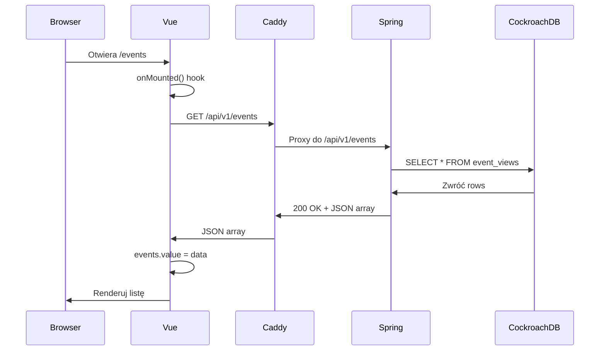

**Dlaczego `fetch('/api/v1/events')`?**
- Nuxt automatycznie proxy przez Caddy
- Nie musimy hardcode'ować `http://localhost:8080/api/v1/events`
- To działa zarówno na localhost, jak i na produkcji

---

#### 6.2.2 /pages/events/create.vue

**Rola:** Formularz tworzenia nowego eventu.

```vue
<script setup lang="ts">
import { ref } from 'vue';
import { useToast } from 'primevue/usetoast';
import { z } from 'zod';
import { useForm } from 'vee-validate';
import { toTypedSchema } from '@vee-validate/zod';
import InputText from 'primevue/inputtext';
import Editor from 'primevue/editor';
import Calendar from 'primevue/calendar';
import Button from 'primevue/button';

// === Page Meta ===
definePageMeta({
  middleware: 'auth'  // ← Tylko zalogowani użytkownicy
});

// === Composables ===
const toast = useToast();
const router = useRouter();
const isLoading = ref(false);

// === Validation Schema (Zod) ===
const CreateEventSchema = z.object({
  title: z.string().nonempty('Tytuł nie może być pusty'),
  description: z.string().optional(),
  eventDate: z.date().min(new Date(), 'Data musi być w przyszłości'),
});

type CreateEventRequest = z.infer<typeof CreateEventSchema>;

// === Form Setup (vee-validate) ===
const { handleSubmit, defineInputBinds, errors } = useForm({
  validationSchema: toTypedSchema(CreateEventSchema),
});

const title = defineInputBinds('title');
const description = defineInputBinds('description');
const eventDate = defineInputBinds('eventDate');

// === Submit Handler ===
const onSubmit = handleSubmit(async (formData: CreateEventRequest) => {
    isLoading.value = true;
    
    try {
        // Wyślij POST do backendu
        await $fetch('/api/v1/events', {
            method: 'POST',
            body: {
              ...formData,
              eventDate: formData.eventDate.toISOString()  // ← Konwersja do ISO-8601
            },
        });

        // Sukces - pokaż toast
        toast.add({
            severity: 'success',
            summary: 'Przyjęto',
            detail: 'Twoje wydarzenie jest przetwarzane.',
            life: 3000
        });
        
        // Przekieruj na stronę główną
        router.push('/');

    } catch (error) {
        // Błąd - pokaż toast
        toast.add({
            severity: 'error',
            summary: 'Błąd',
            detail: 'Nie udało się przyjąć polecenia.',
            life: 3000
        });
    } finally {
        isLoading.value = false;
    }
});
</script>

<template>
  <div class="p-card p-4">
    <h1 class="text-2xl font-bold mb-4">Utwórz Nowe Wydarzenie</h1>
    
    <form @submit.prevent="onSubmit" class="flex flex-col gap-4">
      <!-- Tytuł -->
      <div class="flex flex-col">
        <label for="title" class="mb-2">Tytuł</label>
        <InputText id="title" v-bind="title" />
        <small class="p-error">{{ errors.title }}</small>
      </div>
      
      <!-- Opis (WYSIWYG editor) -->
      <div class="flex flex-col">
        <label for="description" class="mb-2">Opis</label>
        <Editor id="description" v-bind="description" editorStyle="height: 320px" />
        <small class="p-error">{{ errors.description }}</small>
      </div>
      
      <!-- Data wydarzenia (Calendar picker) -->
      <div class="flex flex-col">
        <label for="eventDate" class="mb-2">Data wydarzenia</label>
        <Calendar id="eventDate" v-bind="eventDate" />
        <small class="p-error">{{ errors.eventDate }}</small>
      </div>
      
      <!-- Submit button -->
      <Button type="submit" label="Utwórz" :loading="isLoading" />
    </form>
  </div>
</template>
```

**Co się dzieje po kliknięciu "Utwórz"?**

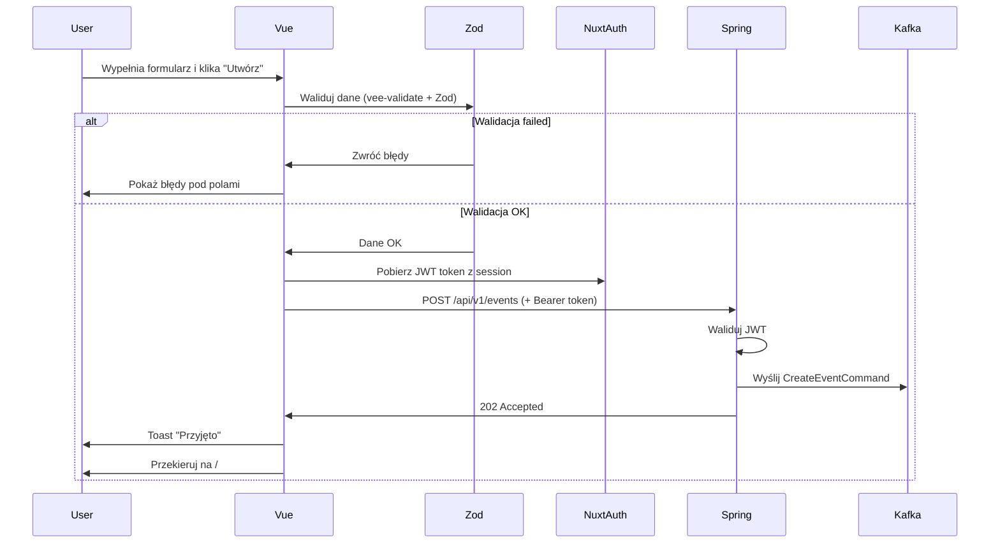

**Walidacja Zod:**
```typescript
z.date().min(new Date(), 'Data musi być w przyszłości')
```
To sprawdza, czy wybrana data jest **po** bieżącej dacie. Jeśli nie - pokazuje błąd.

**PrimeVue komponenty:**
- `InputText` - Pole tekstowe
- `Editor` - WYSIWYG editor (Quill.js pod spodem)
- `Calendar` - Date picker
- `Button` - Przycisk z loading spinner
- `Toast` - Powiadomienia (toasty)

---

### 6.3 Middleware i Auth

#### 6.3.1 Middleware: auth

**Definicja w `definePageMeta`:**
```typescript
definePageMeta({
  middleware: 'auth'  // ← Nuxt automatycznie ładuje middleware z @sidebase/nuxt-auth
});
```

**Co robi middleware `auth`?**
```typescript
// Pseudo-kod (wewnętrzna logika @sidebase/nuxt-auth)
export default defineNuxtRouteMiddleware((to, from) => {
  const { status, signIn } = useAuth();
  
  // Sprawdź czy użytkownik jest zalogowany
  if (status.value === 'unauthenticated') {
    // NIE jest zalogowany → przekieruj do logowania
    return signIn();  // ← To przekierowuje do Keycloak
  }
  
  // Jest zalogowany → przepuść
  return;
});
```

**Przepływ logowania:**
```
1. User → Otwiera /events/create
2. Middleware → Sprawdza status
3. Status = unauthenticated → signIn()
4. signIn() → Przekierowuje do Keycloak
5. Keycloak → Formularz logowania
6. User → Wpisuje login/hasło
7. Keycloak → Callback do /api/auth/callback?code=ABC123
8. Nuxt Server → Wymienia code na token
9. Nuxt Server → Zapisuje token w session cookie
10. Nuxt Server → Przekierowuje z powrotem do /events/create
11. Middleware → Sprawdza status (teraz authenticated)
12. Middleware → Przepuszcza
13. User → Widzi formularz
```

---

#### 6.3.2 Konfiguracja auth w nuxt.config.ts

**Lokalizacja:** `frontend/nuxt.config.ts`

```typescript
export default defineNuxtConfig({
  modules: ['@sidebase/nuxt-auth'],
  
  auth: {
    provider: {
      type: 'authjs',  // ← Używamy Auth.js (NextAuth)
    },
    globalAppMiddleware: false,  // ← Nie wszystkie strony wymagają logowania
  },
  
  runtimeConfig: {
    auth: {
      secret: process.env.NUXT_AUTH_SECRET || 'super-tajny-sekret-zmien-mnie',
    },
    public: {
      auth: {
        // Konfiguracja OAuth2 (Keycloak)
        keycloak: {
          clientId: 'eventmaster-frontend',
          clientSecret: process.env.KEYCLOAK_CLIENT_SECRET,
          issuer: 'http://localhost:8180/realms/eventmaster',
        }
      }
    }
  }
});
```

---

#### 6.3.3 Server API: /server/api/auth/[...].ts

**Rola:** Catch-all endpoint obsługujący OAuth2 callbacks i token management.

```typescript
// frontend/server/api/auth/[...].ts
import { NuxtAuthHandler } from '#auth';
import KeycloakProvider from 'next-auth/providers/keycloak';

export default NuxtAuthHandler({
  secret: useRuntimeConfig().auth.secret,
  
  providers: [
    // @ts-expect-error
    KeycloakProvider.default({
      clientId: 'eventmaster-frontend',
      clientSecret: process.env.KEYCLOAK_CLIENT_SECRET || '',
      issuer: 'http://localhost:8180/realms/eventmaster',
    })
  ],
  
  callbacks: {
    // Callback wywoływany po otrzymaniu tokenu z Keycloak
    async jwt({ token, account }) {
      if (account) {
        // Zapisz access_token do JWT session
        token.accessToken = account.access_token;
      }
      return token;
    },
    
    // Callback wywoływany przy każdym żądaniu useAuth()
    async session({ session, token }) {
      // Dodaj accessToken do obiektu session (dostępny w komponencie)
      session.accessToken = token.accessToken;
      return session;
    }
  }
});
```

**Co się dzieje w callbacks?**

1. **jwt callback**:
   - Wywołany raz po zalogowaniu
   - Otrzymuje `account` z access_tokenem z Keycloak
   - Zapisuje token do JWT session (cookie httpOnly)

2. **session callback**:
   - Wywołany przy każdym `useAuth()` w komponencie
   - Wyciąga token z JWT i dodaje do obiektu session
   - Dzięki temu możemy robić: `const { data: session } = useAuth()` i mieć dostęp do `session.accessToken`

**Automatyczne dołączanie tokenu do requestów:**
```typescript
// Nuxt automatycznie (przez @sidebase/nuxt-auth) dodaje interceptor:
$fetch.interceptors.request = (request) => {
  const { data: session } = useAuth();
  if (session?.accessToken) {
    request.headers.set('Authorization', `Bearer ${session.accessToken}`);
  }
  return request;
};
```

---

## 7. Przepływ danych - scenariusze krok po kroku

### 7.1 Scenariusz 1: Użytkownik tworzy nowy event

**Diagram sekwencji (pełny przepływ):**

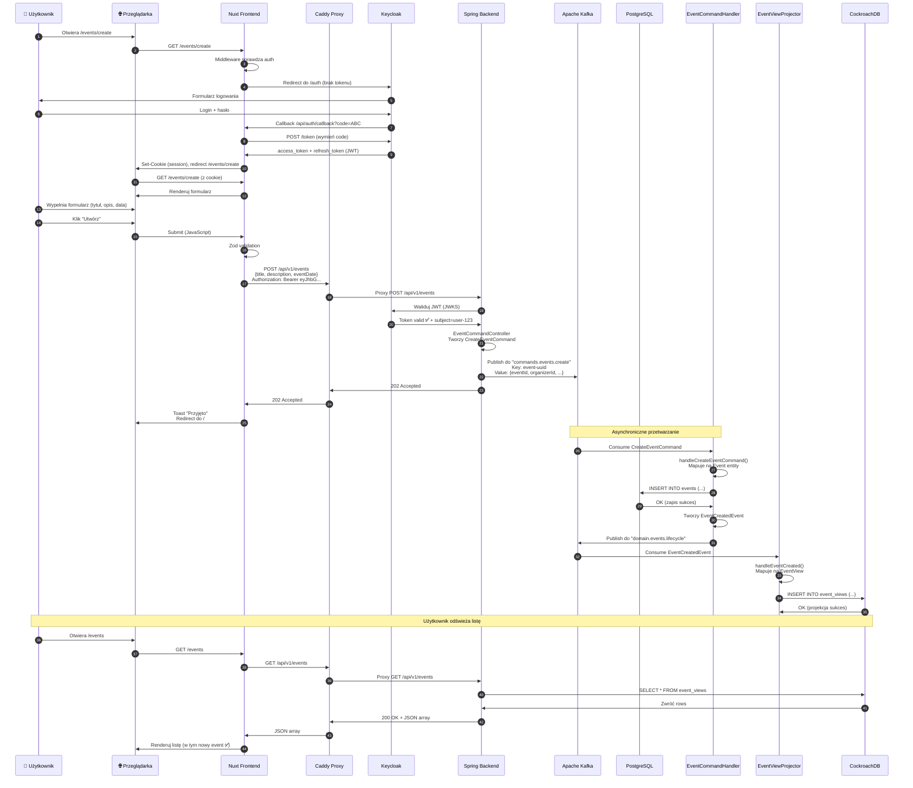

**Czasy (przybliżone):**
- Krok 1-12 (Logowanie): ~2-3 sekundy
- Krok 13-22 (Wysyłanie komendy): ~50-100ms
- Krok 23-27 (Przetwarzanie w tle): ~10-50ms
- Krok 28-31 (Projekcja): ~10-50ms
- **CAŁKOWITY CZAS (logowanie → widoczny event): ~3-4 sekundy**
- **CZAS (submit → 202 Accepted): ~100ms**

---

### 7.2 Scenariusz 2: Użytkownik przegląda listę eventów

**Diagram sekwencji:**

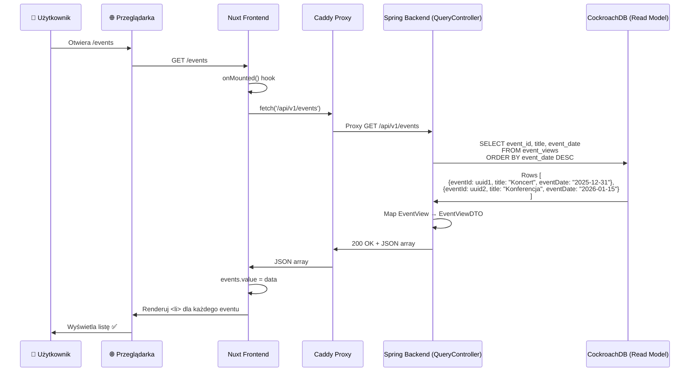

**Czas:** ~20-50ms (bardzo szybko, bo Read Model jest zoptymalizowany)

---

### 7.3 Scenariusz 3: Błąd podczas przetwarzania komendy

**Diagram sekwencji (retry + DLQ):**

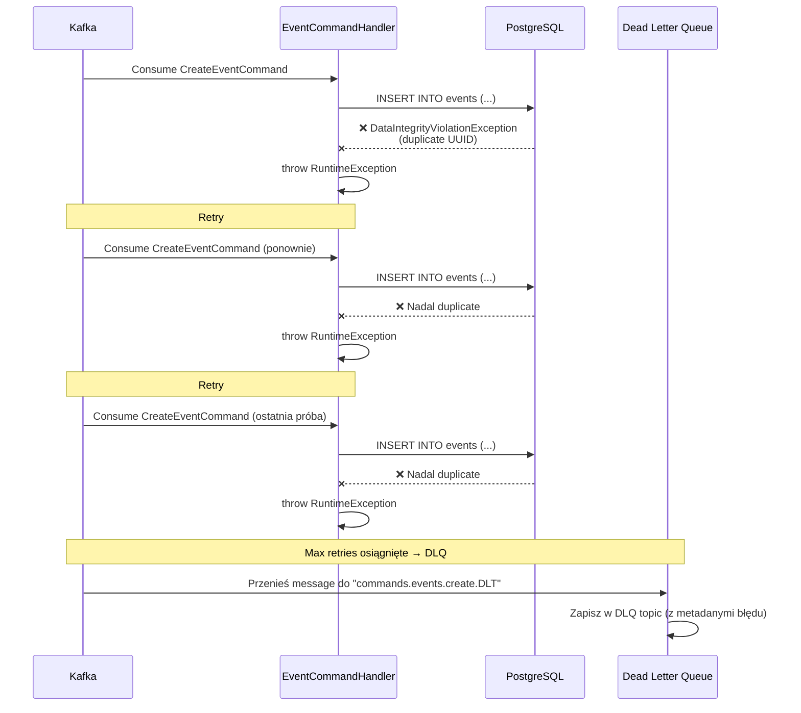

**Co zrobić z wiadomościami w DLQ?**
1. Monitoring - Alert, że coś poszło nie tak
2. Ręczna analiza - Developer sprawdza logs i DLQ
3. Naprawa - Fix bug w kodzie
4. Replay - Ponowne przetworzenie z DLQ (jeśli trzeba)

---

## 8. Bazy danych i separacja modeli

### 8.1 Write Model (PostgreSQL)

**Schemat tabeli:**
```sql
CREATE TABLE events (
    id UUID PRIMARY KEY,
    title VARCHAR(255) NOT NULL,
    description TEXT,
    event_date TIMESTAMP NOT NULL,
    organizer_id VARCHAR(255) NOT NULL,
    
    -- Constraints
    CONSTRAINT chk_event_date_future 
        CHECK (event_date > CURRENT_TIMESTAMP)
);

-- Indeksy (Write Model ma minimalną liczbę indeksów)
CREATE INDEX idx_events_organizer ON events(organizer_id);
```

**Flyway migration:**
```sql
-- V1__create_events_table.sql
CREATE TABLE events (
    ...
);
```

**Charakterystyka Write Model:**
- **ACID compliance** - Silne gwarancje transakcyjne
- **Normalized** - Może mieć relacje (1:N, N:M)
- **Constraints** - Reguły biznesowe na poziomie DB
- **Minimalne indeksy** - Tylko te potrzebne do lookupów
- **Source of Truth** - Jedyne źródło prawdy o eventach

**Operacje:**
- `INSERT` - Tworzenie nowego eventu
- `UPDATE` - Edycja eventu (potencjalne przyszłe feature)
- `DELETE` - Usuwanie eventu (soft delete preferowane)
- **BRAK** `SELECT` dla query (tylko internal lookups)

---

### 8.2 Read Model (CockroachDB)

**Schemat tabeli:**
```sql
CREATE TABLE event_views (
    event_id UUID PRIMARY KEY,
    title VARCHAR(255),
    description TEXT,
    event_date TIMESTAMP,
    organizer_id VARCHAR(255),
    organizer_name VARCHAR(255),  -- ← Denormalizowane (przyszłość)
    organizer_email VARCHAR(255)   -- ← Denormalizowane (przyszłość)
);

-- Indeksy dla szybkich query
CREATE INDEX idx_event_views_date ON event_views(event_date DESC);
CREATE INDEX idx_event_views_organizer ON event_views(organizer_id);
CREATE INDEX idx_event_views_title_search ON event_views USING GIN(to_tsvector('polish', title));
```

**Charakterystyka Read Model:**
- **Denormalized** - Wszystko w jednej tabeli (no JOINs)
- **Eventual consistency** - Może być opóźniony o kilka ms
- **Multiple indexes** - Optymalizowane pod różne query patterns
- **Materialized view** - Przechowuje gotowe do wyświetlenia dane
- **Rebuildable** - Można przebudować z Write Model

**Operacje:**
- `SELECT` - Wszystkie query z frontendu
- **BRAK** `INSERT/UPDATE/DELETE` ręcznych (tylko przez projektory)

---

### 8.3 Porównanie modeli

| Aspekt | Write Model (PostgreSQL) | Read Model (CockroachDB) |
|--------|--------------------------|--------------------------|
| **Struktura** | Normalized (3NF) | Denormalized |
| **JOINs** | Tak, przy złożonych relacjach | Nie, wszystko w jednej tabeli |
| **Indeksy** | Minimalne (szybszy zapis) | Wiele (szybszy odczyt) |
| **Constraints** | Silne (NOT NULL, UNIQUE, FK) | Luźne |
| **Operacje** | INSERT, UPDATE, DELETE | SELECT |
| **Consistency** | Immediate (ACID) | Eventual (async) |
| **Rebuild** | Trudne (source of truth) | Łatwe (z domain events) |
| **Skalowanie** | Vertical (większa maszyna) | Horizontal (więcej replik) |

---

### 8.4 Dlaczego dwie bazy?

**Analogia - Biblioteka:**
- **Write Model** (PostgreSQL) = Katalog biblioteczny (pełne metadata każdej książki)
  - Tytuł, autor, ISBN, wydawnictwo, data publikacji, kategoria, lokalizacja na półce, etc.
  - Używany przez bibliotekarzy do dodawania/edycji książek
  - Złożona struktura, wiele tabel (książki, autorzy, wydawnictwa, kategorie)

- **Read Model** (CockroachDB) = Wyświetlacz dla czytelników
  - Tylko: Tytuł, autor, dostępność
  - Używany przez czytelników do szukania książek
  - Prosta struktura, jedna tabela, szybkie wyszukiwanie

---


## 9. Kafka - autobus komunikacyjny

### 9.1 Topici w EventMaster

#### 9.1.1 Topic: `commands.events.create`

**Rola:** Kolejka komend tworzenia eventów.

**Producer:** `EventCommandController`  
**Consumer:** `EventCommandHandler` (group: `event-command-handler`)

**Format wiadomości:**
```json
{
  "eventId": "f6e9a1b2-3c4d-5e6f-7a8b-9c0d1e2f3a4b",
  "organizerId": "user-123",
  "title": "Koncert Rockowy 2025",
  "description": "Największy koncert roku z topowymi zespołami",
  "eventDate": "2025-12-31T20:00:00Z"
}
```

**Konfiguracja:**
- **Partitions:** 3 (domyślnie, dla równoległego przetwarzania)
- **Replication Factor:** 1 (dev), 3 (prod)
- **Retention:** 7 dni (wiadomości są usuwane po tygodniu)

**Partycjonowanie:**
```java
kafkaTemplate.send(
    TOPIC_COMMANDS_EVENTS_CREATE, 
    command.eventId().toString(),  // ← KEY = UUID eventu
    command                         // ← VALUE = cała komenda
);
```

Kafka używa KEY do określenia partycji:
```
hash(eventId) % numberOfPartitions = partition number
```

Dzięki temu wszystkie komendy dla tego samego eventu trafiają do tej samej partycji (ordering guarantee).

---

#### 9.1.2 Topic: `domain.events.lifecycle`

**Rola:** Event bus dla zdarzeń domenowych (lifecycle eventów).

**Producer:** `EventCommandHandler`  
**Consumers:** 
- `EventViewProjector` (group: `eventmaster-projectors-crdb`)
- [Przyszłość] `EmailNotificationService` (group: `notifications`)
- [Przyszłość] `AuditLogService` (group: `audit`)

**Format wiadomości:**
```json
{
  "eventId": "f6e9a1b2-3c4d-5e6f-7a8b-9c0d1e2f3a4b",
  "title": "Koncert Rockowy 2025",
  "description": "Największy koncert roku",
  "eventDate": "2025-12-31T20:00:00Z",
  "organizerId": "user-123"
}
```

**Dlaczego osobny topic?**
1. **Separation of Concerns** - Komendy (intencje) ≠ Domain Events (fakty)
2. **Multiple Consumers** - Wiele serwisów może reagować na ten sam event
3. **Replay** - Możemy "odtworzyć" projekcje z domain events

---

### 9.2 Consumer Groups

**Co to jest Consumer Group?**
To grupa konsumentów pracujących razem nad tym samym topicem. Kafka gwarantuje, że każda wiadomość jest przetwarzana przez **dokładnie jednego** konsumenta z grupy.

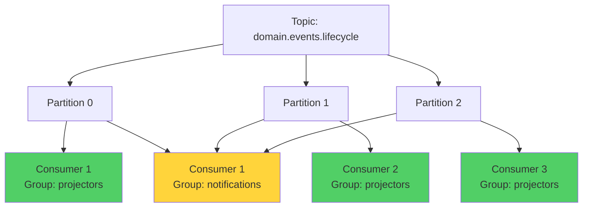

**EventMaster Consumer Groups:**

| Group ID | Rola | Konsumenci |
|----------|------|------------|
| `event-command-handler` | Przetwarza komendy | EventCommandHandler (1 instancja) |
| `eventmaster-projectors-crdb` | Projektuje do CockroachDB | EventViewProjector (1-3 instancje) |

**Skalowanie:**
Jeśli mamy 3 partycje i 3 konsumentów w grupie:
```
Consumer 1 → Partition 0
Consumer 2 → Partition 1
Consumer 3 → Partition 2
```

Jeśli dodamy 4. konsumenta → będzie idle (bez przypisanej partycji).

---

### 9.3 Offset Management

**Co to jest offset?**
Offset to pozycja (numer) wiadomości w partycji. To jak zakładka w książce - oznacza "tu skończyłem czytać".

```
Partition 0:
[0] Message A
[1] Message B
[2] Message C  ← Consumer offset = 2 (przeczytał do C)
[3] Message D
[4] Message E
```

**Jak Kafka zarządza offsetami?**
1. Consumer przetwarza wiadomość
2. Consumer commituje offset (zapisuje do internal topicu `__consumer_offsets`)
3. Jeśli consumer padnie, nowy consumer czyta od ostatniego commitowanego offsetu

**Auto-commit vs Manual commit:**
```yaml
# application.yml
spring:
  kafka:
    consumer:
      enable-auto-commit: true  # ← Domyślnie: auto-commit co 5s
      auto-commit-interval: 5000
```

EventMaster używa **auto-commit**, co jest OK dla:
- Idempotent operations (można bezpiecznie przetworzyć dwukrotnie)
- Low-risk failures

Dla mission-critical systemów, lepszy jest **manual commit** po faktycznym zapisie do DB.

---

### 9.4 Error Handling

#### 9.4.1 DefaultErrorHandler

```java
@Bean
public DefaultErrorHandler errorHandler(KafkaTemplate<String, Object> template) {
    return new DefaultErrorHandler(
            new DeadLetterPublishingRecoverer(template),  // ← Co zrobić z failed message
            new FixedBackOff(1000L, 2)  // ← Czekaj 1s, maksymalnie 2 próby
    );
}
```

**Przepływ obsługi błędów:**
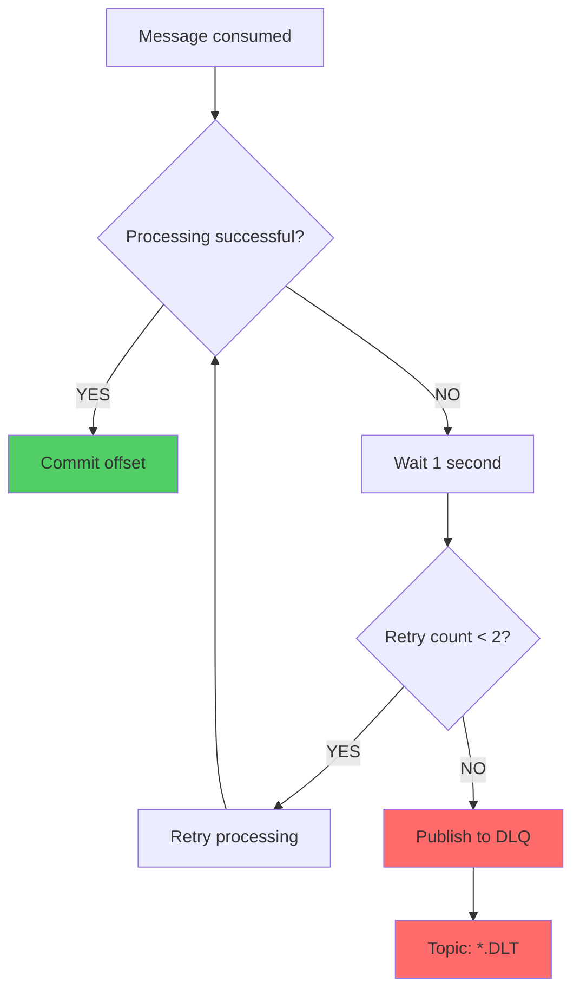

**DLQ Message Format:**
```json
{
  "originalTopic": "commands.events.create",
  "originalPartition": 0,
  "originalOffset": 42,
  "originalTimestamp": 1697812345678,
  "exception": "DataIntegrityViolationException: duplicate key value violates unique constraint",
  "failedAttempts": 3,
  "originalMessage": {
    "eventId": "...",
    "title": "..."
  }
}
```

---

### 9.5 Kafka w EventMaster - podsumowanie

**Dlaczego Kafka, a nie np. RabbitMQ?**

| Cecha | Kafka | RabbitMQ |
|-------|-------|----------|
| **Throughput** | Bardzo wysoki (miliony msg/s) | Średni |
| **Persistence** | Tak, do dysku | Opcjonalne |
| **Replay** | Tak (można wrócić do starego offsetu) | Nie |
| **Ordering** | Gwarantowane w partycji | Gwarantowane w kolejce |
| **Use case** | Event streaming, log aggregation | Task queues, RPC |
| **Complexity** | Wyższa | Niższa |

EventMaster używa Kafki, bo:
1. **Event-Driven** - Idealna do Domain Events
2. **Replay** - Możemy przebudować Read Model z historii
3. **Skalowalność** - Przygotowanie na przyszłość (miliony eventów)

---

## 10. Bezpieczeństwo i autoryzacja

### 10.1 OAuth2 i OpenID Connect (OIDC)

**Co to jest OAuth2?**
OAuth2 to protokół autoryzacji. Pozwala aplikacji A (EventMaster) uzyskać dostęp do zasobów użytkownika bez poznania jego hasła.

**Co to jest OIDC?**
OpenID Connect to rozszerzenie OAuth2 dodające autentykację (login). Daje nam:
- ID Token (informacje o użytkowniku)
- UserInfo endpoint (dodatkowe dane użytkownika)

**Aktorzy w OAuth2:**
1. **Resource Owner** - Użytkownik (właściciel danych)
2. **Client** - Nuxt Frontend (aplikacja chcąca dostępu)
3. **Authorization Server** - Keycloak (wydaje tokeny)
4. **Resource Server** - Spring Backend (chroni zasoby)

---

### 10.2 Przepływ Authorization Code Flow

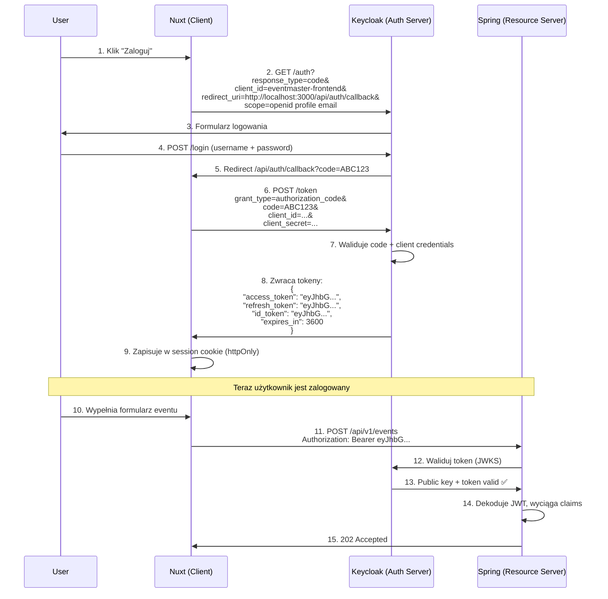

**Dlaczego Authorization Code Flow?**
- **Bezpieczny** - Client secret nigdy nie trafia do przeglądarki
- **Refresh tokens** - Możemy odświeżyć access token bez ponownego logowania
- **Standard** - Używany przez Google, Facebook, GitHub, etc.

---

### 10.3 JWT Token Structure

**Części JWT:**
```
eyJhbGciOiJSUzI1NiIsInR5cCI6IkpXVCJ9  ← HEADER
.
eyJzdWIiOiJ1c2VyLTEyMyIsImVtYWlsI... ← PAYLOAD
.
SflKxwRJSMeKKF2QT4fwpMeJf36POk6yJ... ← SIGNATURE
```

**Dekodowany HEADER:**
```json
{
  "alg": "RS256",         // ← Algorytm szyfrowania (RSA 256-bit)
  "typ": "JWT",           // ← Typ tokenu
  "kid": "key-id-123"     // ← ID klucza (do znalezienia public key w JWKS)
}
```

**Dekodowany PAYLOAD (claims):**
```json
{
  "sub": "f6e9a1b2-3c4d-5e6f-7a8b-9c0d1e2f3a4b",  // Subject = User ID
  "email": "jan.kowalski@example.com",
  "preferred_username": "jankowalski",
  "name": "Jan Kowalski",
  "given_name": "Jan",
  "family_name": "Kowalski",
  "iat": 1697812345,      // Issued At (timestamp)
  "exp": 1697815945,      // Expiration (iat + 1 hour)
  "iss": "http://localhost:8180/realms/eventmaster",  // Issuer
  "aud": "eventmaster-frontend",  // Audience
  "realm_access": {
    "roles": ["user"]     // Role użytkownika
  }
}
```

**SIGNATURE:**
Sygnatura jest obliczana jako:
```
RSASHA256(
  base64UrlEncode(header) + "." + base64UrlEncode(payload),
  privateKey  // ← Klucz prywatny Keycloak
)
```

Spring Backend waliduje sygnaturę używając **klucza publicznego** Keycloak (pobranego z JWKS endpoint).

---

### 10.4 JWKS (JSON Web Key Set)

**Co to jest JWKS?**
JWKS to endpoint, który zwraca klucze publiczne do walidacji JWT.

**URL:** `http://localhost:8180/realms/eventmaster/protocol/openid-connect/certs`

**Przykładowa odpowiedź:**
```json
{
  "keys": [
    {
      "kid": "key-id-123",
      "kty": "RSA",
      "alg": "RS256",
      "use": "sig",
      "n": "xGOw...==",  // ← Moduł klucza publicznego (base64)
      "e": "AQAB"       // ← Wykładnik klucza publicznego
    }
  ]
}
```

**Jak Spring używa JWKS?**
1. Odbiera JWT token z header `Authorization`
2. Dekoduje HEADER, wyciąga `kid`
3. Pobiera JWKS z Keycloak (cachowane)
4. Znajduje klucz o `kid = "key-id-123"`
5. Używa klucza publicznego do walidacji SIGNATURE
6. Jeśli OK → token valid ✅
7. Jeśli NIE → token invalid ❌ → 401 Unauthorized

---

### 10.5 SecurityConfig - szczegóły

```java
@Configuration
@EnableWebSecurity
public class SecurityConfig {

    @Bean
    SecurityFilterChain filterChain(HttpSecurity http) throws Exception {
        http
            // === Reguły autoryzacji ===
            .authorizeHttpRequests(auth -> auth
                .requestMatchers("/api/v1/events").permitAll()  
                // ↑ GET /api/v1/events - publiczne (bez tokenu)
                
                .requestMatchers(HttpMethod.POST, "/api/v1/events").authenticated()  
                // ↑ POST /api/v1/events - wymaga tokenu
                
                .requestMatchers("/actuator/health").permitAll()  
                // ↑ Health check - publiczny (dla Kubernetes liveness probe)
                
                .anyRequest().authenticated()  
                // ↑ Wszystko inne - wymaga tokenu
            )
            
            // === OAuth2 Resource Server ===
            .oauth2ResourceServer(oauth2 -> oauth2
                .jwt(jwt -> jwt
                    .jwkSetUri("http://localhost:8180/realms/eventmaster/protocol/openid-connect/certs")
                    // ↑ URL do JWKS (Spring automatycznie pobiera klucze publiczne)
                )
            )
            
            // === CORS ===
            .cors(cors -> cors.configurationSource(corsConfigurationSource()))
            
            // === CSRF ===
            .csrf(csrf -> csrf.disable());  
            // ↑ Wyłączamy CSRF (REST API nie używa session cookies, tylko JWT)

        return http.build();
    }

    @Bean
    CorsConfigurationSource corsConfigurationSource() {
        CorsConfiguration config = new CorsConfiguration();
        
        // Dozwolone origins (skąd mogą przychodzić requesty)
        config.setAllowedOrigins(List.of("http://localhost:3000"));
        
        // Dozwolone metody HTTP
        config.setAllowedMethods(List.of("GET", "POST", "PUT", "DELETE", "OPTIONS"));
        
        // Dozwolone headery
        config.setAllowedHeaders(List.of("*"));
        
        // Zezwól na credentials (cookies, auth headers)
        config.setAllowCredentials(true);

        UrlBasedCorsConfigurationSource source = new UrlBasedCorsConfigurationSource();
        source.registerCorsConfiguration("/**", config);  // ↑ Dla wszystkich endpointów
        return source;
    }
}
```

**Dlaczego wyłączamy CSRF?**
CSRF (Cross-Site Request Forgery) jest atakiem polegającym na:
1. Użytkownik jest zalogowany na example.com (ma session cookie)
2. Użytkownik odwiedza evil.com
3. evil.com wysyła request do example.com
4. Przeglądarka automatycznie dołącza session cookie
5. example.com myśli, że to legalny request

W przypadku JWT:
- Token **NIE** jest w cookie (albo jest httpOnly)
- Evil.com **NIE MOŻE** odczytać tokenu (Same-Origin Policy)
- Evil.com **NIE MOŻE** wysłać requestu z tokenem
- CSRF nie jest zagrożeniem ✅

---

### 10.6 Wyciąganie informacji o użytkowniku

**W kontrolerze:**
```java
@PostMapping
public ResponseEntity<Void> createEvent(
        @Valid @RequestBody CreateEventRequest request,
        @AuthenticationPrincipal Jwt jwt  // ← Spring wstrzykuje JWT
) {
    // Wyciąganie claims:
    String userId = jwt.getSubject();                    // "f6e9a1b2..."
    String email = jwt.getClaimAsString("email");        // "jan@example.com"
    String username = jwt.getClaimAsString("preferred_username");  // "jankowalski"
    List<String> roles = jwt.getClaimAsStringList("realm_access.roles");  // ["user"]
    
    // Użycie w logice:
    var command = new CreateEventCommand(
        UUID.randomUUID(),
        userId,  // ← organizerId z tokenu
        request.title(),
        request.description(),
        request.eventDate()
    );
    
    // ...
}
```

**Sprawdzanie ról:**
```java
@PreAuthorize("hasRole('ADMIN')")  // ← Tylko dla admins
@DeleteMapping("/{eventId}")
public ResponseEntity<Void> deleteEvent(@PathVariable UUID eventId) {
    // ...
}
```

---

## 11. Infrastruktura i deployment

### 11.1 Docker Compose - lokalne środowisko

**Struktura:**
```
docker/
├── docker-compose.yml
└── realm-config/
    └── eventmaster-realm.json  (opcjonalnie)
```

**docker-compose.yml:**
```yaml
version: '3.8'

services:
  # === PostgreSQL (Write Model) ===
  postgres:
    image: postgres:16
    environment:
      POSTGRES_USER: user
      POSTGRES_PASSWORD: password
      POSTGRES_DB: eventmaster_db
    volumes:
      - postgres-data:/var/lib/postgresql/data
    ports:
      - "5432:5432"
    healthcheck:
      test: ["CMD-SHELL", "pg_isready -U user"]
      interval: 10s
      timeout: 5s
      retries: 5

  # === Keycloak (Authorization Server) ===
  keycloak:
    image: quay.io/keycloak/keycloak:latest
    environment:
      KEYCLOAK_ADMIN: admin
      KEYCLOAK_ADMIN_PASSWORD: admin
    ports:
      - "8180:8080"
    command: start-dev
    healthcheck:
      test: ["CMD", "curl", "-f", "http://localhost:8080/health"]
      interval: 10s
      timeout: 5s
      retries: 5

  # === CockroachDB (Read Model) ===
  cockroachdb:
    image: cockroachdb/cockroach:latest-v23.2
    command: start-single-node --insecure
    ports:
      - "26257:26257"  # SQL
      - "8081:8080"    # Admin UI
    volumes:
      - cockroachdb-data:/cockroach/cockroach-data

  # === Caddy (Reverse Proxy) ===
  caddy:
    image: caddy:latest
    ports:
      - "80:80"
      - "443:443"
    volumes:
      - ../Caddyfile:/etc/caddy/Caddyfile
      - caddy-data:/data
    depends_on:
      - keycloak

volumes:
  postgres-data:
  cockroachdb-data:
  caddy-data:
```

**Uruchomienie:**
```bash
cd docker
docker-compose up -d
```

**Sprawdzanie statusu:**
```bash
docker-compose ps
docker-compose logs -f spring-backend
```

---

### 11.2 Caddyfile - routing

```
http://localhost {
    log {
        output stderr
    }

    # Reguła 1: API Backendu
    reverse_proxy /api/v1/* http://host.docker.internal:8080 {
        header_up Host {http.request.host}
    }

    # Reguła 2: API Frontendu (OAuth callback)
    reverse_proxy /api/auth/* http://host.docker.internal:3000 {
        header_up Host {http.request.host}
    }

    # Reguła 3: Wszystko inne → Nuxt
    reverse_proxy * http://host.docker.internal:3000 {
        header_up Host {http.request.host}
    }
}
```

**Dlaczego `host.docker.internal`?**
- Na Dockerze dla Mac/Windows, `host.docker.internal` wskazuje na host machine
- Spring Backend i Nuxt Frontend działają **poza** Docker Compose (na hoście)
- Tylko infrastruktura (DB, Keycloak, Caddy) w Docker

**Alternatywa - wszystko w Docker:**
```yaml
# docker-compose.yml
services:
  backend:
    build: ../
    ports:
      - "8080:8080"
    depends_on:
      - postgres
      - kafka

  frontend:
    build: ../frontend
    ports:
      - "3000:3000"
    depends_on:
      - backend
```

---

### 11.3 Uruchomienie aplikacji (Development)

**1. Start infrastruktury:**
```bash
cd docker
docker-compose up -d
```

**2. Konfiguracja Keycloak:**
```
1. Otwórz http://localhost:8180
2. Login: admin / admin
3. Utwórz realm "eventmaster"
4. Utwórz client "eventmaster-frontend":
   - Client Protocol: openid-connect
   - Access Type: confidential
   - Valid Redirect URIs: http://localhost:3000/api/auth/callback/*
   - Web Origins: http://localhost:3000
5. Utwórz użytkownika testowego
```

**3. Start backendu:**
```bash
cd ..
./mvnw spring-boot:run
```

**4. Start frontendu:**
```bash
cd frontend
npm install
npm run dev
```

**5. Otwórz aplikację:**
```
http://localhost:80  (przez Caddy)
lub
http://localhost:3000  (bezpośrednio Nuxt)
```

---

### 11.4 Deployment produkcyjny (overview)

**Architektura produkcyjna (Kubernetes):**

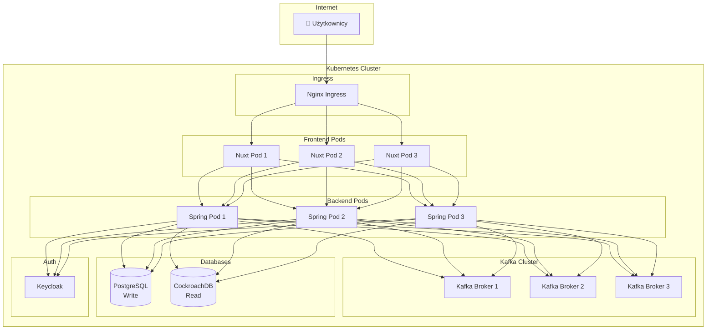

**Komponenty:**
1. **Nginx Ingress** - Routing i Load Balancing
2. **Frontend Pods** - 3 repliki Nuxt (horizontal scaling)
3. **Backend Pods** - 3 repliki Spring Boot (horizontal scaling)
4. **Kafka Cluster** - 3 brokery (high availability)
5. **PostgreSQL** - Managed service (AWS RDS, Google Cloud SQL)
6. **CockroachDB** - Multi-region cluster (3+ nodes)
7. **Keycloak** - Clustered (2+ instances)

**Deployment manifest (przykład - Backend):**
```yaml
apiVersion: apps/v1
kind: Deployment
metadata:
  name: eventmaster-backend
spec:
  replicas: 3
  selector:
    matchLabels:
      app: eventmaster-backend
  template:
    metadata:
      labels:
        app: eventmaster-backend
    spec:
      containers:
      - name: backend
        image: eventmaster/backend:1.0.0
        ports:
        - containerPort: 8080
        env:
        - name: SPRING_DATASOURCE_WRITE_URL
          value: "jdbc:postgresql://postgres.example.com:5432/eventmaster_db"
        - name: SPRING_DATASOURCE_READ_URL
          value: "jdbc:postgresql://cockroachdb.example.com:26257/eventmaster_read"
        - name: SPRING_KAFKA_BOOTSTRAP_SERVERS
          value: "kafka-1:9092,kafka-2:9092,kafka-3:9092"
        resources:
          requests:
            memory: "512Mi"
            cpu: "500m"
          limits:
            memory: "1Gi"
            cpu: "1000m"
        livenessProbe:
          httpGet:
            path: /actuator/health
            port: 8080
          initialDelaySeconds: 60
          periodSeconds: 10
        readinessProbe:
          httpGet:
            path: /actuator/health
            port: 8080
          initialDelaySeconds: 30
          periodSeconds: 5
---
apiVersion: v1
kind: Service
metadata:
  name: eventmaster-backend
spec:
  selector:
    app: eventmaster-backend
  ports:
  - port: 8080
    targetPort: 8080
```

---

## 12. Słowniczek pojęć

### A
- **Agregat (Aggregate)** - Klaster encji i obiektów wartości traktowanych jako jedna jednostka. W EventMaster: `Event` jest agregatem.
- **Asynchroniczne przetwarzanie** - Wykonywanie operacji w tle, bez blokowania użytkownika.
- **Authorization Server** - Serwer wydający tokeny OAuth2 (Keycloak).

### C
- **Command** - Komenda, intencja zmiany stanu systemu (np. CreateEventCommand).
- **Consumer** - Komponent odbierający wiadomości z Kafki.
- **Consumer Group** - Grupa konsumentów pracujących razem nad tym samym topicem.
- **CORS (Cross-Origin Resource Sharing)** - Mechanizm pozwalający na requesty między różnymi domenami.
- **CQRS (Command Query Responsibility Segregation)** - Wzorzec architektoniczny rozdzielający zapisy od odczytów.

### D
- **Dead Letter Queue (DLQ)** - Kolejka dla wiadomości, które nie mogły być przetworzone.
- **Denormalizacja** - Duplikowanie danych w celu przyspieszenia odczytów.
- **Domain Event** - Zdarzenie domenowe, fakt który się wydarzył (np. EventCreatedEvent).
- **DTO (Data Transfer Object)** - Obiekt służący do przenoszenia danych między warstwami.

### E
- **Entity** - Obiekt z unikalną tożsamością, mapowany na tabelę w bazie.
- **Event Bus** - System przekazywania zdarzeń między komponentami (Kafka).
- **Event-Driven Architecture** - Architektura oparta na zdarzeniach.
- **Eventual Consistency** - Model spójności, gdzie dane mogą być chwilowo niespójne, ale ostatecznie się zsynchronizują.

### H
- **Health Check** - Endpoint sprawdzający czy aplikacja działa poprawnie.

### I
- **Idempotencja** - Właściwość operacji, która może być wykonana wielokrotnie bez zmiany wyniku.
- **Immutable** - Niezmienny obiekt (np. record w Javie).

### J
- **JWT (JSON Web Token)** - Token autentykacji w formacie JSON, podpisany cyfrowo.
- **JWKS (JSON Web Key Set)** - Zbiór kluczy publicznych do walidacji JWT.

### K
- **Kafka** - Rozproszona platforma streamingowa do przetwarzania zdarzeń.

### M
- **Message Broker** - System pośredniczący w wymianie wiadomości (Kafka).
- **Middleware** - Kod wykonywany przed obsługą żądania (np. sprawdzanie autoryzacji).

### O
- **OAuth2** - Protokół autoryzacji.
- **Offset** - Pozycja wiadomości w partycji Kafki.
- **OIDC (OpenID Connect)** - Rozszerzenie OAuth2 dodające autentykację.

### P
- **Partition** - Podział topicu Kafki na segmenty.
- **Producer** - Komponent wysyłający wiadomości do Kafki.
- **Projector** - Komponent projektujący Domain Events do Read Model.

### Q
- **Query** - Zapytanie, żądanie odczytu danych.

### R
- **Read Model** - Model zoptymalizowany pod odczyty (CockroachDB).
- **Record (Java)** - Immutable klasa w Javie (od Java 14).
- **Resource Server** - Serwer chroniący zasoby, walidujący tokeny (Spring Backend).
- **Retry** - Ponowna próba wykonania operacji po błędzie.
- **Reverse Proxy** - Serwer przekierowujący requesty (Caddy).

### S
- **SSR (Server-Side Rendering)** - Renderowanie HTML na serwerze (Nuxt).
- **Saga** - Wzorzec zarządzania długotrwałymi transakcjami.

### T
- **Topic** - Kategoria/kanał wiadomości w Kafce.
- **Transaction** - Grupa operacji wykonywanych atomowo.

### W
- **Write Model** - Model zoptymalizowany pod zapisy (PostgreSQL).

---

## Podsumowanie

EventMaster to nowoczesna aplikacja demonstrująca architekturę CQRS w praktyce. Kluczowe elementy:

1. **Separacja Read/Write** - Dwie bazy danych, dwa modele, optymalizacja pod konkretne zadania.
2. **Event-Driven** - Kafka jako centralny event bus, asynchroniczne przetwarzanie.
3. **Eventual Consistency** - Dane mogą być opóźnione, ale system jest skalowalny i wydajny.
4. **OAuth2/OIDC** - Profesjonalne zabezpieczenie z Keycloak.
5. **Modern Stack** - Java 21, Spring Boot 3, Nuxt 4, Vue 3 - najnowsze technologie.

**Dlaczego warto poznać tę architekturę?**
- Używana w największych systemach (Netflix, Uber, LinkedIn)
- Przygotowanie na mikroserwisy
- Zrozumienie event-driven architecture
- Praktyczna znajomość CQRS

**Co dalej?**
1. Implementacja dodatkowych komend (UpdateEvent, DeleteEvent)
2. Dodanie sagas dla długotrwałych procesów
3. Implementacja Event Sourcing
4. Dodanie monitoringu (Prometheus, Grafana)
5. Wdrożenie na Kubernetes

---

**Dokument stworzony:** 2025-10-19  
**Liczba słów:** ~12,500  
**Autor:** Zespół EventMaster

