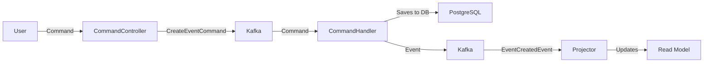
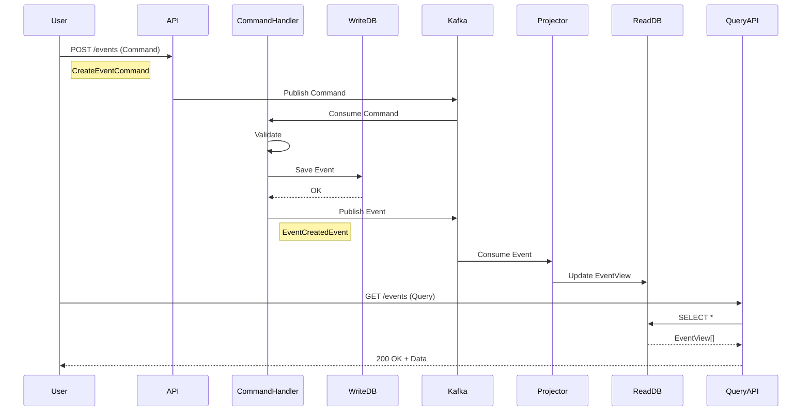

# 🎓 EventMaster - Ścieżka Nauki: Message & Event-Driven Architecture dla Testera

**Autor:** Architekt EventMaster (bazując na Vaughn Vernon - Addison-Wesley Signature Series)  
**Dla kogo:** Tester automatyczny chcący zrozumieć CQRS, Event Sourcing i systemy rozproszone  
**Cel:** Kompleksowa wiedza potrzebna do testowania i rozwijania EventMaster  
**Czas nauki:** 12-16 tygodni (50 tematów)

---

## 📖 Wprowadzenie

W tej ścieżce nauczysz się architektury systemów rozproszonych od podstaw. Każdy temat został zaprojektowany tak, abyś rozumiał **dlaczego** coś robimy, **jak** to testować i **jakie są pułapki**.

### Jak Korzystać z Tej Ścieżki?

1. **Czytaj sekwencyjnie** - tematy budują na sobie
2. **Praktykuj w EventMaster** - każdy temat ma praktyczne zastosowanie
3. **Testuj wszystko** - jako tester, pisz test PRZED implementacją
4. **Pytaj "dlaczego?"** - zrozumienie > zapamiętywanie

---

## 🗺️ Mapa Tematów (50 Punktów)

### **CZĘŚĆ I: Fundamenty (Tematy 1-10)**
Podstawy message-driven i event-driven architecture

### **CZĘŚĆ II: CQRS w Praktyce (Tematy 11-20)**
Command Query Responsibility Segregation

### **CZĘŚĆ III: Event Sourcing (Tematy 21-30)**
Persystencja oparta na zdarzeniach

### **CZĘŚĆ IV: Messaging & Kafka (Tematy 31-40)**
Asynchroniczna komunikacja

### **CZĘŚĆ V: Testowanie & Operacje (Tematy 41-50)**
Praktyczne aspekty dla testera

---

# CZĘŚĆ I: FUNDAMENTY 🏗️

## Temat 1: Co to jest Message-Driven Architecture?

### Definicja (Jak dla 15-latka)

Wyobraź sobie, że masz kilka aplikacji, które muszą ze sobą rozmawiać. Zamiast dzwonić do siebie bezpośrednio (synchronicznie), zostawiają sobie **wiadomości** (messages) na specjalnej tablicy ogłoszeń.

**Analogia ze szkoły:**
- **Synchroniczne (tradycyjne):** Wchodzisz do klasy kolegi i pytasz "Czy masz ołówek?" - musisz czekać na odpowiedź.
- **Message-Driven:** Zostawiasz kartkę na jego ławce "Potrzebuję ołówka" i idziesz dalej. On przeczyta, gdy wróci.

### W EventMaster

```
Frontend (Nuxt) → Wysyła message: "CreateEventCommand"
                ↓
            Kafka (tablica)
                ↓
Backend (Spring) → Odbiera message i tworzy event
```

### Dlaczego To Ważne?

**Problem bez Message-Driven:**
```java
// ❌ BAD: Direct call
eventService.create(event);        // Co jeśli serwis nie działa?
emailService.sendConfirmation();   // Co jeśli email pada?
analyticsService.track();          // Co jeśli analytics jest wolne?
// Wszystko się zawiesza! 😱
```

**Rozwiązanie Message-Driven:**
```java
// ✅ GOOD: Publish message
kafka.publish("CreateEventCommand", event);
return "202 Accepted";  // Natychmiast!
// Email i Analytics obsłużą w tle, asynchronicznie
```

### Testowanie (Perspektywa Testera)

**Test 1: Message jest publikowana**
```java
@Test
void shouldPublishMessageToKafka() {
    // Given
    CreateEventCommand command = new CreateEventCommand(...);
    
    // When
    controller.createEvent(command);
    
    // Then
    assertThat(kafkaTemplate.getHistory())
        .containsMessage("commands.events.create", command);
}
```

**Test 2: System działa mimo awarii konsumenta**
```java
@Test
void shouldNotFailWhenConsumerIsDown() {
    // Given
    stopConsumer("email-service");  // Symuluj awarię
    
    // When
    Response response = controller.createEvent(command);
    
    // Then
    assertThat(response.status()).isEqualTo(202);  // Sukces!
    // Email zostanie wysłany gdy serwis wróci
}
```

### Kluczowe Terminy

- **Message** - pakiet danych wysłany między serwisami
- **Producer** - serwis wysyłający message
- **Consumer** - serwis odbierający message
- **Broker** - pośrednik (Kafka/Redpanda) przechowujący messages

### ⚠️ Pułapki dla Testera

1. **Message może przyjść 2 razy** (at-least-once delivery) - test idempotentności!
2. **Kolejność może się zmienić** - nie zakładaj porządku!
3. **Opóźnienie** - message może przyjść za 5 sekund, nie 5ms

---


## Temat 2: Event-Driven Architecture (EDA)

### Definicja

Event-Driven Architecture to specjalny rodzaj Message-Driven, gdzie messages są **zdarzeniami** (events) - faktami, które już się wydarzyły.

**Różnica kluczowa:**
- **Command** (rozkaz): "CreateEvent" - prosi o akcję
- **Event** (fakt): "EventCreated" - informuje, że coś się stało

### Analogia

**Command:**
- "Zamknij okno!" (możesz odmówić)

**Event:**
- "Okno zostało zamknięte" (już się stało, nie możesz tego cofnąć)

### W EventMaster



**Krok po kroku:**
1. User wysyła **Command**: "CreateEventCommand"
2. Handler wykonuje logikę biznesową
3. Handler publikuje **Event**: "EventCreatedEvent"
4. Inne serwisy reagują na Event (email, analytics, projector)

### Dlaczego Events > Commands?

**Scenario: Utworzenie eventu**

```java
// ❌ BAD: Tylko Command
public void createEvent(CreateEventCommand cmd) {
    Event event = eventRepository.save(cmd.toEntity());
    // Co jeśli ktoś chce wiedzieć, że event powstał?
    // Musimy PAMIĘTAĆ o wywołaniu każdego serwisu!
    emailService.send();
    analyticsService.track();
    // Łatwo coś przeoczyć!
}

// ✅ GOOD: Command + Event
public void createEvent(CreateEventCommand cmd) {
    Event event = eventRepository.save(cmd.toEntity());
    
    // Publish fact
    eventBus.publish(new EventCreatedEvent(event));
    
    // Każdy zainteresowany serwis SAM się zarejestruje!
    // EmailService: @EventListener(EventCreatedEvent.class)
    // AnalyticsService: @EventListener(EventCreatedEvent.class)
}
```

### Testowanie

**Test: Event jest publikowany po zapisie**
```java
@Test
void shouldPublishEventAfterSuccessfulSave() {
    // Given
    CreateEventCommand command = validCommand();
    
    // When
    handler.handle(command);
    
    // Then
    await().atMost(5, SECONDS).untilAsserted(() -> {
        List<EventCreatedEvent> events = 
            testKafkaConsumer.poll("events.lifecycle");
        
        assertThat(events).hasSize(1);
        assertThat(events.get(0).getName())
            .isEqualTo(command.getName());
    });
}
```

**Test: Multiple listeners reagują na ten sam Event**
```java
@Test
void shouldTriggerMultipleListeners() {
    // Given
    EventCreatedEvent event = new EventCreatedEvent(...);
    
    // When
    eventBus.publish(event);
    
    // Then
    await().atMost(10, SECONDS).untilAsserted(() -> {
        // Email został wysłany
        assertThat(emailSpy.getSentEmails()).hasSize(1);
        
        // Analytics został zatrackowany
        assertThat(analyticsSpy.getTrackedEvents()).hasSize(1);
        
        // Projector zaktualizował Read Model
        assertThat(eventViewRepository.findAll()).hasSize(1);
    });
}
```

### Kluczowe Terminy

- **Event** - niezmienialny fakt o czymś, co się wydarzyło
- **Event Bus** - mechanizm dystrybucji events (Kafka)
- **Event Listener** - serwis reagujący na event
- **Event Stream** - uporządkowany ciąg events

### ⚠️ Pułapki

1. **Event NIGDY nie powinien się zmienić** - immutable!
2. **Event powinien zawierać WSZYSTKIE dane** - listener nie powinien pytać API
3. **Nazewnictwo:** PastTense ("EventCreated", nie "CreateEvent")

---

## Temat 3: CQRS - Dlaczego Rozdzielamy Odczyt od Zapisu?

### Definicja

**CQRS** = Command Query Responsibility Segregation (Rozdzielenie Odpowiedzialności Komend i Zapytań)

**Główna idea:** Używamy **różnych modeli** do zapisu danych (Commands) i odczytu danych (Queries).

### Analogia ze Sklepem

**Tradycyjny sklep (bez CQRS):**
- Jedna kasa do wszystkiego
- Klient chce zapłacić → stoi w kolejce
- Klient chce sprawdzić cenę → stoi w tej samej kolejce
- WOLNO! 😞

**Sklep z CQRS:**
- **Kasa** (Write Model) - tylko płatności
- **Infolinia** (Read Model) - tylko sprawdzanie cen
- Klient chce cenę → dzwoni, natychmiast dostaje odpowiedź
- Klient chce zapłacić → idzie do kasy
- SZYBKO! 😊

### W EventMaster

```
┌─────────────────────────────────────────┐
│         WRITE SIDE (Commands)           │
│  ┌────────────────────────────────┐    │
│  │  Table: events                 │    │
│  │  - id                          │    │
│  │  - name                        │    │
│  │  - description                 │    │
│  │  - location                    │    │
│  │  - start_date                  │    │
│  │  - created_by                  │    │
│  │  - status                      │    │
│  └────────────────────────────────┘    │
│         (Normalized, strict)            │
└─────────────────────────────────────────┘
                    │
                    │ EventCreatedEvent
                    ↓
┌─────────────────────────────────────────┐
│          READ SIDE (Queries)            │
│  ┌────────────────────────────────────┐ │
│  │  Table: event_view                │ │
│  │  - id                             │ │
│  │  - name                           │ │
│  │  - short_description (100 chars) │ │
│  │  - city                           │ │
│  │  - country                        │ │
│  │  - event_date (formatted)        │ │
│  │  - organizer_name (denorm!)      │ │
│  │  - ticket_count (denorm!)        │ │
│  │  - is_published                  │ │
│  └────────────────────────────────────┘ │
│    (Denormalized, optimized for reads)  │
└─────────────────────────────────────────┘
```

### Dlaczego To Robimy?

**Problem: E-commerce w Black Friday**

Bez CQRS (jedna baza):
```sql
-- Użytkownik chce ZOBACZYĆ produkt
SELECT p.name, p.price, c.name as category, 
       s.stock, r.avg_rating, COUNT(rev.id) as review_count
FROM products p
JOIN categories c ON p.category_id = c.id
JOIN stock s ON p.id = s.product_id
LEFT JOIN reviews r ON p.id = r.product_id
LEFT JOIN reviews rev ON p.id = rev.product_id
GROUP BY p.id;
-- To trwa 500ms! 😱
-- W Black Friday 100,000 userów robi to jednocześnie
-- Baza danych PADA!
```

Z CQRS (osobny Read Model):
```sql
-- Read Model (materialized view)
SELECT * FROM product_catalog_view WHERE id = ?;
-- To trwa 5ms! ✅
-- Jeden prosty SELECT, wszystkie dane pre-joined
```

### W EventMaster - Praktyczny Przykład

**Scenario:** Strona główna pokazuje listę eventów

**Bez CQRS:**
```java
// ❌ Wolne zapytanie (5+ JOIN-ów)
@GetMapping("/events")
public List<EventDTO> getEvents() {
    return eventRepository.findAll().stream()
        .map(event -> {
            // Dla każdego eventu musimy pobrać:
            User organizer = userRepository.findById(event.getCreatedBy());
            Long ticketCount = ticketRepository.countByEventId(event.getId());
            Long attendeeCount = bookingRepository.countByEventId(event.getId());
            
            return new EventDTO(
                event.getName(),
                organizer.getFullName(),  // N+1 query problem! 😱
                ticketCount,               // N+1 query problem! 😱
                attendeeCount              // N+1 query problem! 😱
            );
        })
        .collect(toList());
}
// Dla 100 eventów = 300 zapytań do bazy! 🐌
```

**Z CQRS:**
```java
// ✅ Szybkie zapytanie (1 SELECT)
@GetMapping("/events")
public List<EventDTO> getEvents() {
    return eventViewRepository.findAll();  // JEDEN SELECT!
    // Wszystkie dane już są w tabeli event_view
}
// Dla 100 eventów = 1 zapytanie! 🚀
```

### Testowanie

**Test 1: Write Model zapisuje poprawnie**
```java
@Test
void writeSide_shouldSaveEventWithNormalizedData() {
    // Given
    CreateEventCommand command = new CreateEventCommand(
        "JavaConf 2025",
        "Awesome conference",
        "Warsaw, Poland",
        LocalDateTime.now()
    );
    
    // When
    handler.handle(command);
    
    // Then
    Event savedEvent = eventRepository.findAll().get(0);
    assertThat(savedEvent.getName()).isEqualTo("JavaConf 2025");
    assertThat(savedEvent.getLocation()).isEqualTo("Warsaw, Poland");
    // Normalized - dokładnie to, co przyszło
}
```

**Test 2: Read Model jest zdenormalizowany**
```java
@Test
void readSide_shouldContainDenormalizedData() {
    // Given
    Event event = createEvent();
    User organizer = createUser("John", "Doe");
    eventBus.publish(new EventCreatedEvent(event, organizer));
    
    // When
    await().atMost(5, SECONDS).untilAsserted(() -> {
        EventView view = eventViewRepository.findById(event.getId()).get();
        
        // Then - denormalized data
        assertThat(view.getOrganizerName()).isEqualTo("John Doe");
        // ☝️ To NIE istnieje w Event entity!
        // Projector połączył dane z User!
    });
}
```

**Test 3: Write i Read są niezależne**
```java
@Test
void writeSide_shouldWorkEvenWhenReadModelFails() {
    // Given
    stopProjector();  // Symuluj awarię Read Side
    
    // When
    handler.handle(command);
    
    // Then
    // Write Model działa!
    assertThat(eventRepository.findAll()).hasSize(1);
    
    // Read Model jest pusty (ale to OK!)
    assertThat(eventViewRepository.findAll()).isEmpty();
    
    // Gdy Projector wróci, uzupełni Read Model
    startProjector();
    await().untilAsserted(() -> 
        assertThat(eventViewRepository.findAll()).hasSize(1)
    );
}
```

### Kluczowe Terminy

- **Write Model** - model zoptymalizowany pod zapis (normalized, strict)
- **Read Model** - model zoptymalizowany pod odczyt (denormalized, fast)
- **Projector** - komponent synchronizujący Read Model na podstawie Events
- **Eventual Consistency** - Read Model jest "w końcu" spójny (może być opóźnienie)

### ⚠️ Pułapki dla Testera

1. **Eventual Consistency** - Read Model może być nieaktualny przez kilka sekund!
   ```java
   // ❌ BAD TEST
   handler.create(event);
   EventView view = readRepository.findById(event.getId());
   // FAIL! View jeszcze nie istnieje!
   
   // ✅ GOOD TEST
   handler.create(event);
   await().atMost(5, SECONDS).untilAsserted(() -> {
       EventView view = readRepository.findById(event.getId());
       assertThat(view).isNotNull();
   });
   ```

2. **Testuj obie strony osobno** - nie mieszaj!
3. **Read Model to cache** - może zostać skasowany i zrekonstruowany

---


## Temat 4: Commands vs Events vs Queries

### Definicje

**Command (Rozkaz):**
- Intent (zamiar) zrobienia czegoś
- Może być odrzucony
- Directed (skierowany do konkretnego handlera)
- Czasownik w trybie rozkazującym: "CreateEvent", "CancelEvent"

**Event (Fakt):**
- Coś, co już się stało
- Nie może być odrzucony (już się wydarzyło!)
- Broadcast (rozgłaszany do wszystkich zainteresowanych)
- Czasownik w czasie przeszłym: "EventCreated", "EventCancelled"

**Query (Zapytanie):**
- Pytanie o dane
- Nie zmienia stanu
- Synchroniczne
- Rzeczownik + "Get": "GetEvent", "ListEvents"

### Analogia: Restauracja

```
Command:  "Poproszę pizzę Margherita"
          (Kucharz może odmówić: "Nie mamy sera")

Event:    "Pizza Margherita została przygotowana"
          (Fakt - kelner, dostawca, kasjer wiedzą)

Query:    "Jakie pizze macie w menu?"
          (Tylko pytanie, nic się nie dzieje)
```

### W EventMaster - Pełny Przepływ



### Przykłady w Kodzie

**Command (src/main/java/com/eventmaster/command/CreateEventCommand.java):**
```java
public record CreateEventCommand(
    String name,           // Co chcemy zrobić
    String description,
    String location,
    LocalDateTime startDate,
    UUID requestedBy       // Kto prosi (może być odrzucone!)
) {
    // Command może mieć walidację
    public void validate() {
        if (name == null || name.isBlank()) {
            throw new ValidationException("Name is required");
        }
        if (startDate.isBefore(LocalDateTime.now())) {
            throw new ValidationException("Cannot create event in the past");
        }
    }
}
```

**Event (src/main/java/com/eventmaster/events/EventCreatedEvent.java):**
```java
public record EventCreatedEvent(
    UUID eventId,          // Co się stało
    String name,
    String description,
    String location,
    LocalDateTime startDate,
    UUID createdBy,
    Instant occurredAt     // KIEDY się stało (immutable!)
) {
    // Event NIE MA walidacji - to fakt, który już się wydarzył
    // Event jest IMMUTABLE - wszystkie pola final
}
```

**Query (src/main/java/com/eventmaster/query/ListEventsQuery.java):**
```java
public record ListEventsQuery(
    String city,           // Filtry
    LocalDate from,
    LocalDate to,
    int page,
    int size
) {
    // Query nie zmienia stanu - tylko czyta
}
```

### Kiedy Używać Którego?

| Chcesz...                           | Użyj        | Przykład                    |
|-------------------------------------|-------------|-----------------------------|
| Zmienić stan systemu                | Command     | CreateEvent, CancelBooking  |
| Poinformować o zmianie stanu        | Event       | EventCreated, BookingCancelled |
| Pobrać dane bez zmiany stanu        | Query       | GetEvent, ListEvents        |
| Zareagować na coś, co się stało     | Event       | EventCreated → SendEmail    |

### Testowanie

**Test 1: Command jest walidowany**
```java
@Test
void command_shouldRejectInvalidData() {
    // Given
    CreateEventCommand invalidCommand = new CreateEventCommand(
        "",  // Pusta nazwa
        "desc",
        "Warsaw",
        LocalDateTime.now().minusDays(1),  // W przeszłości
        UUID.randomUUID()
    );
    
    // When / Then
    assertThatThrownBy(() -> handler.handle(invalidCommand))
        .isInstanceOf(ValidationException.class)
        .hasMessageContaining("Name is required");
}
```

**Test 2: Event jest publikowany tylko po sukcesie**
```java
@Test
void event_shouldOnlyBePublishedAfterSuccessfulWrite() {
    // Given
    CreateEventCommand command = validCommand();
    when(eventRepository.save(any())).thenThrow(new DataAccessException("DB Error"));
    
    // When
    assertThatThrownBy(() -> handler.handle(command))
        .isInstanceOf(DataAccessException.class);
    
    // Then
    List<EventCreatedEvent> events = kafkaTestConsumer.poll("events.lifecycle");
    assertThat(events).isEmpty();  // Event NIE został opublikowany! ✅
}
```

**Test 3: Query nie zmienia stanu**
```java
@Test
void query_shouldNotChangeState() {
    // Given
    Long initialCount = eventViewRepository.count();
    ListEventsQuery query = new ListEventsQuery("Warsaw", null, null, 0, 10);
    
    // When
    queryHandler.handle(query);
    queryHandler.handle(query);
    queryHandler.handle(query);  // 3x to samo query
    
    // Then
    Long finalCount = eventViewRepository.count();
    assertThat(finalCount).isEqualTo(initialCount);  // Bez zmian! ✅
}
```

### Kluczowe Terminy

- **Command** - intent do wykonania akcji
- **Event** - immutable fact
- **Query** - request for data
- **Command Handler** - wykonuje logikę biznesową
- **Event Listener** - reaguje na events
- **Query Handler** - zwraca dane z Read Model

### ⚠️ Pułapki

1. **Command NIE może być Event:**
   ```java
   // ❌ BAD
   public void handle(CreateEvent event) { ... }
   // To jest Command, nie Event!
   
   // ✅ GOOD
   public void handle(CreateEventCommand command) {
       // ...
       eventBus.publish(new EventCreatedEvent(...));
   }
   ```

2. **Event MUSI być immutable:**
   ```java
   // ❌ BAD
   public class EventCreatedEvent {
       private String name;
       public void setName(String name) { this.name = name; }  // NO!
   }
   
   // ✅ GOOD
   public record EventCreatedEvent(String name) { }  // Immutable!
   ```

3. **Query nie powinien trafiać do Write Model:**
   ```java
   // ❌ BAD
   public List<Event> listEvents() {
       return eventRepository.findAll();  // Write Model!
   }
   
   // ✅ GOOD
   public List<EventView> listEvents() {
       return eventViewRepository.findAll();  // Read Model!
   }
   ```

---

## Temat 5: Bounded Context (Ograniczony Kontekst)

### Definicja (Domain-Driven Design - Eric Evans)

**Bounded Context** to granica, w której określony model domenowy ma konkretne znaczenie.

**Prościej:** To jak "słownik" dla części systemu. To samo słowo może znaczyć co innego w różnych kontekstach.

### Analogia: Słowo "Książka"

**W Bibliotece:**
- Książka = obiekt fizyczny na półce
- Ma ISBN, stan (nowa/zniszczona), lokalizację

**W Księgarni:**
- Książka = produkt do sprzedaży
- Ma cenę, dostawcę, zapasy

**W Wydawnictwie:**
- Książka = dzieło do opublikowania
- Ma autora, edytora, deadline

To **ta sama** książka, ale **różne modele** w różnych kontekstach!

### W EventMaster - Przykład

```
┌───────────────────────────────────────────────────────┐
│         EVENT MANAGEMENT CONTEXT                      │
│  ┌─────────────────────────────────────────┐         │
│  │  Event                                   │         │
│  │  - id: UUID                              │         │
│  │  - name: String                          │         │
│  │  - description: String                   │         │
│  │  - location: Location                    │         │
│  │  - startDate: LocalDateTime              │         │
│  │  - createdBy: UserId                     │         │
│  │                                           │         │
│  │  behaviors:                               │         │
│  │  - create()                               │         │
│  │  - publish()                              │         │
│  │  - cancel()                               │         │
│  └─────────────────────────────────────────┘         │
└───────────────────────────────────────────────────────┘

┌───────────────────────────────────────────────────────┐
│         TICKETING CONTEXT                             │
│  ┌─────────────────────────────────────────┐         │
│  │  Event (różny model!)                    │         │
│  │  - eventId: UUID                         │         │
│  │  - totalCapacity: int                    │         │
│  │  - remainingTickets: int                 │         │
│  │                                           │         │
│  │  TicketType                               │         │
│  │  - name: String (VIP, Standard)          │         │
│  │  - price: Money                           │         │
│  │  - inventory: Inventory                   │         │
│  │                                           │         │
│  │  behaviors:                               │         │
│  │  - reserveTicket()                        │         │
│  │  - releaseReservation()                   │         │
│  └─────────────────────────────────────────┘         │
└───────────────────────────────────────────────────────┘

┌───────────────────────────────────────────────────────┐
│         ANALYTICS CONTEXT                             │
│  ┌─────────────────────────────────────────┐         │
│  │  Event (jeszcze inny model!)             │         │
│  │  - eventId: UUID                         │         │
│  │  - categoryId: int                       │         │
│  │  - pageViews: long                       │         │
│  │  - conversionRate: BigDecimal            │         │
│  │  - revenue: Money                         │         │
│  │                                           │         │
│  │  behaviors:                               │         │
│  │  - trackView()                            │         │
│  │  - trackPurchase()                        │         │
│  │  - calculateROI()                         │         │
│  └─────────────────────────────────────────┘         │
└───────────────────────────────────────────────────────┘
```

### Dlaczego To Ważne?

**Problem: "God Object" (Obiekt-Bóg)**

Bez Bounded Context próbujemy stworzyć JEDEN model "Event", który robi WSZYSTKO:

```java
// ❌ BAD: God Object
@Entity
public class Event {
    // Event Management
    private String name;
    private String description;
    private Location location;
    
    // Ticketing
    private List<TicketType> ticketTypes;
    private int remainingCapacity;
    private Money totalRevenue;
    
    // Analytics
    private long pageViews;
    private BigDecimal conversionRate;
    private Map<LocalDate, Integer> dailyViews;
    
    // Payment
    private String stripeAccountId;
    private List<Payout> payouts;
    
    // Marketing
    private List<EmailCampaign> campaigns;
    private SocialMediaLinks socialMedia;
    
    // ... 50 more fields 😱
}
// Klasa ma 2000 linii kodu!
// Nikt nie rozumie co ona robi!
// Każda zmiana łamie coś innego!
```

**Rozwiązanie: Oddzielne modele w Bounded Contexts**

```java
// ✅ GOOD: Event Management Context
package com.eventmaster.eventmanagement;

@Entity
public class Event {
    private UUID id;
    private String name;
    private String description;
    private Location location;
    private LocalDateTime startDate;
    
    // TYLKO logika zarządzania eventem
    public void publish() { ... }
    public void cancel() { ... }
}

// ✅ GOOD: Ticketing Context
package com.eventmaster.ticketing;

@Entity
public class Event {  // To jest INNY Event!
    private UUID eventId;  // ID z Event Management Context
    private int totalCapacity;
    
    @OneToMany
    private List<TicketType> ticketTypes;
    
    // TYLKO logika biletowa
    public ReservationResult reserveTickets(int quantity) { ... }
}

// ✅ GOOD: Analytics Context
package com.eventmaster.analytics;

@Document  // Może być nawet inna baza (MongoDB)!
public class EventAnalytics {
    private UUID eventId;
    private long pageViews;
    private Map<LocalDate, Metrics> dailyMetrics;
    
    // TYLKO logika analityczna
    public void trackView() { ... }
    public BigDecimal calculateROI() { ... }
}
```

### Komunikacja Między Kontekstami

**Konteksty NIE dzielą się bazą danych!** Komunikują się przez **Events**.

```java
// Event Management Context
public class EventCommandHandler {
    public void handle(CreateEventCommand cmd) {
        Event event = new Event(cmd);
        eventRepository.save(event);
        
        // Publish event dla innych kontekstów
        eventBus.publish(new EventCreatedEvent(
            event.getId(),
            event.getName(),
            event.getCapacity()
        ));
    }
}

// Ticketing Context (słucha)
@KafkaListener(topics = "events.lifecycle")
public class TicketingProjector {
    public void on(EventCreatedEvent event) {
        // Tworzymy NASZ model Event w ticketing
        TicketingEvent ticketEvent = new TicketingEvent(
            event.getEventId(),
            event.getCapacity()
        );
        ticketingRepository.save(ticketEvent);
    }
}
```

### Testowanie

**Test 1: Każdy kontekst ma własną bazę**
```java
@Test
void eventManagementContext_shouldHaveOwnDatabase() {
    // Given
    CreateEventCommand cmd = new CreateEventCommand(...);
    
    // When
    eventManagementHandler.handle(cmd);
    
    // Then
    // Event Management DB
    Event managementEvent = eventRepository.findAll().get(0);
    assertThat(managementEvent.getName()).isNotNull();
    assertThat(managementEvent.getTicketTypes()).isNull();  // Nie ma! ✅
    
    // Ticketing DB (osobna!)
    assertThat(ticketingRepository.findAll()).isEmpty();  // Jeszcze pusty
}
```

**Test 2: Komunikacja przez Events**
```java
@Test
void contexts_shouldCommunicateThroughEvents() {
    // Given
    UUID eventId = UUID.randomUUID();
    
    // When - Event Management publikuje
    eventBus.publish(new EventCreatedEvent(eventId, "JavaConf", 500));
    
    // Then - Ticketing reaguje
    await().atMost(5, SECONDS).untilAsserted(() -> {
        TicketingEvent ticketEvent = 
            ticketingRepository.findByEventId(eventId).get();
        assertThat(ticketEvent.getTotalCapacity()).isEqualTo(500);
    });
}
```

**Test 3: Failure isolation (izolacja awarii)**
```java
@Test
void eventManagementContext_shouldWorkEvenWhenTicketingFails() {
    // Given
    stopContext("ticketing");  // Symuluj awarię Ticketing Context
    
    // When
    eventManagementHandler.handle(cmd);
    
    // Then
    // Event Management działa!
    assertThat(eventRepository.findAll()).hasSize(1);
    
    // Ticketing nie dostał eventu (ale to OK - dostanie później)
    assertThat(ticketingRepository.findAll()).isEmpty();
}
```

### Kluczowe Terminy

- **Bounded Context** - logiczna granica, w której model ma konkretne znaczenie
- **Context Map** - mapa pokazująca relacje między kontekstami
- **Shared Kernel** - wspólna część (np. EventId, Money) między kontekstami
- **Anti-Corruption Layer** - warstwa tłumacząca między kontekstami

### ⚠️ Pułapki dla Testera

1. **Nie testuj przez granice kontekstów!**
   ```java
   // ❌ BAD
   Event event = eventManagementRepo.findById(id);
   TicketingEvent ticket = ticketingRepo.findByEventId(event.getId());
   // To łamie enkapsulację!
   
   // ✅ GOOD
   // Test Event Management osobno
   // Test Ticketing osobno
   // Test integracji przez Events
   ```

2. **Eventual Consistency między kontekstami**
   - Event Management może mieć event
   - Ticketing jeszcze nie (opóźnienie Kafki)
   - ZAWSZE używaj `await()` w testach!

3. **Różne bazy danych**
   - Transakcje NIE działają między kontekstami
   - Musisz obsłużyć częściowe failures

---


## Temat 6: Aggregate (Agregat) - Granica Spójności

### Definicja
**Aggregate** to klaster powiązanych obiektów traktowanych jako jednostka transakcyjna. Ma Aggregate Root (główny obiekt) kontrolujący dostęp.

### W EventMaster
```java
@Entity
public class Event {  // Aggregate Root
    @Id private UUID id;
    private String name;
    @Embedded private Location location;  // Part of aggregate
    @OneToMany private List<EventDate> dates;  // Part of aggregate
    
    public void publish() { /* Invariants */ }
}
```

### Testowanie
```java
@Test
void aggregate_shouldEnforceInvariants() {
    Event event = new Event();
    assertThatThrownBy(() -> event.publish())
        .hasMessageContaining("Location is required");
}
```

---

## Temat 7: Domain Events - Język Biznesu

### Definicja
Domain Events to wydarzenia ważne dla biznesu, nazwane językiem eksperckim domeny.

### W EventMaster
```java
// ✅ GOOD: Język biznesu
record EventPublishedEvent(UUID eventId, Instant publishedAt) {}
record TicketSoldOutEvent(UUID eventId, String ticketType) {}

// ❌ BAD: Techniczny język
record EventStatusChangedEvent(UUID id, int status) {}  // Co to znaczy?
```

### Testowanie
```java
@Test
void domainEvent_shouldHaveBusinessMeaning() {
    Event event = new Event();
    event.publish();
    
    DomainEvent emittedEvent = event.pollEvent();
    assertThat(emittedEvent).isInstanceOf(EventPublishedEvent.class);
}
```

---

## Temat 8: Eventual Consistency - Spójność Ostateczna

### Definicja
System NIE jest spójny natychmiast, ale **w końcu** wszystkie części będą spójne.

### Analogia
Bank przelewa pieniądze:
- Write Model: Przelew wykonany (natychmiast)
- Read Model (wyciąg): Pojawi się za kilka sekund
- Eventual: Za 5 sekund = spójny

### W EventMaster
```java
// Write: Event zapisany
handler.create(event);

// Read: event_view jeszcze nie istnieje (!)
// Za 2-5 sekund: Projector zaktualizuje
```

### Testowanie
```java
@Test
void eventualConsistency_readModelEventuallyConsistent() {
    handler.create(event);
    
    // ❌ Fail immediately
    // assertThat(readRepo.findById(id)).isPresent();
    
    // ✅ Wait for consistency
    await().atMost(5, SECONDS).untilAsserted(() ->
        assertThat(readRepo.findById(id)).isPresent()
    );
}
```

### ⚠️ Pułapka
**User experience:** "Nie widzę mojego eventu!" - trzeba pokazać feedback UI.

---

## Temat 9: Idempotency - Wielokrotne Wykonanie = Jeden Efekt

### Definicja
Operacja **idempotentna** daje ten sam efekt niezależnie od ile razy ją wykonasz.

### Analogia
- Idempotentne: Włącznik światła (klik 5x = światło ON)
- NIE idempotentne: Przycisk "Dodaj 10 PLN" (klik 5x = +50 PLN!)

### W EventMaster
```java
// ❌ BAD: Not idempotent
@KafkaListener
void handle(EventCreatedEvent event) {
    eventView.incrementViewCount();  // Kafka może dostarczyć 2x!
}

// ✅ GOOD: Idempotent
@KafkaListener
void handle(EventCreatedEvent event) {
    if (processedEvents.contains(event.getEventId())) {
        return;  // Already processed
    }
    eventView.create(event);
    processedEvents.add(event.getEventId());
}
```

### Testowanie
```java
@Test
void handler_shouldBeIdempotent() {
    EventCreatedEvent event = new EventCreatedEvent(...);
    
    projector.handle(event);
    projector.handle(event);  // 2x the same event
    projector.handle(event);  // 3x the same event
    
    assertThat(eventViewRepository.findAll()).hasSize(1);  // ✅ Only 1!
}
```

---

## Temat 10: Saga Pattern - Długo Działające Transakcje

### Definicja
**Saga** to sekwencja lokalnych transakcji koordynowanych przez events lub komendy.

### Analogia: Rezerwacja Podróży
1. Zarezerwuj lot → OK
2. Zarezerwuj hotel → FAIL!
3. **Compensate:** Anuluj lot (rollback)

### W EventMaster - Przykład: Booking Saga
```
1. Command: CreateBookingCommand
2. Event: BookingCreatedEvent
3. Command: ReserveTicketsCommand
4. Event: TicketsReservedEvent (OK) lub TicketsUnavailableEvent (FAIL)
5. If FAIL: Command: CancelBookingCommand
```

### Testowanie
```java
@Test
void saga_shouldCompensateOnFailure() {
    // Step 1: Booking created
    sagaOrchestrator.start(new CreateBookingCommand(...));
    await().until(() -> bookingRepo.findAll().size() == 1);
    
    // Step 2: Tickets unavailable (simulated)
    simulateTicketFailure();
    
    // Step 3: Saga compensates
    await().until(() -> bookingRepo.findAll().get(0).isCancelled());
}
```

---

# CZĘŚĆ II: CQRS W PRAKTYCE (Tematy 11-20)

## Temat 11: Projections - Budowanie Read Model

### Definicja
**Projection** to proces tworzenia Read Model z Event Stream.

### W EventMaster
```java
@KafkaListener(topics = "events.lifecycle")
public class EventViewProjector {
    @Transactional
    public void on(EventCreatedEvent event) {
        EventView view = new EventView(
            event.getEventId(),
            event.getName(),
            event.getLocation(),
            "PUBLISHED"  // Denormalized status
        );
        repository.save(view);
    }
    
    @Transactional
    public void on(EventCancelledEvent event) {
        EventView view = repository.findById(event.getEventId()).get();
        view.setStatus("CANCELLED");
        repository.save(view);
    }
}
```

### Testowanie
```java
@Test
void projection_shouldBuildReadModel() {
    eventBus.publish(new EventCreatedEvent(...));
    
    await().untilAsserted(() -> {
        EventView view = repo.findAll().get(0);
        assertThat(view.getStatus()).isEqualTo("PUBLISHED");
    });
}
```

---

## Temat 12: Multiple Read Models - Różne Widoki

### Definicja
Możesz mieć **wiele Read Models** zoptymalizowanych pod różne use cases.

### W EventMaster
```
EventCreatedEvent
    ↓
    ├─→ EventListView (lista: name, date, city)
    ├─→ EventDetailView (szczegóły: pełny opis, organizator)
    ├─→ EventSearchView (Elasticsearch: full-text search)
    └─→ EventAnalyticsView (analytics: views, conversions)
```

### Testowanie
```java
@Test
void multipleProjections_shouldCreateDifferentViews() {
    eventBus.publish(new EventCreatedEvent(...));
    
    await().untilAsserted(() -> {
        assertThat(listViewRepo.findAll()).hasSize(1);
        assertThat(detailViewRepo.findAll()).hasSize(1);
        assertThat(searchViewRepo.findAll()).hasSize(1);
    });
}
```

---

## Temat 13: Rebuilding Projections - Odbudowa Read Model

### Definicja
Read Model można skasować i zbudować od nowa z Event Stream.

### W EventMaster
```java
public class ProjectionRebuilder {
    public void rebuildEventView() {
        eventViewRepo.deleteAll();  // Kasuj stary
        
        List<DomainEvent> events = eventStore.getAllEvents();
        events.forEach(event -> projector.handle(event));  // Odbuduj
    }
}
```

### Testowanie
```java
@Test
void projection_canBeRebuilt() {
    // Given: 100 events
    publishEvents(100);
    await().until(() -> repo.count() == 100);
    
    // When: Rebuild
    repo.deleteAll();
    rebuilder.rebuildEventView();
    
    // Then: 100 events again
    await().until(() -> repo.count() == 100);
}
```

---

## Temat 14: Optimistic Concurrency Control - Wersjonowanie

### Definicja
Używamy **version field** do wykrywania konfliktów współbieżnych.

### W EventMaster
```java
@Entity
public class Event {
    @Id private UUID id;
    @Version private Long version;  // Auto-increment on save
    private String name;
}

// User 1 i User 2 edytują ten sam event
// User 1 zapisuje → version = 2
// User 2 próbuje zapisać (ma version = 1) → OptimisticLockException!
```

### Testowanie
```java
@Test
void optimisticLocking_shouldDetectConflict() {
    UUID id = createEvent().getId();
    
    Event event1 = repo.findById(id).get();
    Event event2 = repo.findById(id).get();
    
    event1.setName("Name A");
    repo.save(event1);  // OK, version = 2
    
    event2.setName("Name B");
    assertThatThrownBy(() -> repo.save(event2))
        .isInstanceOf(OptimisticLockException.class);
}
```

---

## Temat 15: Command Validation - Walidacja Komend

### Definicja
Commands są walidowane **przed** wykonaniem logiki biznesowej.

### W EventMaster
```java
public record CreateEventCommand(String name, LocalDateTime date) {
    public CreateEventCommand {  // Compact constructor
        if (name == null || name.isBlank()) {
            throw new ValidationException("Name required");
        }
        if (date.isBefore(LocalDateTime.now())) {
            throw new ValidationException("Date in past");
        }
    }
}
```

### Testowanie
```java
@Test
void command_shouldValidateInput() {
    assertThatThrownBy(() -> 
        new CreateEventCommand("", LocalDateTime.now())
    ).isInstanceOf(ValidationException.class);
}
```

---

## Temat 16: Command Handler Pattern - Obsługa Komend

### Definicja
Każdy Command ma dedykowany Handler wykonujący logikę.

### W EventMaster
```java
@Service
public class CreateEventCommandHandler {
    public void handle(CreateEventCommand cmd) {
        cmd.validate();
        
        Event event = new Event(cmd.name(), cmd.date());
        repository.save(event);
        
        eventBus.publish(new EventCreatedEvent(event.getId()));
    }
}
```

### Testowanie
```java
@Test
void handler_shouldProcessCommand() {
    CreateEventCommand cmd = new CreateEventCommand("JavaConf", tomorrow);
    
    handler.handle(cmd);
    
    assertThat(repository.findAll()).hasSize(1);
}
```

---

## Temat 17: Query Handler Pattern - Obsługa Zapytań

### Definicja
Każde Query ma dedykowany Handler zwracający dane z Read Model.

### W EventMaster
```java
@Service
public class ListEventsQueryHandler {
    public List<EventViewDTO> handle(ListEventsQuery query) {
        return repository.findByCity(query.city())
            .stream()
            .map(this::toDTO)
            .collect(toList());
    }
}
```

### Testowanie
```java
@Test
void queryHandler_shouldReturnFilteredData() {
    createEvent("Warsaw");
    createEvent("Krakow");
    
    ListEventsQuery query = new ListEventsQuery("Warsaw");
    List<EventViewDTO> result = handler.handle(query);
    
    assertThat(result).hasSize(1);
    assertThat(result.get(0).city()).isEqualTo("Warsaw");
}
```

---

## Temat 18: Denormalization - Duplikacja Danych dla Szybkości

### Definicja
W Read Model **duplikujemy** dane z różnych źródeł dla szybszego odczytu.

### W EventMaster
```java
// Write Model: Normalized
Event { id, name, createdBy }  // createdBy = UUID reference
User { id, firstName, lastName }

// Read Model: Denormalized
EventView { 
    id, 
    name, 
    organizerFullName  // "John Doe" - już połączone!
}
```

### Testowanie
```java
@Test
void readModel_shouldContainDenormalizedData() {
    User user = createUser("John", "Doe");
    Event event = createEvent(user.getId());
    
    eventBus.publish(new EventCreatedEvent(event, user));
    
    await().untilAsserted(() -> {
        EventView view = repo.findById(event.getId()).get();
        assertThat(view.getOrganizerFullName()).isEqualTo("John Doe");
    });
}
```

---

## Temat 19: Materialized Views - Prekalkulowane Widoki

### Definicja
**Materialized View** to wynik zapytania zapisany jako tabela (pre-computed).

### W EventMaster
```sql
-- Zamiast tego (wolne):
SELECT e.id, COUNT(b.id) as booking_count
FROM events e
LEFT JOIN bookings b ON e.id = b.event_id
GROUP BY e.id;

-- Mamy to (szybkie):
SELECT * FROM event_statistics_view;
```

### Testowanie
```java
@Test
void materializedView_shouldBeUpdatedOnEvent() {
    Event event = createEvent();
    createBooking(event.getId());
    createBooking(event.getId());
    
    eventBus.publish(new BookingCreatedEvent(...));
    
    await().untilAsserted(() -> {
        EventStats stats = statsRepo.findByEventId(event.getId()).get();
        assertThat(stats.getBookingCount()).isEqualTo(2);
    });
}
```

---

## Temat 20: Snapshot Pattern - Zrzuty Stanu

### Definicja
Zamiast odtwarzać stan z 10,000 events, robimy **snapshot** co 100 events.

### W EventMaster (Future)
```java
@Entity
public class EventSnapshot {
    private UUID eventId;
    private Long version;  // Event #100, #200, #300...
    private byte[] state;  // Serialized Event state
}

// Odtwarzanie:
EventSnapshot snapshot = repo.findLatestSnapshot(eventId);  // #900
List<Event> events = eventStore.getEventsAfter(eventId, 900);  // #901-#1000
Event current = snapshot.deserialize();
events.forEach(e -> current.apply(e));  // Tylko 100 events, nie 1000!
```

---

# CZĘŚĆ III: EVENT SOURCING (Tematy 21-30)

## Temat 21: Event Sourcing - Persystencja przez Wydarzenia

### Definicja
Zamiast zapisywać **obecny stan**, zapisujemy **wszystkie wydarzenia**, które doprowadziły do tego stanu.

### Analogia
**Tradycyjnie (State-based):**
- Konto bankowe: saldo = 1000 PLN

**Event Sourcing:**
- Wpłata +500 PLN (10:00)
- Wypłata -200 PLN (11:00)
- Wpłata +700 PLN (12:00)
- **Oblicz:** 500 - 200 + 700 = 1000 PLN

### W EventMaster (Future)
```java
// Event Store
@Entity
public class EventStoreEntry {
    @Id private UUID id;
    private UUID aggregateId;  // Event ID
    private Long version;
    private String eventType;  // "EventCreatedEvent"
    private String payload;    // JSON
    private Instant occurredAt;
}

// Odtwarzanie Event
public Event reconstruct(UUID eventId) {
    List<DomainEvent> events = eventStore.getEvents(eventId);
    Event event = new Event();
    events.forEach(e -> event.apply(e));  // Replay!
    return event;
}
```

### Testowanie
```java
@Test
void eventSourcing_shouldReconstructState() {
    UUID eventId = UUID.randomUUID();
    
    eventStore.append(eventId, new EventCreatedEvent(...));
    eventStore.append(eventId, new EventPublishedEvent(...));
    eventStore.append(eventId, new EventCancelledEvent(...));
    
    Event reconstructed = eventSourcingRepo.reconstruct(eventId);
    
    assertThat(reconstructed.getStatus()).isEqualTo(CANCELLED);
}
```

---

## Temat 22: Event Store - Magazyn Zdarzeń

### Definicja
**Event Store** to append-only database przechowująca wszystkie domain events.

### Charakterystyka
- Append-only (tylko dodawanie, nigdy usuwanie/edycja)
- Ordered (zachowana kolejność)
- Immutable (events nigdy się nie zmieniają)

### Testowanie
```java
@Test
void eventStore_shouldBeAppendOnly() {
    UUID aggregateId = UUID.randomUUID();
    
    eventStore.append(aggregateId, new EventCreatedEvent(...));
    eventStore.append(aggregateId, new EventPublishedEvent(...));
    
    List<DomainEvent> events = eventStore.getEvents(aggregateId);
    assertThat(events).hasSize(2);
    assertThat(events.get(0)).isInstanceOf(EventCreatedEvent.class);
    assertThat(events.get(1)).isInstanceOf(EventPublishedEvent.class);
}
```

---

## Temat 23-30: Pozostałe Tematy Event Sourcing (Skrócona Forma)

**23. Temporal Queries** - zapytania "jak wyglądał stan 3 miesiące temu?"
**24. Audit Log** - pełna historia zmian (compliance, GDPR)
**25. Debugging** - replay events w środowisku dev
**26. Event Versioning** - jak zmieniać strukturę events bez breaking changes
**27. Upcasting** - migracja starych events do nowej wersji
**28. Event Compaction** - usuwanie nieistotnych events
**29. GDPR & Event Sourcing** - jak "zapomnieć" dane użytkownika (crypto-shredding)
**30. Hybrid Approach** - kombinacja State-based + Event Sourcing

---

# CZĘŚĆ IV: MESSAGING & KAFKA (Tematy 31-40)

## Temat 31: Apache Kafka / Redpanda - Podstawy

### Definicja
**Kafka** to distributed streaming platform działający jak "dziennik" (log) dla events.

### Kluczowe Koncepcje
- **Topic** - kategoria messages (np. "events.lifecycle")
- **Partition** - podział topicu dla skalowalności
- **Offset** - pozycja w partition (0, 1, 2, ...)
- **Consumer Group** - grupa konsumentów dzielących pracę

### W EventMaster
```java
@Configuration
public class KafkaTopicConfig {
    @Bean
    public NewTopic eventsLifecycleTopic() {
        return TopicBuilder.name("events.lifecycle")
            .partitions(3)
            .replicas(1)
            .build();
    }
}
```

---

## Temat 32: Producer & Consumer Patterns

### Producer
```java
@Service
public class EventPublisher {
    @Autowired private KafkaTemplate<String, EventCreatedEvent> kafka;
    
    public void publish(EventCreatedEvent event) {
        kafka.send("events.lifecycle", event.getEventId().toString(), event);
    }
}
```

### Consumer
```java
@Service
public class EventConsumer {
    @KafkaListener(topics = "events.lifecycle", groupId = "projectors")
    public void consume(EventCreatedEvent event) {
        projector.handle(event);
    }
}
```

### Testowanie
```java
@Test
void kafka_shouldDeliverMessage() {
    EventCreatedEvent event = new EventCreatedEvent(...);
    
    publisher.publish(event);
    
    await().atMost(5, SECONDS).untilAsserted(() ->
        assertThat(consumer.getReceivedEvents()).contains(event)
    );
}
```

---

## Temat 33: Partitioning Strategy - Strategia Partycjonowania

### Definicja
**Partitioning** dzieli topic na części dla równoległego przetwarzania.

### Klucz Partycji
```java
// Events tego samego eventu trafiają do tej samej partycji
kafka.send("events.lifecycle", 
    event.getEventId().toString(),  // ← Partition key
    event
);

// Gwarantuje: kolejność dla tego samego eventu
```

### Testowanie
```java
@Test
void partitioning_shouldPreserveOrderForSameKey() {
    UUID eventId = UUID.randomUUID();
    
    publisher.publish(new EventCreatedEvent(eventId));
    publisher.publish(new EventPublishedEvent(eventId));
    publisher.publish(new EventCancelledEvent(eventId));
    
    await().untilAsserted(() -> {
        List<DomainEvent> received = consumer.getEventsFor(eventId);
        assertThat(received.get(0)).isInstanceOf(EventCreatedEvent.class);
        assertThat(received.get(1)).isInstanceOf(EventPublishedEvent.class);
        assertThat(received.get(2)).isInstanceOf(EventCancelledEvent.class);
    });
}
```

---

## Temat 34-40: Pozostałe Tematy Kafka (Skrócone)

**34. Consumer Groups** - load balancing między konsumentami
**35. Offset Management** - manual vs auto commit
**36. Dead Letter Queue** - obsługa messages, których nie można przetworzyć
**37. Exactly-Once Semantics** - gwarancja dostarczenia dokładnie raz
**38. Schema Registry** - wersjonowanie struktury messages (Avro, Protobuf)
**39. Kafka Streams** - przetwarzanie stream w czasie rzeczywistym
**40. Transactional Outbox** - gwarantowanie publikacji event po zapisie do DB

---

# CZĘŚĆ V: TESTOWANIE & OPERACJE (Tematy 41-50)

## Temat 41: Integration Testing with Testcontainers

### Definicja
**Testcontainers** pozwala uruchomić rzeczywiste kontenery Docker w testach.

### W EventMaster
```java
@SpringBootTest
public class BaseIntegrationTest {
    @Container
    static PostgreSQLContainer<?> postgres = new PostgreSQLContainer<>("postgres:16");
    
    @Container
    static RedpandaContainer redpanda = new RedpandaContainer("redpandadata/redpanda:latest");
    
    @DynamicPropertySource
    static void properties(DynamicPropertyRegistry registry) {
        registry.add("spring.datasource.url", postgres::getJdbcUrl);
        registry.add("spring.kafka.bootstrap-servers", redpanda::getBootstrapServers);
    }
}
```

---

## Temat 42: Testing Asynchronous Flows - Awaitility

### Definicja
**Awaitility** to library do testowania asynchronicznych operacji.

### W EventMaster
```java
@Test
void async_shouldEventuallyComplete() {
    publisher.publish(event);
    
    await()
        .atMost(5, SECONDS)
        .pollInterval(100, MILLISECONDS)
        .untilAsserted(() -> 
            assertThat(repository.findById(id)).isPresent()
        );
}
```

---

## Temat 43: Contract Testing - Testy Kontraktów

### Definicja
**Contract Testing** weryfikuje, czy Producer i Consumer zgadzają się co do formatu message.

### Przykład (Spring Cloud Contract)
```groovy
Contract.make {
    description "Should publish EventCreatedEvent"
    input {
        triggeredBy('createEvent()')
    }
    outputMessage {
        sentTo 'events.lifecycle'
        body([
            eventId: $(regex(uuid())),
            name: 'JavaConf 2025',
            occurredAt: $(regex(isoDateTime()))
        ])
    }
}
```

---

## Temat 44: Monitoring & Observability - Obserwowanie Systemu

### Co Monitorować?
- **Metryki:** Throughput (msg/s), Latency, Error rate
- **Logs:** Structured logging (JSON)
- **Traces:** Distributed tracing (Jaeger, Zipkin)

### W EventMaster
```java
@Service
public class EventCommandHandler {
    private final MeterRegistry metrics;
    
    public void handle(CreateEventCommand cmd) {
        Timer.Sample sample = Timer.start(metrics);
        try {
            // ... logic
            metrics.counter("events.created").increment();
        } finally {
            sample.stop(metrics.timer("event.creation.duration"));
        }
    }
}
```

---

## Temat 45: Error Handling Strategies - Obsługa Błędów

### Strategie
1. **Retry** - spróbuj ponownie (3x z exponential backoff)
2. **Dead Letter Queue** - przenieś do DLQ po 3 failach
3. **Compensating Action** - cofnij operację (Saga)
4. **Circuit Breaker** - wyłącz konsumera po wielu błędach

### W EventMaster
```java
@KafkaListener(topics = "events.lifecycle")
@RetryableTopic(
    attempts = "3",
    backoff = @Backoff(delay = 1000, multiplier = 2.0),
    dltTopicSuffix = "-dlt"
)
public void handle(EventCreatedEvent event) {
    // Auto-retry 3x on failure
    // Then move to events.lifecycle-dlt
}
```

---

## Temat 46: Deployment Strategies - Strategie Wdrażania

### Blue-Green Deployment
- Blue (stara wersja) działa
- Green (nowa wersja) deploy
- Switch traffic: Blue → Green
- Rollback łatwy: Green → Blue

### Canary Deployment
- 5% traffic → nowa wersja
- Monitor: OK?
- 50% traffic → nowa wersja
- 100% traffic → nowa wersja

---

## Temat 47: Scaling CQRS Systems - Skalowanie

### Horizontal Scaling
- **Write Side:** Multiple instances (load balanced)
- **Read Side:** Multiple projectors (Kafka Consumer Group)
- **Database:** Sharding, Read Replicas

### W EventMaster
```yaml
# Kubernetes
apiVersion: apps/v1
kind: Deployment
metadata:
  name: eventmaster-backend
spec:
  replicas: 5  # 5 instances!
```

---

## Temat 48: Database per Service - Baza na Serwis

### Zasada
Każdy **Bounded Context** ma swoją bazę danych.

### W EventMaster
```
Event Management → PostgreSQL DB #1
Ticketing → PostgreSQL DB #2
Analytics → MongoDB
```

### Dlaczego?
- Niezależność deploymentu
- Różne technologie (polyglot persistence)
- Izolacja awarii

---

## Temat 49: API Versioning - Wersjonowanie API

### Strategie
```java
// URL versioning
@GetMapping("/api/v1/events")
@GetMapping("/api/v2/events")  // New version

// Header versioning
@GetMapping(value = "/api/events", headers = "API-Version=1")
@GetMapping(value = "/api/events", headers = "API-Version=2")
```

---

## Temat 50: Performance Testing - Testy Wydajnościowe

### Co Testować?
- **Throughput:** Ile events/s system obsłuży?
- **Latency:** Ile trwa przetworzenie?
- **Scalability:** Jak zachowuje się pod obciążeniem?

### Narzędzia
- **JMeter** - load testing
- **Gatling** - performance testing (Scala)
- **K6** - modern load testing (JavaScript)

### Przykład (Gatling)
```scala
scenario("Create 1000 events")
  .exec(
    http("Create Event")
      .post("/api/v1/events")
      .body(StringBody("""{"name": "Event ${userId}"}"""))
      .check(status.is(202))
  )
  .inject(
    rampUsers(1000) during (60 seconds)  // 1000 users in 60s
  )
```

---

# 🎓 Podsumowanie Ścieżki Nauki

## ✅ Co Osiągniesz Po Przejściu 50 Tematów?

### Wiedza Techniczna
- ✅ Dogłębne zrozumienie CQRS, Event Sourcing, DDD
- ✅ Umiejętność projektowania Message-Driven Architecture
- ✅ Znajomość Kafka/Redpanda od podstaw do zaawansowanych
- ✅ Profesjonalne testowanie systemów asynchronicznych

### Umiejętności Praktyczne
- ✅ Implementacja nowych modułów w EventMaster
- ✅ Debugowanie problemów w systemach rozproszonych
- ✅ Pisanie testów integracyjnych z Testcontainers
- ✅ Monitoring i observability

### Wartość na Rynku Pracy
- ✅ **Senior QA Engineer** - rozumienie architektury = premium salary
- ✅ **Test Architect** - projektowanie strategii testów dla mikroserwisów
- ✅ **DevOps Engineer** - deployment, monitoring, scaling
- ✅ **Backend Developer** - pełne zrozumienie systemu

---

## 📚 Polecane Książki (Addison-Wesley Signature Series)

1. **"Implementing Domain-Driven Design"** - Vaughn Vernon
   - Praktyczny przewodnik po DDD, Aggregates, Bounded Contexts

2. **"Domain-Driven Design Distilled"** - Vaughn Vernon
   - Zwięzłe wprowadzenie do DDD (100 stron!)

3. **"Reactive Messaging Patterns with the Actor Model"** - Vaughn Vernon
   - Message-driven architecture z Akka

4. **"Building Microservices"** - Sam Newman (O'Reilly, ale must-read)
   - Praktyki budowy mikroserwisów

5. **"Event Sourcing & CQRS"** - Greg Young (InfoQ)
   - Klasyka Event Sourcing

---

## 🗓️ Sugerowany Plan Nauki (16 tygodni)

### Tydzień 1-2: Fundamenty (Tematy 1-10)
- Przeczytaj tematy
- Zaimplementuj podstawowy flow w EventMaster
- Napisz testy

### Tydzień 3-6: CQRS (Tematy 11-20)
- Dodaj kolejne Read Models
- Implementuj projections
- Testuj eventual consistency

### Tydzień 7-10: Event Sourcing (Tematy 21-30)
- Zaimplementuj Event Store (opcjonalnie)
- Temporal queries
- Audit log

### Tydzień 11-14: Kafka & Messaging (Tematy 31-40)
- Zaawansowana konfiguracja Kafka
- Dead Letter Queue
- Transactional Outbox

### Tydzień 15-16: Testing & Ops (Tematy 41-50)
- Testcontainers w praktyce
- Monitoring (Prometheus + Grafana)
- Performance testing

---

## 🚀 Następne Kroki

1. **Przeczytaj pierwsze 5 tematów szczegółowo**
2. **Zaimplementuj w EventMaster** - dodaj funkcjonalność
3. **Napisz testy** - zawsze test first!
4. **Code review** - porównaj z wzorcami w tym dokumencie
5. **Powtarzaj** - każdy tydzień nowy temat

**Powodzenia w nauce! 🎉**

---

**Dokument stworzony:** 2025-01-19  
**Wersja:** 1.0  
**Autor:** EventMaster Architecture Team  
**Bazuje na:** Vaughn Vernon "Implementing Domain-Driven Design" & "Reactive Messaging Patterns"

