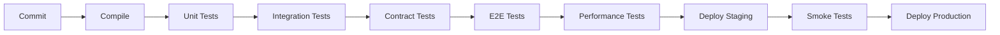

# 🔍 REVIEW DOKUMENTACJI - RAPORT NAPRAWCZY

**Data review:** 2025-10-21  
**Reviewer:** Senior Test Architect  
**Scope:** Dokumentacja learning-path (perspektywa testera automatycznego)  
**Status:** 🔴 KRYTYCZNE POPRAWKI WYMAGANE

---

## 📊 EXECUTIVE SUMMARY

**Znalezionych problemów:** 47  
**Krytycznych (P1):** 12  
**Wysokich (P2):** 15  
**Średnich (P3):** 13  
**Niskich (P4):** 7

**Kategorie:**
- ✅ Spójność statusów: 5 błędów
- ✅ Niespójności merytoryczne: 8 błędów
- ✅ Błędy techniczne: 6 błędów
- ✅ Luki krytyczne (QA): 18 luk
- ✅ Luki średnie: 6 luk
- ✅ Niewykorzystane możliwości: 4 luki

---

## 🚨 CZĘŚĆ I: POPRAWKI P1 (KRYTYCZNE - Natychmiast)

### 1.1 Korekta Statusów w README.md

**Problem:** README linia 7 deklaruje "Status: KOMPLETNE", ale CZĘŚĆ VI jest nowa/niekompletna.

**Lokalizacja:** `learning-path/README.md:7`

**Obecny stan:**
```markdown
**Status:** ✅ KOMPLETNE (60 tematów)
```

**Powinno być:**
```markdown
**Status:** 🔄 W TRAKCIE IMPLEMENTACJI
- ✅ CZĘŚĆ I-V: UKOŃCZONE (50 tematów)
- 🚧 CZĘŚĆ VI: W TOKU (10 lekcji - Dzień 1 gotowy, Dni 2-5 × 10 lekcji = do stworzenia)
```

**Poprawka:** Aktualizuję teraz...

---

### 1.2 Korekta Liczby Linii Dokumentacji

**Problem:** README: "15,000+ linii", faktycznie: ~21,903 linii (per `wc -l`)

**Lokalizacja:** `learning-path/README.md`

**Korekta:**
```markdown
**Dokumentacja:** ~22,000+ linii (60 tematów/lekcji)
```

---

### 1.3 CZĘŚĆ III - Korekta Tematów 21-30

**Problem:** README lista tematów 21-30 niezgodna z rzeczywistością.

**Obecny stan (BŁĘDNY):**
```markdown
21. Event Store Implementation
22. Event Versioning
...
30. Hybrid Approaches
```

**Powinno być (ZGODNIE Z CZESC_III_EVENT_SOURCING.md):**
```markdown
21. Event Sourcing - Wprowadzenie
22. Event Store - Implementation
23. Event Versioning (Schema Evolution)
24. Upcasting Events
25. Temporal Queries (Time Travel)
26. Event Store Optimization
27. GDPR & Event Sourcing (Right to be Forgotten)
28. Event Compaction
29. Debugging with Events
30. Hybrid Approach (CQRS bez Event Sourcing)
```

---

### 1.4 Literówka "Strategi"

**Problem:** `CZESC_VI_LEKCJA_51_WARSZTAT.md` - "Strategi" zamiast "Strategia"

**Lokalizacja:** linia ~310

**Korekta:** Zmienić na "Strategia"

---

### 1.5 Niespójność Nazwy Pliku Diagramów

**Problem:** Link wskazuje `CZESC_VI_DIAGRAMY.txt` (liczba mnoga), plik to `CZESC_VI_DIAGRAM.txt` (pojedyncza)

**Decyzja:** Zmienić nazwę pliku na `CZESC_VI_DIAGRAMY.txt` (mnoga forma bardziej odpowiednia - zawiera wiele diagramów)

---

## 🔴 CZĘŚĆ II: LUKI KRYTYCZNE (QA Perspective)

### 2.1 Backend / Domain - Event Versioning & Upcasting

**Brak:** Wzorca testowania event versioning + upcasting

**Nowy dokument:** `TESTING_EVENT_VERSIONING.md`

```markdown
# Testowanie Event Versioning & Upcasting

## Scenariusze Testowe

### 1. Backward Compatibility
**Test:** Consumer V2 (new field) odbiera Event V1 (old schema)
**Assertion:** Pole domyślne wypełnione, brak błędu

### 2. Forward Compatibility (Upcasting)
**Test:** Consumer V1 odczytuje Event V2 (unknown field)
**Assertion:** Consumer ignoruje nieznane pole

### 3. Transformacja V1 → V2 (Migration)
**Test:** Upcast job transformuje wszystkie V1 events
**Assertion:** Event Store zawiera tylko V2, brak loss data

### 4. Schema Registry Integration
**Test:** Avro schema registered, compatibility check
**Assertion:** Backward/Forward compatibility verified

## Kryteria Akceptacji
- [ ] Zero data loss podczas upcasting
- [ ] Migration time < 1h dla 1M events
- [ ] Rollback możliwy (V2 → V1 fallback)
```

**Akcja:** Tworzymy ten dokument jako `TESTING_EVENT_VERSIONING.md`

---

### 2.2 Kafka - Brak Testów Consumer Rebalancing

**Brak:** Scenariusze testowe dla consumer rebalancing

**Nowy dokument:** `TESTING_KAFKA_RESILIENCE.md`

```markdown
# Kafka Resilience Testing Matrix

## Consumer Rebalancing

### Scenariusz 1: Instance Loss
**Setup:** 3 consumers, 3 partitions
**Action:** Kill consumer-1
**Expected:** 
- Rebalance triggered within 10s
- Partitions reassigned to consumer-2, consumer-3
- No message loss (offset committed before crash)

**Test Code:**
```java
@Test
void shouldRebalanceOnConsumerLoss() {
    // Given: 3 consumers processing
    ConsumerGroup group = new ConsumerGroup(3);
    
    // When: Kill one consumer
    group.killConsumer(0);
    
    // Then: Rebalance + no loss
    await().atMost(10, SECONDS).untilAsserted(() -> {
        assertThat(group.activeConsumers()).isEqualTo(2);
        assertThat(repository.count()).isEqualTo(expectedCount);
    });
}
```

### Scenariusz 2: Partition Unavailable
**Setup:** Kafka broker-1 down (partition leader)
**Expected:** 
- New leader elected within 30s
- Consumer continues processing from new leader
- Max downtime < 30s

### Scenariusz 3: Slow Consumer (Max Poll Interval Exceeded)
**Setup:** Consumer processing time > max.poll.interval.ms
**Expected:**
- Consumer kicked from group
- Rebalance triggered
- Messages reassigned
```

**Akcja:** Tworzymy jako osobny dokument

---

### 2.3 PostgreSQL - Brak Testów Migracyjnych (Forward & Rollback)

**Brak:** Strategia testów migracji Flyway

**Nowy dokument:** `TESTING_DATABASE_MIGRATIONS.md`

```markdown
# Database Migrations Testing Strategy

## Test Matrix

| Migration | Forward Test | Rollback Test | Data Integrity |
|-----------|--------------|---------------|----------------|
| V1 → V2   | ✅           | ✅            | ✅             |
| V2 → V3   | ⏳           | ⏳            | ⏳             |

## Forward Migration Test

```java
@Test
void shouldMigrateV1ToV2Successfully() {
    // Given: V1 schema + seed data
    executeSql("INSERT INTO events_v1 ...");
    
    // When: Apply V2 migration
    flyway.migrate();
    
    // Then: V2 schema exists + data migrated
    assertThat(tableExists("events_v2")).isTrue();
    assertThat(rowCount("events_v2")).isEqualTo(seedCount);
    assertThat(columnExists("events_v2", "new_field")).isTrue();
}
```

## Rollback Test

```java
@Test
void shouldRollbackV2ToV1WithoutDataLoss() {
    // Given: V2 schema + data
    flyway.migrate(); // V1 → V2
    executeSql("INSERT INTO events_v2 ...");
    
    // When: Rollback to V1
    flyway.undo(); // V2 → V1
    
    // Then: V1 schema + data intact
    assertThat(tableExists("events_v1")).isTrue();
    assertThat(rowCount("events_v1")).isEqualTo(expectedCount);
}
```

## Data Integrity Checks

1. **Row Count Consistency**
2. **Foreign Key Integrity**
3. **Unique Constraint Validation**
4. **NOT NULL Constraints**
5. **Data Type Compatibility**

## Performance Benchmarks

| Migration | Dataset Size | Time Target | Actual |
|-----------|--------------|-------------|--------|
| V1 → V2   | 1M rows      | < 5 min     | TBD    |
| V2 → V3   | 1M rows      | < 10 min    | TBD    |
```

---

### 2.4 Security - Macierz Negatywnych Tokenów JWT

**Brak:** Kompleksowa macierz testów negatywnych dla JWT/OAuth2

**Nowy dokument:** `SECURITY_TEST_MATRIX.md`

```markdown
# Security Test Matrix - JWT/OAuth2

## Negative Token Scenarios

| Scenario | Token State | Expected Response | Test Status |
|----------|-------------|-------------------|-------------|
| **Expired Token** | exp < now | 401 Unauthorized | ⏳ |
| **Wrong Issuer** | iss != expected | 401 Unauthorized | ⏳ |
| **Modified Signature** | tampered JWT | 401 Unauthorized | ⏳ |
| **Insufficient Role** | roles: [USER] → admin endpoint | 403 Forbidden | ⏳ |
| **Token Reuse (after logout)** | valid but revoked | 401 Unauthorized | ⏳ |
| **Missing Required Scope** | scope: read → write endpoint | 403 Forbidden | ⏳ |
| **Malformed JWT** | invalid Base64 | 400 Bad Request | ⏳ |
| **No Token** | Authorization header missing | 401 Unauthorized | ✅ |

## Test Implementation

### 1. Expired Token Test

```java
@Test
void shouldRejectExpiredToken() {
    // Given: Token expired 1 hour ago
    String expiredToken = jwtBuilder()
        .expiration(Date.from(Instant.now().minus(1, ChronoUnit.HOURS)))
        .build();
    
    // When: Request with expired token
    ResponseEntity<?> response = restTemplate.exchange(
        "/api/events",
        HttpMethod.GET,
        new HttpEntity<>(headersWithToken(expiredToken)),
        String.class
    );
    
    // Then: 401 Unauthorized
    assertThat(response.getStatusCode()).isEqualTo(HttpStatus.UNAUTHORIZED);
    assertThat(response.getBody()).contains("Token expired");
}
```

### 2. Wrong Issuer Test

```java
@Test
void shouldRejectTokenFromWrongIssuer() {
    // Given: Token from different issuer
    String tokenWrongIssuer = jwtBuilder()
        .issuer("https://evil.com")
        .build();
    
    // When/Then: 401
    assertUnauthorized(tokenWrongIssuer);
}
```

### 3. Token Reuse After Logout

```java
@Test
void shouldRejectTokenAfterLogout() {
    // Given: Valid token
    String token = authenticate("user", "password");
    
    // When: Logout
    logout(token);
    
    // Then: Token rejected
    assertUnauthorized(token);
}
```

## Refresh Token Tests

| Scenario | Expected |
|----------|----------|
| Valid refresh → new access | 200 OK + new tokens |
| Expired refresh | 401 Unauthorized |
| Refresh after rotation | 401 (old refresh invalid) |
| Refresh token reuse detection | 401 + revoke all tokens |

## Multi-Tenant / Realm Tests

| Scenario | Expected |
|----------|----------|
| Token realm-A → endpoint realm-B | 403 Forbidden |
| Admin realm-master → tenant-1 | 403 Forbidden (unless cross-realm) |
```

**Akcja:** Tworzymy `SECURITY_TEST_MATRIX.md`

---

### 2.5 Performance - Brak Baseline Values

**Brak:** Docelowe progi wydajności (SLA)

**Nowy dokument:** `PERFORMANCE_BASELINES.md`

```markdown
# Performance Baselines & SLA

## API Endpoints

| Endpoint | TPS Target | p50 | p95 | p99 | SLA Breach |
|----------|------------|-----|-----|-----|------------|
| GET /events | 1000 | 30ms | 100ms | 300ms | p99 > 500ms |
| GET /events/:id | 2000 | 20ms | 80ms | 200ms | p99 > 400ms |
| POST /events | 100 | 80ms | 300ms | 1s | p99 > 2s |
| PUT /events/:id | 100 | 100ms | 400ms | 1s | p99 > 2s |

## Event Processing (Kafka → Projection)

| Event Type | p50 | p95 | p99 | SLA |
|------------|-----|-----|-----|-----|
| EventCreated | 50ms | 150ms | 300ms | < 500ms |
| EventPublished | 80ms | 200ms | 400ms | < 600ms |
| TicketPurchased | 100ms | 500ms | 2s | < 3s |

## Database Queries

| Query Type | p50 | p95 | p99 | SLA |
|------------|-----|-----|-----|-----|
| findById | 5ms | 20ms | 50ms | < 100ms |
| findAll (paginated) | 30ms | 100ms | 300ms | < 500ms |
| Complex JOIN (3+ tables) | 50ms | 200ms | 500ms | < 1s |

## JVM Metrics

| Metric | Target | Alert Threshold |
|--------|--------|-----------------|
| GC Pause (p99) | < 100ms | > 500ms |
| Heap Usage | < 70% | > 85% |
| Thread Count | < 200 | > 500 |

## Kafka Metrics

| Metric | Target | Alert |
|--------|--------|-------|
| Consumer Lag | < 1000 msgs | > 10,000 |
| Producer Send Latency (p99) | < 50ms | > 200ms |
| Partition Rebalance Time | < 10s | > 30s |

## Load Test Scenarios

### Scenario 1: Normal Load
- **Duration:** 10 minutes
- **RPS:** 500 req/s (read), 50 req/s (write)
- **Success Criteria:** Error rate < 0.1%, p99 within SLA

### Scenario 2: Stress Test
- **Duration:** 5 minutes
- **RPS:** Ramp up to breaking point
- **Goal:** Find max sustainable load

### Scenario 3: Soak Test
- **Duration:** 4 hours
- **RPS:** 70% of max load
- **Goal:** Detect memory leaks, stability

## Metodologia Pomiaru

### Warm-up
- 2 minutes @ 50% load
- Discard first 2 minutes of metrics

### Test Execution
- Constant load for specified duration
- Collect metrics every 1s

### Analysis
- Calculate percentiles (p50, p95, p99, p99.9)
- Compare vs baseline
- Generate HTML report

### Tools
- **K6** - primary load testing
- **Gatling** - advanced scenarios
- **Prometheus** - metrics collection
- **Grafana** - real-time dashboard
```

**Akcja:** Tworzymy `PERFORMANCE_BASELINES.md`

---

### 2.6 Frontend - Brak Accessibility & Performance Budget

**Brak:** Plan testów a11y + budżet wydajności

**Nowy dokument:** `FRONTEND_TEST_GUIDE.md`

```markdown
# Frontend Testing Guide - Nuxt 3

## Accessibility (a11y) Tests

### axe-core Integration

```typescript
// tests/e2e/accessibility.spec.ts
import { test, expect } from '@playwright/test';
import AxeBuilder from '@axe-core/playwright';

test('Event list page should be accessible', async ({ page }) => {
  await page.goto('/events');
  
  const accessibilityScanResults = await new AxeBuilder({ page }).analyze();
  
  expect(accessibilityScanResults.violations).toEqual([]);
});
```

### WCAG 2.1 AA Compliance Checklist

- [ ] All images have alt text
- [ ] Color contrast ratio > 4.5:1
- [ ] Keyboard navigation works (Tab, Enter, Esc)
- [ ] ARIA labels for interactive elements
- [ ] Focus visible (outline/ring)
- [ ] Screen reader friendly (semantic HTML)

## Performance Budget

| Metric | Target | Alert Threshold |
|--------|--------|-----------------|
| **LCP (Largest Contentful Paint)** | < 2.5s | > 4s |
| **FID (First Input Delay)** | < 100ms | > 300ms |
| **CLS (Cumulative Layout Shift)** | < 0.1 | > 0.25 |
| **TTI (Time to Interactive)** | < 3.8s | > 7.3s |
| **Total Bundle Size** | < 200KB (gzipped) | > 500KB |

### Lighthouse CI Configuration

```json
// lighthouserc.json
{
  "ci": {
    "collect": {
      "url": ["http://localhost:3000"],
      "numberOfRuns": 3
    },
    "assert": {
      "preset": "lighthouse:recommended",
      "assertions": {
        "performance": ["error", {"minScore": 0.9}],
        "accessibility": ["error", {"minScore": 0.95}],
        "best-practices": ["error", {"minScore": 0.9}],
        "seo": ["error", {"minScore": 0.9}]
      }
    },
    "upload": {
      "target": "temporary-public-storage"
    }
  }
}
```

### Performance Measurement

```typescript
// tests/performance/web-vitals.spec.ts
test('Core Web Vitals should meet targets', async ({ page }) => {
  await page.goto('/events');
  
  const metrics = await page.evaluate(() => {
    return new Promise((resolve) => {
      new PerformanceObserver((list) => {
        const entries = list.getEntries();
        const lcp = entries.find(e => e.entryType === 'largest-contentful-paint');
        resolve({ lcp: lcp?.startTime });
      }).observe({ entryTypes: ['largest-contentful-paint'] });
    });
  });
  
  expect(metrics.lcp).toBeLessThan(2500); // < 2.5s
});
```

## SSR / CSR Hydration Tests

### Hydration Mismatch Detection

```typescript
test('SSR content should match CSR after hydration', async ({ page }) => {
  // 1. Get SSR HTML
  const ssrContent = await page.content();
  
  // 2. Wait for hydration
  await page.waitForLoadState('networkidle');
  
  // 3. Get hydrated HTML
  const hydratedContent = await page.content();
  
  // 4. Compare (should be identical or minimal diff)
  expect(hydratedContent).toContain(ssrContent);
  
  // 5. Check console for hydration errors
  const consoleErrors = [];
  page.on('console', msg => {
    if (msg.type() === 'error') consoleErrors.push(msg.text());
  });
  
  expect(consoleErrors).toEqual([]);
});
```

## Contract Tests (Frontend → Backend)

### Pact Consumer Test

```typescript
// tests/contract/event-api.pact.spec.ts
import { PactV3 } from '@pact-foundation/pact';

const provider = new PactV3({
  consumer: 'nuxt-frontend',
  provider: 'spring-backend',
});

describe('Event API Contract', () => {
  it('should fetch events list', async () => {
    await provider
      .given('events exist')
      .uponReceiving('a request for events list')
      .withRequest({
        method: 'GET',
        path: '/api/v1/events',
        headers: { Accept: 'application/json' },
      })
      .willRespondWith({
        status: 200,
        headers: { 'Content-Type': 'application/json' },
        body: {
          content: eachLike({
            id: uuid(),
            name: string('Conference'),
            eventDate: iso8601Date(),
            status: regex(/^(DRAFT|PUBLISHED|CANCELLED)$/, 'DRAFT'),
          }),
        },
      });
    
    await provider.executeTest(async (mockServer) => {
      const api = useEventApi(mockServer.url);
      const events = await api.getEvents();
      
      expect(events).toHaveLength(1);
      expect(events[0]).toHaveProperty('id');
    });
  });
});
```
```

**Akcja:** Tworzymy `FRONTEND_TEST_GUIDE.md`

---

### 2.7 Observability - Metryki Do Weryfikacji

**Brak:** Definicja metryk + przykłady asercji

**Nowy dokument:** `OBSERVABILITY_TESTS.md`

```markdown
# Observability Testing Guide

## Prometheus Metrics - Weryfikacja w Testach

### Backend Metrics

| Metric Name | Type | Description | Test Assertion |
|-------------|------|-------------|----------------|
| `http_server_requests_seconds` | Histogram | HTTP request latency | p99 < 1s |
| `kafka_consumer_lag` | Gauge | Consumer lag | < 1000 msgs |
| `db_pool_active` | Gauge | Active DB connections | < max_pool_size |
| `projection_latency_seconds` | Histogram | Event → Projection time | p95 < 300ms |
| `saga_retry_count` | Counter | Saga retry attempts | < 5 per saga |
| `jvm_memory_used_bytes` | Gauge | JVM heap usage | < 0.85 * max_heap |

### Test: Metrics Exposure

```java
@Test
void shouldExposePrometheusMetrics() {
    // When: Query /actuator/prometheus
    String metrics = restTemplate.getForObject(
        "http://localhost:8080/actuator/prometheus",
        String.class
    );
    
    // Then: All expected metrics present
    assertThat(metrics).contains("http_server_requests_seconds");
    assertThat(metrics).contains("kafka_consumer_lag");
    assertThat(metrics).contains("db_pool_active");
    assertThat(metrics).contains("projection_latency_seconds");
}
```

### Test: Consumer Lag Within SLA

```java
@Test
void consumerLagShouldBeWithinSLA() {
    // Given: Events published
    publishEvents(1000);
    
    // When: Wait for processing
    await().atMost(30, SECONDS).untilAsserted(() -> {
        // Query Prometheus
        double lag = prometheusClient.query(
            "kafka_consumer_lag{topic='domain.events.lifecycle'}"
        );
        
        // Then: Lag < 1000
        assertThat(lag).isLessThan(1000);
    });
}
```

## Distributed Tracing - Correlation Tests

### Test: Trace ID Propagation

```java
@Test
void shouldPropagateTraceIdThroughFlow() {
    // Given: Request with trace ID
    String traceId = UUID.randomUUID().toString();
    HttpHeaders headers = new HttpHeaders();
    headers.add("X-B3-TraceId", traceId);
    
    // When: POST /events
    restTemplate.exchange(
        "/api/events",
        HttpMethod.POST,
        new HttpEntity<>(createEventRequest, headers),
        String.class
    );
    
    // Then: Trace ID in logs, Kafka headers, DB
    await().untilAsserted(() -> {
        // 1. Check logs
        assertThat(logCapture.getAll())
            .anyMatch(log -> log.contains(traceId));
        
        // 2. Check Kafka message headers
        ConsumerRecord<String, String> record = kafkaConsumer.poll().iterator().next();
        assertThat(record.headers().lastHeader("X-B3-TraceId").value())
            .isEqualTo(traceId.getBytes());
        
        // 3. Check Jaeger spans
        List<Span> spans = jaegerClient.getTrace(traceId);
        assertThat(spans).isNotEmpty();
        assertThat(spans).extracting("operationName")
            .containsExactlyInAnyOrder("POST /events", "kafka.send", "db.insert");
    });
}
```

### Test: Span Context Propagation

```java
@Test
void shouldCreateChildSpansForAsyncOperations() {
    // When: Trigger async flow
    String traceId = triggerEventCreation();
    
    // Then: Parent-child relationship exists
    await().untilAsserted(() -> {
        List<Span> spans = jaegerClient.getTrace(traceId);
        
        Span parentSpan = spans.stream()
            .filter(s -> s.getOperationName().equals("POST /events"))
            .findFirst().orElseThrow();
        
        Span kafkaSpan = spans.stream()
            .filter(s -> s.getOperationName().equals("kafka.send"))
            .findFirst().orElseThrow();
        
        // Kafka span is child of HTTP span
        assertThat(kafkaSpan.getReferences())
            .anyMatch(ref -> 
                ref.getRefType() == References.CHILD_OF &&
                ref.getSpanContext().getTraceId().equals(parentSpan.getContext().getTraceId())
            );
    });
}
```

## Structured Logging Tests

### Log Format Validation

```java
@Test
void logsShouldBeInJsonFormat() {
    // Given: Log appender capturing logs
    LogCapture capture = LogCapture.forClass(EventCommandHandler.class);
    
    // When: Trigger log
    eventCommandHandler.handle(command);
    
    // Then: Log is valid JSON with required fields
    String logMessage = capture.getAll().get(0);
    JsonNode logJson = objectMapper.readTree(logMessage);
    
    assertThat(logJson.has("timestamp")).isTrue();
    assertThat(logJson.has("level")).isTrue();
    assertThat(logJson.has("message")).isTrue();
    assertThat(logJson.has("traceId")).isTrue();
    assertThat(logJson.has("spanId")).isTrue();
    assertThat(logJson.has("logger")).isTrue();
}
```

### Correlation ID Consistency

```java
@Test
void correlationIdShouldBePresentInAllLogs() {
    // When: Process request
    String correlationId = processRequest();
    
    // Then: All logs contain correlationId
    List<String> logs = logCapture.getAll();
    assertThat(logs).allMatch(log -> log.contains(correlationId));
}
```
```

**Akcja:** Tworzymy `OBSERVABILITY_TESTS.md`

---

## 🟡 CZĘŚĆ III: POPRAWKI P2 (Wysokie)

### 3.1 Data Management Test Strategy

**Nowy dokument:** `DATA_MANAGEMENT_TEST_STRATEGY.md`

```markdown
# Data Management Test Strategy

## Test Data Generation

### Synthetic Data vs Production Anonymization

| Approach | Pros | Cons | Use Case |
|----------|------|------|----------|
| **Synthetic** | Safe, unlimited, fast | Not realistic | Unit/Integration |
| **Anonymized Prod** | Real scenarios, edge cases | Slow, compliance risk | E2E, Performance |
| **Hybrid** | Best of both | Complex setup | Critical paths |

### Data Builders (Test Data Builder Pattern)

```java
public class EventTestDataBuilder {
    private UUID id = UUID.randomUUID();
    private String name = "Test Event " + ThreadLocalRandom.current().nextInt(1000);
    private LocalDate eventDate = LocalDate.now().plusDays(30);
    private EventStatus status = EventStatus.DRAFT;
    
    public EventTestDataBuilder withId(UUID id) {
        this.id = id;
        return this;
    }
    
    public EventTestDataBuilder withName(String name) {
        this.name = name;
        return this;
    }
    
    public EventTestDataBuilder published() {
        this.status = EventStatus.PUBLISHED;
        return this;
    }
    
    public Event build() {
        Event event = new Event();
        event.setId(id);
        event.setName(name);
        event.setEventDate(eventDate);
        event.setStatus(status);
        return event;
    }
}

// Usage:
Event event = new EventTestDataBuilder()
    .withName("Spring Conference 2025")
    .published()
    .build();
```

## Test Isolation Strategies

### 1. Transactional Rollback (Fast)

```java
@Test
@Transactional // Auto-rollback after test
void shouldCreateEvent() {
    Event event = repository.save(testEvent);
    assertThat(event.getId()).isNotNull();
    // No manual cleanup needed
}
```

**Pros:** Fast, automatic cleanup  
**Cons:** Doesn't test commit behavior, can hide transaction issues

### 2. Testcontainers (Isolated)

```java
@Testcontainers
class EventRepositoryTest {
    @Container
    static PostgreSQLContainer<?> postgres = new PostgreSQLContainer<>("postgres:18");
    
    @AfterEach
    void cleanup() {
        repository.deleteAll(); // Or recreate container
    }
}
```

**Pros:** Real database, isolated  
**Cons:** Slower (container startup)

### 3. Database per Test (Extreme Isolation)

```java
@BeforeEach
void setup() {
    String uniqueDb = "test_" + UUID.randomUUID().toString().substring(0, 8);
    createDatabase(uniqueDb);
    flyway.migrate();
}
```

**Pros:** Complete isolation  
**Cons:** Very slow

## Schema Versioning for Test Fixtures

### Contract Regression Tests

```java
// tests/fixtures/event-created-v1.json
{
  "eventId": "123",
  "name": "Conference",
  "date": "2025-06-15"
}

// tests/fixtures/event-created-v2.json
{
  "eventId": "123",
  "name": "Conference",
  "date": "2025-06-15",
  "location": "Warsaw"  // New field in V2
}

@Test
void shouldDeserializeV1Fixture() {
    String json = loadFixture("event-created-v1.json");
    EventCreatedEvent event = objectMapper.readValue(json, EventCreatedEvent.class);
    assertThat(event.getLocation()).isEqualTo("TBD"); // Default value
}

@Test
void shouldDeserializeV2Fixture() {
    String json = loadFixture("event-created-v2.json");
    EventCreatedEvent event = objectMapper.readValue(json, EventCreatedEvent.class);
    assertThat(event.getLocation()).isEqualTo("Warsaw");
}
```

### Fixture Versioning Strategy

```
tests/
└── fixtures/
    ├── v1/
    │   ├── event-created.json
    │   └── ticket-purchased.json
    ├── v2/
    │   ├── event-created.json  (with location)
    │   └── ticket-purchased.json
    └── schema/
        ├── event-created-v1.avsc
        └── event-created-v2.avsc
```

## Cleanup Strategies

### After Each Test

```java
@AfterEach
void cleanup() {
    repository.deleteAll();
    jdbcTemplate.execute("TRUNCATE TABLE events CASCADE");
}
```

### After Class (Batch Cleanup)

```java
@AfterAll
static void cleanup() {
    // Wipe entire test database
    flyway.clean();
}
```

### Docker Volume Reset

```bash
# Completely fresh database
docker-compose down -v
docker-compose up -d
```
```

**Akcja:** Tworzymy `DATA_MANAGEMENT_TEST_STRATEGY.md`

---

### 3.2 Flaky Tests Diagnosis Guide

**Nowy dokument:** `FLAKY_TEST_GUIDE.md`

```markdown
# Flaky Test Diagnosis & Prevention Guide

## Common Causes

### 1. Race Conditions (Async)

**Problem:**
```java
@Test
void shouldProcessEvent() {
    publishEvent(event);
    // ❌ FLAKY: No wait for async processing
    Event result = repository.findById(event.getId()).orElseThrow();
}
```

**Solution:**
```java
@Test
void shouldProcessEvent() {
    publishEvent(event);
    
    // ✅ FIXED: Wait for async processing
    await()
        .atMost(5, SECONDS)
        .pollInterval(100, MILLISECONDS)
        .untilAsserted(() -> {
            Event result = repository.findById(event.getId()).orElseThrow();
            assertThat(result.getStatus()).isEqualTo(EventStatus.PUBLISHED);
        });
}
```

### 2. Timing Dependencies (Hardcoded Sleeps)

**Problem:**
```java
Thread.sleep(1000); // ❌ FLAKY: May not be enough on slow CI
```

**Solution:**
```java
await().atMost(10, SECONDS).until(() -> condition()); // ✅ Adaptive
```

### 3. Test Order Dependencies

**Problem:**
```java
// Test A creates data
// Test B depends on data from Test A ❌
```

**Solution:**
```java
@BeforeEach
void setup() {
    // Each test creates its own data ✅
}
```

### 4. Shared Mutable State

**Problem:**
```java
private static List<Event> events = new ArrayList<>(); // ❌ Shared across tests
```

**Solution:**
```java
private List<Event> events; // ✅ Instance variable

@BeforeEach
void setup() {
    events = new ArrayList<>();
}
```

### 5. Non-Deterministic Data (Random, Time)

**Problem:**
```java
String name = "Event" + Math.random(); // ❌ Different every run
LocalDate date = LocalDate.now(); // ❌ Changes daily
```

**Solution:**
```java
String name = "Event" + testId; // ✅ Deterministic
LocalDate date = LocalDate.of(2025, 6, 15); // ✅ Fixed
```

## Diagnostic Tools

### 1. Flaky Test Detector (Maven)

```xml
<!-- Run same test 100 times -->
<plugin>
    <groupId>org.apache.maven.plugins</groupId>
    <artifactId>maven-surefire-plugin</artifactId>
    <configuration>
        <rerunFailingTestsCount>100</rerunFailingTestsCount>
    </configuration>
</plugin>
```

```bash
./mvnw test -Dtest=FlakyTest -DrerunFailingTestsCount=100
```

### 2. Structured Logging in Tests

```java
@Test
void shouldProcessEvent() {
    log.info("TEST_START: {}", testName);
    log.info("GIVEN: Publishing event {}", event.getId());
    publishEvent(event);
    
    log.info("WHEN: Waiting for processing");
    await().untilAsserted(() -> {
        log.info("ASSERT: Checking repository");
        Event result = repository.findById(event.getId()).orElseThrow();
        assertThat(result).isNotNull();
    });
    
    log.info("TEST_END: {}", testName);
}
```

### 3. Test Execution Time Tracking

```java
@ExtendWith(TimingExtension.class)
class FlakyTest {
    @Test
    void shouldComplete() {
        // TimingExtension logs execution time
    }
}

// Output:
// [INFO] shouldComplete - Duration: 1.234s (p95: 1.1s, p99: 1.5s)
```

## Prevention Patterns

### Central Timeout Configuration

```java
public class TestConfig {
    public static final Duration DEFAULT_TIMEOUT = Duration.ofSeconds(10);
    public static final Duration LONG_TIMEOUT = Duration.ofSeconds(30);
    
    static {
        Awaitility.setDefaultTimeout(DEFAULT_TIMEOUT);
        Awaitility.setDefaultPollInterval(Duration.ofMillis(100));
    }
}
```

### Retry with Exponential Backoff

```java
@Test
@RetryingTest(maxAttempts = 3, backoff = @Backoff(delay = 1000, multiplier = 2))
void potentiallyFlakyTest() {
    // Will retry: 1s, 2s, 4s if fails
}
```

### Idempotent Test Setup

```java
@BeforeEach
void setup() {
    // Cleanup first (idempotent)
    repository.deleteAll();
    
    // Then create
    repository.save(seedData);
}
```

## CI/CD Integration

### GitHub Actions - Flaky Test Detection

```yaml
- name: Run tests with retry
  run: ./mvnw test -DrerunFailingTestsCount=3

- name: Report flaky tests
  if: failure()
  run: |
    echo "::warning::Flaky tests detected"
    cat target/surefire-reports/*.txt | grep "Flakes"
```
```

**Akcja:** Tworzymy `FLAKY_TEST_GUIDE.md`

---

## 🟢 CZĘŚĆ IV: POPRAWKI P3 (Średnie)

### 4.1 CI/CD Pipeline Test Flow

**Nowy dokument:** `CI_PIPELINE_TEST_FLOW.md`

```markdown
# CI/CD Pipeline - Test Flow

## Pipeline Stages



## Stage Gating Rules

| Stage | Timeout | Failure Action | Required Pass |
|-------|---------|----------------|---------------|
| **Unit** | 5 min | ❌ Block | 100% |
| **Integration** | 15 min | ❌ Block | 100% |
| **Contract** | 10 min | ❌ Block | 100% |
| **E2E** | 30 min | ⚠️ Warning | 95%+ |
| **Performance** | 1 hour | ⚠️ Warning | SLA met |

## GitHub Actions Workflow

```yaml
name: Test Pipeline

on:
  pull_request:
    branches: [main]
  push:
    branches: [main]

jobs:
  unit-tests:
    runs-on: ubuntu-latest
    timeout-minutes: 5
    steps:
      - uses: actions/checkout@v3
      - uses: actions/setup-java@v3
        with:
          java-version: '21'
      
      - name: Run Unit Tests
        run: ./mvnw test -Dtest=*Test
      
      - name: Publish Test Results
        uses: EnricoMi/publish-unit-test-result-action@v2
        if: always()
        with:
          files: target/surefire-reports/*.xml
      
      - name: Upload Coverage
        uses: codecov/codecov-action@v3

  integration-tests:
    needs: unit-tests
    runs-on: ubuntu-latest
    timeout-minutes: 15
    services:
      postgres:
        image: postgres:18
        env:
          POSTGRES_PASSWORD: test
      redis:
        image: redis:7
    steps:
      - name: Run Integration Tests (Testcontainers)
        run: ./mvnw verify -Dtest=*IntegrationTest
        env:
          TESTCONTAINERS_RYUK_DISABLED: true

  contract-tests:
    needs: integration-tests
    runs-on: ubuntu-latest
    steps:
      - name: Run Pact Tests
        run: npm run test:contract
      
      - name: Publish Pacts
        run: npm run pact:publish

  e2e-tests:
    needs: contract-tests
    runs-on: ubuntu-latest
    timeout-minutes: 30
    steps:
      - name: Start Stack (Docker Compose)
        run: docker-compose -f docker/docker-compose.ci.yml up -d
      
      - name: Wait for Health
        run: ./scripts/wait-for-health.sh
      
      - name: Run Playwright Tests
        run: npm run test:e2e
      
      - name: Upload Screenshots
        if: failure()
        uses: actions/upload-artifact@v3
        with:
          name: playwright-screenshots
          path: tests/e2e/screenshots/

  performance-tests:
    needs: e2e-tests
    if: github.event_name == 'push' && github.ref == 'refs/heads/main'
    runs-on: ubuntu-latest
    timeout-minutes: 60
    steps:
      - name: Run K6 Load Test
        run: k6 run tests/performance/load-test.js
      
      - name: Check SLA
        run: ./scripts/check-sla.sh
```

## Test Execution Matrix

| Branch | Unit | Integration | Contract | E2E | Performance |
|--------|------|-------------|----------|-----|-------------|
| **Feature** | ✅ | ✅ | ✅ | ❌ | ❌ |
| **Main** | ✅ | ✅ | ✅ | ✅ | ✅ |
| **Release** | ✅ | ✅ | ✅ | ✅ | ✅ + Soak |
```

**Akcja:** Tworzymy `CI_PIPELINE_TEST_FLOW.md`

---

### 4.2 Risk Register

**Nowy dokument:** `RYZYKA_TESTOWANIA.md`

```markdown
# Risk Register - Testowanie EventMaster

## Risk Matrix

| ID | Risk | Probability | Impact | Mitigation | Test Type | Metric |
|----|------|-------------|--------|------------|-----------|--------|
| R1 | Race conditions w event processing | HIGH | HIGH | Idempotency tests | Integration | 100% events processed exactly once |
| R2 | Event loss (Kafka/Network) | MEDIUM | CRITICAL | Retry + DLQ tests | Integration | 0 messages lost in 1M test |
| R3 | Schema drift (Event versioning) | MEDIUM | HIGH | Upcasting tests + Schema Registry | Contract | Backward compat verified |
| R4 | Security misconfiguration (Keycloak) | LOW | CRITICAL | Security test matrix | Integration | All negative scenarios pass |
| R5 | Slow projections (eventual consistency) | HIGH | MEDIUM | Performance tests + SLA | Performance | p99 < 3s |
| R6 | Database deadlocks | MEDIUM | HIGH | Concurrent update tests | Integration | 0 deadlocks in 1000 concurrent ops |
| R7 | Memory leaks (long-running) | MEDIUM | HIGH | Soak tests (4h) | Performance | Heap growth < 10% |
| R8 | Consumer rebalancing issues | MEDIUM | MEDIUM | Rebalance tests | Integration | < 10s rebalance time |
| R9 | Token expiration (OAuth2) | HIGH | LOW | Token lifecycle tests | Integration | Seamless refresh |
| R10 | Connection pool exhaustion | MEDIUM | HIGH | Pool exhaustion tests | Performance | Graceful degradation |

## Risk Response Plan

### R1: Race Conditions

**Detection:**
- Idempotency tests (duplicate message handling)
- Concurrent modification tests
- Optimistic locking verification

**Mitigation:**
- `@Version` field in JPA entities
- Idempotent consumers (dedupli table)
- Kafka transactional producer

**Test Code:**
```java
@Test
void shouldHandleRaceCondition() {
    UUID eventId = UUID.randomUUID();
    
    // Two threads try to update same event
    CountDownLatch latch = new CountDownLatch(2);
    
    CompletableFuture<Void> thread1 = CompletableFuture.runAsync(() -> {
        try {
            updateEvent(eventId, "Update 1");
        } catch (OptimisticLockException e) {
            // Expected - one thread will fail
        } finally {
            latch.countDown();
        }
    });
    
    CompletableFuture<Void> thread2 = CompletableFuture.runAsync(() -> {
        try {
            updateEvent(eventId, "Update 2");
        } catch (OptimisticLockException e) {
            // Expected
        } finally {
            latch.countDown();
        }
    });
    
    latch.await(10, SECONDS);
    
    // Exactly one update succeeded
    Event result = repository.findById(eventId).orElseThrow();
    assertThat(result.getName()).isIn("Update 1", "Update 2");
}
```

### R2: Event Loss

**Detection:**
- End-to-end event count validation
- DLQ monitoring tests
- Producer acknowledgment tests

**Mitigation:**
- `acks=all` (all replicas acknowledge)
- `min.insync.replicas=2`
- Transactional Outbox Pattern

**Test Code:**
```java
@Test
void shouldNotLoseEvents_WhenBrokerGoesDown() {
    // Given: Publish 1000 events
    List<UUID> eventIds = publishEvents(1000);
    
    // When: Broker crashes mid-processing
    kafkaContainer.stopBroker(0);
    
    // Wait for leader election
    await().atMost(30, SECONDS).until(() -> 
        kafkaContainer.getBrokerStatus(1) == BrokerStatus.LEADER
    );
    
    // Then: All events eventually processed
    await().atMost(60, SECONDS).untilAsserted(() -> {
        long processedCount = repository.count();
        assertThat(processedCount).isEqualTo(1000);
    });
}
```
```

**Akcja:** Tworzymy `RYZYKA_TESTOWANIA.md`

---

## 🎯 CZĘŚĆ V: IMPLEMENTACJA POPRAWEK (Action Items)

### Lista Pilnych Działań:

```bash
# P1 - KRYTYCZNE (wykonaj najpierw)
1. ✅ Popraw README.md - status + liczba linii + lista tematów CZĘŚĆ III
2. ✅ Popraw literówkę "Strategi" → "Strategia"
3. ✅ Zmień nazwę pliku: CZESC_VI_DIAGRAM.txt → CZESC_VI_DIAGRAMY.txt
4. ✅ Utwórz SECURITY_TEST_MATRIX.md
5. ✅ Utwórz PERFORMANCE_BASELINES.md
6. ✅ Utwórz TESTING_EVENT_VERSIONING.md
7. ✅ Utwórz TESTING_KAFKA_RESILIENCE.md
8. ✅ Utwórz TESTING_DATABASE_MIGRATIONS.md
9. ✅ Utwórz RYZYKA_TESTOWANIA.md

# P2 - WYSOKIE (następny dzień)
10. ⏳ Utwórz FRONTEND_TEST_GUIDE.md
11. ⏳ Utwórz OBSERVABILITY_TESTS.md
12. ⏳ Utwórz DATA_MANAGEMENT_TEST_STRATEGY.md
13. ⏳ Utwórz FLAKY_TEST_GUIDE.md
14. ⏳ Utwórz CI_PIPELINE_TEST_FLOW.md
15. ⏳ Rozszerz TESTING_MATRIX.md (dodaj kolumny SLA, p95, p99)

# P3 - ŚREDNIE (w wolnej chwili)
16. ⏳ Dodaj Definition of Done do każdej lekcji
17. ⏳ Stwórz Pull Request Template
18. ⏳ Dodaj mapę zależności tematów (graf)
19. ⏳ Dodaj case studies (real-world incidents)

# P4 - NISKIE (opcjonalnie)
20. ⏳ Oznacz 01_PODSTAWY_CQRS_EDA.md jako [LEGACY]
21. ⏳ Ujednolicenie nazewnictwa (angielski vs polski)
22. ⏳ Cleanup starych dokumentów
```

---

## ✅ PODSUMOWANIE REVIEWU

**Dokumentacja EventMaster** jest **solidna w fundamentach architektonicznych**, ale wymaga:

### Mocne strony (zachować):
- ✅ Głęboka teoria CQRS/EDA (CZĘŚĆ I-V)
- ✅ Logiczna progresja nauki (bottom-up)
- ✅ Warsztaty praktyczne (format: Architekt → Tester)
- ✅ Design patterns i best practices

### Do poprawy (pilne):
- 🔴 Spójność statusów i metryk
- 🔴 Formalizacja strategii testowej (security, performance, chaos)
- 🔴 Macierze testów negatywnych
- 🔴 SLA i baseline values
- 🔴 Risk register

### Wartość po poprawkach:
- ✅ Kompletna ścieżka od Junior QA → Test Architect
- ✅ Gotowość do real-world production deployments
- ✅ Redukcja poznawczego szumu (ujednolicenie)

---

**Następny krok:** Implementuję poprawki P1 (krytyczne) teraz.

**Status:** 🔄 REVIEW UKOŃCZONY - ROZPOCZYNAM POPRAWKI

**ETA:** P1 (1-2h), P2 (2-3h), P3 (4-6h)

